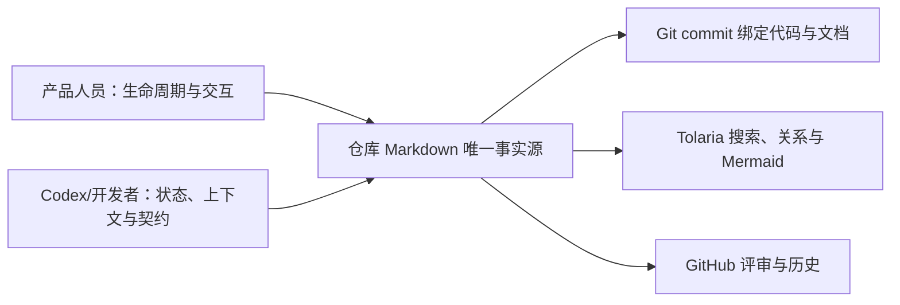

# Payment Web Platform 文档

这里是仓库文档的统一入口，也是 Tolaria 当前 vault 的首页。Tolaria 和 GitHub 读取同一批 Markdown，代码、文档、截图和版本由同一个 Git commit 绑定。

## 产品入口

- [产品生命周期](./product/lifecycle.md)：当前阶段、已经交付的能力、下一里程碑和生产阻断项。
- [系统管理](./product/system-management.md)：用户、角色、菜单、部门、字典的可见范围、主要交互、只读边界和页面截图。
- [商户管理](./product/merchant-management.md)：MCH-001/002 Candidate 基线，以及 MCH-003 全页新增/编辑、独立审核和受保护证件目标（ADR-0015）。

## 开发入口

- [Current Delivery Status](./ai-context/current-status.md)：新任务首先读取的当前事实、唯一下一任务和验证边界。
- [AI 开发上下文](./ai-context/README.md)：按前端、后端、权限、数据库或治理范围选择必读材料。
- [开发工作流](./ai-context/development-workflow.md)：实现、测试、代码与文档同步门禁。
- [Identity Admin API Contract](./ai-contract/identity-admin-api-contract.md) 与 [System Dictionary API Contract](./ai-contract/system-dictionary-api-contract.md)：跨端协议。
- [Merchant Lifecycle API Contract](./ai-contract/merchant-lifecycle-api-contract.md)：MCH-001/002 基线与 MCH-003 精确新增、amendment、文档 DTO 契约。
- [ADR](./adr/)：已经接受的架构结论和变更原因。
- [Judge Charter](./judge-charter.md)：不可变候选版本、独立复审和正式门禁。

## 文档状态

Tolaria 是阅读工具，不改变事实优先级。当前状态以 [Current Delivery Status](./ai-context/current-status.md) 为准；产品目标以 accepted ADR 和版本化契约为准；当前运行行为必须回到源码和测试核验。
