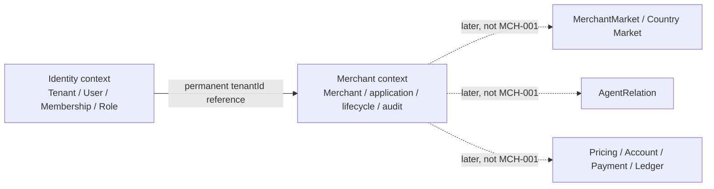

# Merchant Lifecycle Engineering Context

## Current fact

The current working tree contains the MCH-001 Candidate implementation. `backend/modules/merchant` owns a Spring-free lifecycle Core, a PostgreSQL/cryptography adapter and separate PLATFORM/MERCHANT HTTP configurations. Additive V32 creates the Merchant, permanent deduplication and append-only audit boundary, protected-field key metadata, eight dedicated permissions and domain-specific menus. Forward-only V33 replaces the original session-setting rotation exception with a database-enforced offline capability Role. PLATFORM and MERCHANT composition roots import only their matching HTTP configuration; AGENT carries the migration resources for the shared database but imports no Merchant service, rotation service or HTTP endpoint.

The frontend contains a PLATFORM Merchant list/detail/review surface and a MERCHANT self-service profile/submission surface. The AGENT deployment contains no Merchant route, page or API literal. Focused PostgreSQL, HTTP and frontend tests are green. A real local browser run exercised MERCHANT submit, PLATFORM approve, disable and enable, with both applications observing `PENDING_REVIEW -> ACTIVE -> DISABLED -> ACTIVE`; timestamps used localized formatting, lifecycle reasons used i18n labels, the MERCHANT profile page no longer deadlocked, and AGENT exposed no Merchant menu. An author-independent frontend review found and the Candidate fixed two issues: `registrationNumberMasked` now fails closed unless it has a valid masked shape, and the PLATFORM list serializes concurrent refreshes through a latest-query queue so an older response cannot overwrite the newest filter state. Formal repository gates and signed author-independent review results must still be bound to the exact immutable candidate SHA. Therefore these are local Candidate facts, not Production GO.

The browser run used local password authentication. Successful password login is permitted only under the `local` and `iam002-local` profiles and records Session `STEP_UP_AT` at the current UTC time so local sensitive-operation acceptance can use the existing 10-minute freshness check. This is a local reauthentication fixture, not LoA 2. A production OIDC login leaves `stepUpAt` absent until the same identity completes the independent OIDC step-up flow.

Canonical target sources are `docs/adr/0013-separate-merchant-business-lifecycle-from-identity-tenancy.md` and `docs/ai-contract/merchant-lifecycle-api-contract.md`; governance manifests and Judges must bind those exact repository paths.

## Required reading

Before any MCH-001 code change, read in order:

1. [Current Delivery Status](../current-status.md) and repository `AGENTS.md`;
2. [Merchant management product scope](../../product/merchant-management.md);
3. [ADR-0013](../../adr/0013-separate-merchant-business-lifecycle-from-identity-tenancy.md);
4. [Merchant Lifecycle API Contract](../../ai-contract/merchant-lifecycle-api-contract.md);
5. [Backend context](../backend/README.md), [frontend context](../frontend/README.md) and [Identity Admin API Contract](../../ai-contract/identity-admin-api-contract.md);
6. [Judge Charter](../../judge-charter.md) and payment-modernization Reimagine workflow before migration, Rule, Judge or Capability Slice work.

## Boundary map



Dependency direction is one-way at the business boundary: Merchant verifies an existing MERCHANT Tenant through an Identity port. Identity does not depend on Merchant and does not create Merchant rows during tenant/admin provisioning.

The backend follows ADR-0005: Core contains Merchant state and commands without Spring MVC, jOOQ, Redis or Sa-Token. PostgreSQL and backoffice HTTP adapters belong to the Merchant bounded context; the three application modules remain composition roots. PLATFORM registers the control-plane adapter, MERCHANT registers self-service, and AGENT registers neither.

## Target persistence facts

The implementation migration is append-only and must at minimum establish:

```text
merchant
merchant_command_dedup
merchant_audit_event
```

Required invariants:

- unique permanent `tenant_id`, fixed `account_domain='MERCHANT'` and composite FK to Identity Tenant;
- unique immutable server-generated `merchant_code`;
- database-constrained five-state enum and non-negative `row_version`;
- country plus versioned keyed registration fingerprint uniqueness;
- mandatory AES-256-GCM registration ciphertext with a fixed 128-bit tag, per-key unique nonce and Merchant/Tenant/country-bound AAD, separate from audit/idempotency payloads;
- one database active Search-HMAC key and a transaction-level advisory registration-write fence shared by submissions, replacements and atomic backfill/proof/cutover;
- idempotency uniqueness over actor domain, actor Membership, command type and UUID key, with lifetime-retained HMAC key, command-schema, digest-scheme and registration-normalization versions;
- audit actor source separate from the target Merchant Tenant.

The implementation chose append-only `V32__add_merchant_lifecycle.sql` after confirming V31 as the previous maximum. It is immutable. `V33__isolate_merchant_registration_rotation_role.sql` is the forward correction that removes caller-controlled rotation authorization and replaces it with the exact `payment_merchant_registration_rotation` database capability Role.

Production database principals are part of this boundary, not optional deployment advice:

- before Flyway reaches V33, a direct cluster-superuser session runs `backend/scripts/mch001-bootstrap-registration-rotation-role.sql` exactly once per PostgreSQL cluster; it creates or verifies the canonical zero-membership `NOLOGIN` capability Role outside Flyway;
- the object-owning Flyway login is a direct `NOSUPERUSER NOCREATEROLE` principal and runs `backend/scripts/mch001-migration-principal-preflight.sql` before migration; the preflight fails closed if the capability Role is missing, non-canonical, has a membership or is accessible to that login;
- every Web runtime uses a different `NOSUPERUSER NOCREATEROLE` principal that is neither the object owner nor a direct or indirect member of the rotation Role;
- only after every target database has completed V33 may a separately managed offline operations login receive direct `SET TRUE`, `INHERIT FALSE`, `ADMIN FALSE` membership in the `NOLOGIN` capability Role;
- the offline adapter uses its own non-Web data source, executes `SET LOCAL ROLE` as the first operation inside the rotation transaction, verifies the effective/session principals and direct membership options, acquires the shared advisory fence, rotates every row and atomically switches metadata; commit and rollback both restore the pooled connection principal, and the three Web composition roots do not register this service;
- the local `payment_dev` superuser is a disposable fixture convenience and is not an acceptable production runtime model.

Any later correction to V32 or V33 uses a new forward migration.

## Implementation plan

### Task 1: Governance and immutable baseline

Acceptance:

- submission requests never accept a client `reasonCode`; audit derives `APPLICATION_SUBMITTED` for first submission and `APPLICATION_RESUBMITTED` for rejected resubmission, while PLATFORM commands accept only their exact action-specific reason codes;
- explicit JSON `expectedVersion: null` fixes the shared submission endpoint to `submit`, while a non-negative integer fixes `resubmit`; after live authorization the permanent deduplication replay is resolved before current Merchant-state validation so a lost first-submit response remains replayable;

- this governance change adds the candidate `MCH-001` Rule Card, deterministic decision/contract Judge, policy/registry entries and Merchant documentation ownership rule;
- challenge the production-pre plan, freeze an immutable governance commit and obtain author-independent review before implementation;
- derive the Capability Slice identity from that commit, not from the pre-specification baseline.

Verification:

```bash
python3 -I scripts/check-doc-decisions.py
python3 -I scripts/check_mch001_merchant_lifecycle.py --repository-root .
```

### Task 2: Persistence and pure lifecycle core

Acceptance:

- add append-only schema, jOOQ generation, protected registration-field port and permanent Tenant binding;
- implement exact transition table, profile mutability rules, optimistic locking and idempotency transaction;
- prove first-submit races, duplicate fingerprint, stale version, same/different idempotency payload across schema/normalization upgrades, revoked-actor replay, atomic search-key rotation under concurrent writes, country-change registration requirements and illegal transitions against PostgreSQL.

Verification:

```bash
backend/mvnw -f backend/pom.xml clean verify
```

### Task 3: Backend composition and permissions

Acceptance:

- register only self-service in MERCHANT and only protected control-plane endpoints in PLATFORM; AGENT remains negative;
- derive self Tenant/Membership from Session and recheck actor, target binding, permission, state and version inside the write transaction;
- prove the exact permission through the same assigned protected Role, lock source Tenant before the complete Membership-to-Role-to-Grant path, then use a later database-time statement to revalidate Tenant ACTIVE state and grant expiry before deduplication or Merchant access;
- revalidate the live actor before deduplication lookup, then replay using the stored command-schema, canonical-digest, registration-normalization and HMAC-key versions; unknown versions fail closed;
- prove registration plaintext and free-text lifecycle reasons are absent from responses, logs, audit and deduplication records, AEAD nonces cannot repeat, and ciphertext cannot be swapped across Merchants.

Verification:

```bash
backend/mvnw -f backend/pom.xml clean verify
```

### Task 4: PLATFORM and MERCHANT frontend slices

Acceptance:

- PLATFORM provides Merchant list/detail/review/lifecycle actions with status-correct controls and conflict refresh;
- MERCHANT provides application/profile states without browser persistence of registration plaintext;
- AGENT build contains no Merchant route, API client or page; all IDs remain strings and all new copy is bilingual.

Verification:

```bash
pnpm --dir frontend/admin test:unit
pnpm --dir frontend/admin check:type
pnpm --dir frontend/admin test:production-safety
pnpm --dir frontend/admin build:all
```

### Task 5: Integrated acceptance and immutable Candidate

Acceptance:

- real PostgreSQL plus the three backend composition roots cover cross-domain, cross-Tenant, state, idempotency and version attacks;
- browser verification covers the required PLATFORM/MERCHANT states and confirms AGENT absence and no sensitive browser storage; the current local run has covered submit, approve, disable, enable, cross-application state synchronization, localized timestamps and reasons, profile-page availability and AGENT menu absence, while rejected resubmission, termination and protected-storage inspection remain part of the complete immutable gate;
- code, Contract, product page, current status and Merchant context describe the same implementation commit.

Verification:

```bash
backend/mvnw -f backend/pom.xml clean verify
pnpm --dir frontend/admin test:unit
pnpm --dir frontend/admin check:type
pnpm --dir frontend/admin test:production-safety
pnpm --dir frontend/admin build:all
python3 -I scripts/check-doc-decisions.py
python3 -I scripts/check_mch001_merchant_lifecycle.py --repository-root .
python3 -I scripts/check_modernization_artifacts.py \
  --repository-root /Users/mac/Documents/demo/payment-web-platform \
  --commit <immutable-candidate-sha> \
  --trusted-policy-commit <protected-base-sha> \
  --trusted-legacy-workspace /Users/mac/Documents/work/backend
```

Formal closure still requires an immutable Candidate commit, the complete repository gate and two independent signed PASS Review Results bound to the same evaluated version. The completed local browser flow, local green tests or an author review do not replace that evidence.

## Release and rollback requirements

Rollout order is protected-field key readiness, schema, backend permission/state enforcement, then compatible frontends. Navigation remains unavailable until both backend and frontend are ready. Post-deploy checks cover state counts, orphan/duplicate Tenant bindings, fingerprint uniqueness, deduplication conflicts, audit completeness and absence of protected plaintext.

V40 Merchant BUTTON title convergence is an explicit compatibility exception to that generic order:

1. First deploy the dual-key frontend before V40 to every client that renders IAM menu titles. It must resolve both historical `merchant.*` button keys and canonical `merchant.permission.*` keys as strings in `zh-CN` and `en-US`; verify that the still-V39 database renders all six actions without raw keys.
2. Enter a migration maintenance window and stop every `iam_menu` writer, including old application nodes and menu administration commands. Confirm the current successful Flyway version is exactly 39 and V40 is pending before starting the dedicated migration job. Do not rely on a lock timeout as writer quiescence.
3. Run the migration job through V41 in one controlled window. The V40 callback and V41 postcondition take `SHARE ROW EXCLUSIVE` locks on the `iam_tenant` and `iam_menu` tables, so any unexpected writer, non-canonical V39 input or non-canonical V40 output stops the release. A lock wait, callback exception or V41 exception is a stop condition, not permission to use `repair` or edit V40.
4. Verify Flyway current successful version 41, the exact six `merchant.permission.*` titles, unchanged permission/auth-code/parent/status fields, and localized rendering in both languages before restoring menu writes.

Before V40 executes, rollback may restore the prior frontend because the database still contains historical keys. After V40 succeeds, keep the dual-key frontend and forward-fix the database or binaries; operators must not roll back to a frontend that lacks `merchant.permission.*`. If the callback fails, the successful version remains 39; if V41 rejects drift, it remains 40. Preserve the rejected rows for classification and release a separately reviewed forward migration instead of mutating V40, deleting Flyway history or using `repair`.

Before first Merchant write, rollback may remove the new binaries while leaving additive unused schema. After writes begin, stop Merchant commands and forward-fix or restore a coordinated snapshot; an old binary is not a writable rollback target. Existing Identity and system-management capabilities remain independently operable because Merchant state never rewrites IAM lifecycle state.

## Known non-goals

Do not add Market, AgentRelation, rates, limits, settlement/fund accounts, integration configuration, payment permissions or money flows while implementing this slice. A field or menu that requires one of those concepts is a new Capability Slice, not a convenient extension of MCH-001.

## MCH-002 Candidate implementation

MCH-002 is governed by `docs/adr/0014-platform-maintained-merchant-profile-and-operating-markets.md` and extends `docs/ai-contract/merchant-lifecycle-api-contract.md` without rewriting MCH-001 history.

- New PLATFORM command: `PUT /api/platform/merchants/{merchantId}/profile`, exact protected `merchant:update`, recent step-up, `expectedVersion` and permanent idempotency.
- Request fields: `legalName`, `displayName`, `merchantTypeCode`, `legalPersonName`, `authenticationType`, required `remarks` string (0..300 Unicode code points; empty means no remark), and `marketCodes` (one or more of BRA/PHL). It never accepts registration identity or status. The classification fields never create Tenant, AgentRelation, MerchantMarket or authorization scope.
- Only ACTIVE/DISABLED update; state and `statusReasonCode` are unchanged, semantic no-op is rejected, and success increments `rowVersion` once with `PLATFORM_PROFILE_UPDATED` audit. Historical status reason may be null only when exact evidence is absent and is never guessed from status.
- V34, V35 and V36 are append-only. V34 adds remarks and normalized operating-market storage; V35 forward-adds the three old-page business classification fields and dictionary projections; V36 enforces one audit event per Merchant aggregate version. The permanently frozen V34 bridge and audit-preflight callbacks accept only canonical V33, reject duplicate audit-version evidence before status-reason backfill and roll back together with V34 on failure. A V34/V35 database with ambiguous audit history stays blocked pending an approved forward repair; audit rows are never deleted or rewritten to pass migration.
- PLATFORM list uses ACTIVE/DISABLED Switch and other-state Tag. Its required `reviewPending` response field is computed from either a pending Merchant application or a pending amendment, so reviewed rows without later review work do not expose the review route. Detail/review place the back icon in the Vben `Page` title slot, and only an actually pending review exposes the header action. The current worktree implements this behavior and has passed preserved-volume V33-to-V36 migration plus real PLATFORM/MERCHANT/AGENT browser verification. It is still a mutable Candidate, not Production GO or exact-SHA Judge evidence.

## MCH-003 mutable Candidate implementation

MCH-003 is governed by `docs/adr/0015-platform-assisted-merchant-onboarding-and-reviewed-amendments.md`
and section 12 of the Merchant Lifecycle Contract. The former `implementation pending` description
is historical and no longer describes this worktree: source, integrated local and browser evidence
now exist. Unified backend `clean verify`: PASS. 95 XML reports / 678 tests / 0 failures / 0 errors. The working tree remains mutable and Production
NO-GO until exact-SHA repository gates and signed author-independent review finish.

- PLATFORM `merchant:create` selects an existing ACTIVE unbound MERCHANT Tenant and creates a
  `PENDING_REVIEW` Merchant without creating IAM records.
- Create and edit share the exact 23-input/five-document full-page form. Detail and review are
  separate hidden full-page routes backed by one complete read-only profile presentation. Review
  adds one action that opens the bounded approve/reject and reason-code modal; ordinary detail has
  no review action. Edit creates a separate amendment whose origin version/status and author
  Membership are immutable; only an independent reviewer may apply it.
- `registrationCountry` is a clearable Select backed only by assigned ISO alpha-2 codes. Changing it
  forces registration-number `REPLACE`; changing `legalIdTypeCode` forces legal-ID `REPLACE`. The
  corresponding `RETAIN` option returns only after the original protection context is restored.
- The list centers localized market names without codes. It keeps at most three available operations
  inline and moves the fourth and later operations into the existing click-triggered overflow.
- A V40-scoped callback locks IAM menu writers and validates exact canonical V39 input before the
  frozen V40 forward-canonicalizes the six Merchant BUTTON titles. V41 locks the same tables and
  validates the exact `merchant.permission.*` postcondition; previously executed migrations remain
  immutable.
- V37 or later must forward-converge `DIRECT` to canonical `PLATFORM` without rewriting V35 or old
  idempotency decoders. The MCH-002 PUT becomes existing-receipt replay-only after cutover.
- Five image fields use the protected document capability: ImageIO sanitization, AES-256-GCM private
  storage, actor/target/kind-bound temporary upload and authorized streaming. Merchant/amendment rows
  retain document IDs, never public URLs. Create requires five temporary uploads; amendment records
  each exact current same-kind binding as `RETAIN` or a same-actor temporary upload as `REPLACE`, so
  editing unrelated fields requires no redundant upload and replacing one document does not disturb
  the other four.
- The existing attached-content path accepts optional `amendmentId`. Omission reads current effective
  evidence; a pending reviewer must pass the exact amendment ID and the server resolves only that
  PENDING_REVIEW attachment. A 404 never falls back to current Merchant evidence.
- Backend, frontend, migrations, browser verification and all three MCH-003 Judges must agree before
  formal closure. Current route behavior is Candidate evidence, not Production GO.

V42 adds immutable amendment-document references and backfills retained historical amendment
evidence; V43 makes those references append-only and validates each `RETAIN`/`REPLACE` binding.
Before V42 starts, operators must stop every old Merchant create/amend/review writer and keep them
quiesced until V43 and the matching backend are active. An old binary is not a writable rollback
target after V42; any migration/reference mismatch is preserved for classification and fixed only
by a new forward migration.

The latest three-composition-root plus blackbox Maven `verify -am` completed 17/17 reactor projects
with `BUILD SUCCESS`; the IAM blackbox passed 10/10 and the run completed in 07:56.
`LocalIdentityFixtureBootstrapIntegrationTest` passed 61/61 under JDK 25 and PostgreSQL 18. Its
automated sequence shares one candidate lineage across `local` and `iam002-local`, consumes
candidate1 through candidate9, deterministically creates candidate10, preserves all nine Merchant
aggregate digests on repeated restart, and accepts only exact replacement ordinals `2..999999`;
leading-zero, `1`, `1000000` and non-digit lineage values fail closed with no repair.
The real HTTP path created Merchant `10802` from Tenant `4000`; a same-volume restart preserved the
Merchant aggregate digest and made exact empty replacement Tenant `10805`
(`local-merchant-candidate-2`) the sole eligible candidate, with zero Department, Membership, Role
and Merchant rows. The local runtime remained healthy. Unified backend `clean verify`: PASS. 95 XML reports / 678 tests / 0 failures / 0 errors. Earlier
blackbox timeout and Valkey Testcontainers readiness failures remain historical failed attempts and
do not replace the latest complete successful run.

Frontend mutable evidence under Node.js 24 is 128 files/975 tests, five typechecks, 31
production-safety tests and all three application artifacts. The current browser flow verified three
inline list actions with no overflow, centered localized market text, matching full-page detail/review
content, the single review modal action, and complete create/edit forms. Page-internal timing measured
about 335ms to mount create and 460ms to hydrate all 23 edit fields, with no new business console
errors or warnings. Late preview and submit responses are invalidated on unmount; an in-flight
binding freezes Tenant, form and upload controls and keeps its temporary documents out of delete,
replace and component teardown cleanup until the server resolves.
A fresh author-independent review is required after this worktree freezes; older
review counts do not approve this generation.
MCH-001/MCH-002/MCH-003 checkers, documentation decision tests and `git diff --check` passed. These
are mutable working-tree facts, not immutable Judge evidence or Production GO.
