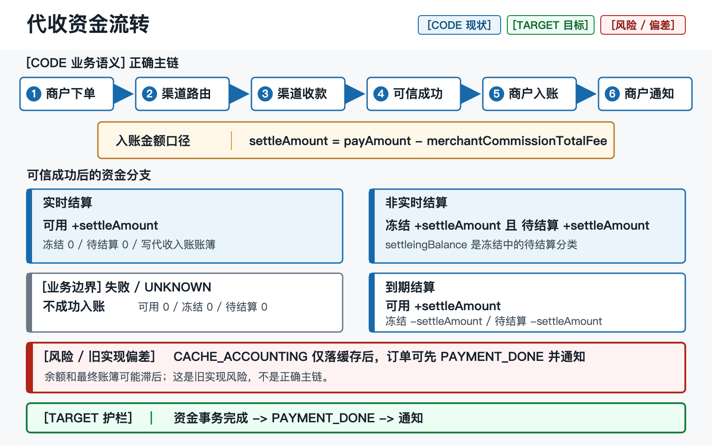
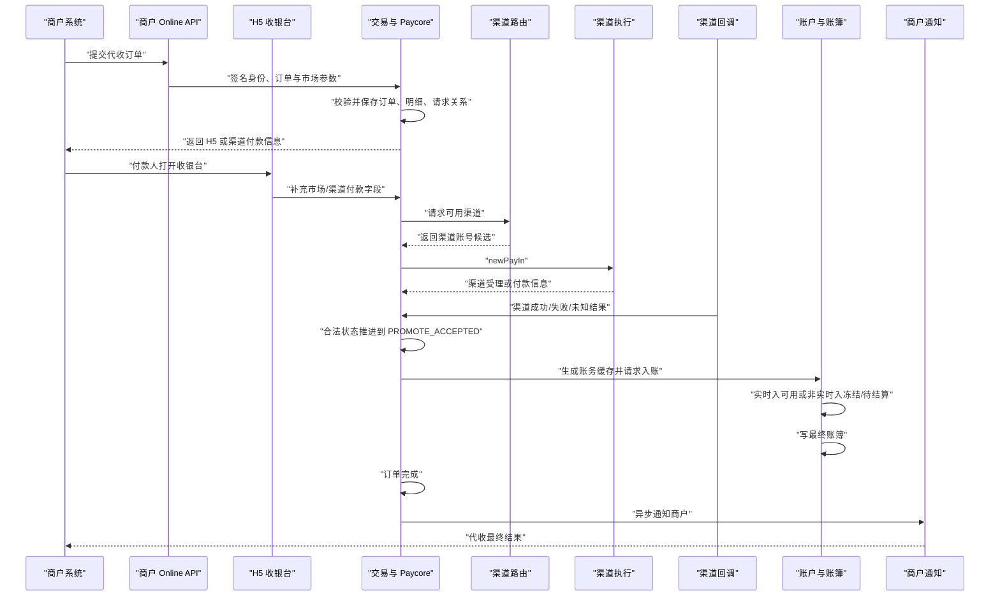
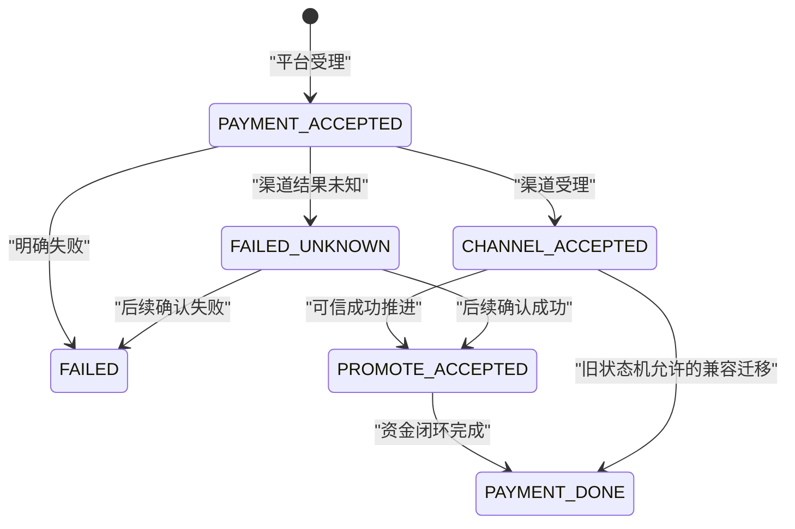

# 代收链路：产品与技术参考基线

## 0. 定位与一页结论

> **定位：旧系统参考。** 本文反向整理旧系统 `cb-*` 仓库的代收业务语义、资金流和已证实风险，用于产品理解、目标设计和迁移验收；它不是 `payment-web-platform` 的当前实现说明，也不授权复制旧架构。

证据标签：

| 标签 | 含义 |
| --- | --- |
| `CODE` | 已由旧系统固定源码快照复核：`cb-transcation release-V2@4948fecc6afd57eaf57b44276756d60f3ac26698`、`cb-channel@782c8ea46573eea7f18599af01670e391da99aa0`、`cb-notify@8f89457cf806eb95264bb9734c14a342b96b23be` |
| `DOC` | 来自旧系统 `docs/ai-context/current-baseline`，本次未逐仓重新验证 |
| `TARGET` | `payment-web-platform` 目标架构或当前交付边界，不代表已经实现 |
| `UNKNOWN` | 缺少生产配置、数据库结构、部署版本、运行日志或负责人确认 |

一页结论：

1. `DOC`：代收是付款人向商户付款的入金业务；渠道成功前，商户余额不得增加。
2. `CODE`：商户入账基数是 `settleAmount = payAmount - merchantCommissionTotalFee`，不是毛额 `payAmount`。
3. `CODE`：实时结算增加可用余额；非实时结算同时增加冻结余额和待结算余额，后续再转为可用。
4. `CODE`：旧系统通过订单状态、账务缓存、账户事务日志、最终账簿、队列和任务尝试实现最终一致。
5. `CODE`：旧系统主链允许 `PAYMENT_DONE` 和商户成功通知早于余额及最终账簿，不能把该行为解释为正确业务规则。
6. `CODE`：渠道失败推进仍是空实现；部分本地 worker 遇到一次异常后会退出。
7. `TARGET`：目标平台要求订单、账本和 Outbox 在同一资金事务提交，通知只能发生在该事务提交之后。
8. `TARGET`：目标平台当前仍在 Merchant/IAM Candidate 阶段，Payment、Account、Ledger 尚未进入当前实现阶段。

旧系统代收的核心价值不是“返回一个支付链接”，而是把商户订单、渠道结果、商户入账、最终账簿、通知和对账连成可追溯的资金事实。

本文的 Finance verdict：**Fail，不能把旧系统资金闭环原样迁移到目标平台。**

### 图文速览

[](../../assets/payment-flows/collection-fund-flow.svg)

> 图中将业务正确主链、旧实现偏差和目标护栏分层展示；`PAYMENT_DONE` 早于余额及最终账簿仍属于旧实现风险，不是目标业务规则。

## 1. 产品视角

### 1.1 用户与参与者

| 参与者 | 诉求 | 代收中的责任 |
| --- | --- | --- |
| 商户 | 创建订单、获知结果、获得可结算资金 | 提供商户单号、金额、产品、通知地址等 |
| 付款人 | 看到可信订单并完成本地支付 | 在 H5 或渠道页面补充手机、银行、身份等市场字段 |
| 平台运营 | 处理未知结果、异常入账、通知失败和对账差异 | 依据订单、渠道、账簿和日志证据操作 |
| 渠道 | 接受拉单、收款并回传结果 | 返回渠道请求号、付款信息和最终结果 |
| 财务 | 确认入账、待结算、结算与账簿一致 | 使用订单、账户、账簿和结算记录对账 |

### 1.2 产品价值

- `DOC`：为商户屏蔽多个国家和渠道的接入差异。
- `DOC`：按商户产品、费率、限额和渠道状态选择可执行通道。
- `CODE`：把毛额、商户手续费和净结算额固化到订单及账务载荷。
- `CODE`：支持实时结算与非实时结算两种资金可用时点。
- `DOC`：通过回调、主动查询、任务、账务缓存和通知重试收敛外部不确定性。

### 1.3 业务边界

代收包括：
- 商户下单与幂等受理；
- H5 收银台与市场特有付款信息；
- 渠道路由和渠道拉单；
- 渠道回调或可信主动推进；
- 商户账户入账、待结算与后续结算；
- 商户通知、查询、运营恢复和对账。

代收不等于：
- 代付：商户资金向外支付，受理时通常需要冻结；
- 商户提现：从商户余额发起的独立审核和出金流程；
- 调账：由有权操作人直接增减余额的独立审计动作；
- 渠道退款或代付冲正：必须使用独立业务单和账簿语义。

### 1.4 金额口径

| 字段 | 旧系统代收含义 | 资金用途 |
| --- | --- | --- |
| `payAmount` | 商户/付款人总支付额 | 回调毛额比较、订单展示 |
| `actualAmount` | 默认等于 `payAmount`；部分市场按渠道实付重算 | 记录实际支付事实 |
| `merchantCommissionTotalFee` | 商户手续费总额 | 平台费收入依据之一 |
| `settleAmount` | `payAmount - merchantCommissionTotalFee` | 商户实际入账或待结算基数 |

`CODE`：`ExternalAccountConvert.modelToRequest` 将毛额和 `settleAmount` 一起放入账务请求，`FrozenAmountInfoConvert.otherToTransferInModel` 最终以 `settleAmount` 动账。

> `UNKNOWN`：币种 scale、比例费与固定费的舍入模式尚未形成目标平台已批准的数据字典。旧系统存在多种数据库精度，不能全局假定两位小数。

## 2. 端到端流程



这张图表达目标业务顺序，不表示旧系统已经把所有步骤放在一个事务中。旧系统的实际偏差见第 8 节。

主要阶段：
1. `DOC`：`cb-api` 验证商户接入身份并接收订单。
2. `CODE`：`CollectionAcceptServiceImpl.accepted` 校验订单、市场差异、限额和子账户状态。
3. `CODE`：`SingleCollectionServiceImpl.acceptedSingleCollectionOrder` 保存订单与明细，状态进入 `PAYMENT_ACCEPTED`。
4. `DOC`：`cb-channel` 根据产品、限额、商户覆盖、黑名单、熔断和调度选择渠道。
5. `CODE`：渠道受理后订单进入 `CHANNEL_ACCEPTED`；明确异常进入 `FAILED`，结果不明进入 `FAILED_UNKNOWN`。
6. `CODE`：可信成功推进将 `CHANNEL_ACCEPTED` 或 `FAILED_UNKNOWN` 转为 `PROMOTE_ACCEPTED`。
7. `CODE`：账务缓存携带订单号、商户、子账户、毛额、净结算额、币种和结算状态。
8. `CODE`：账户层按结算状态改变余额并写账簿。
9. `CODE`：非实时资金到结算日后，从冻结/待结算转入可用。

## 3. 状态机



| 状态 | 产品含义 | 是否可对外视为最终成功 | 资金含义 |
| --- | --- | --- | --- |
| `PAYMENT_ACCEPTED` | 平台已受理 | 否 | 不动账 |
| `CHANNEL_ACCEPTED` | 渠道已受理或已有付款信息 | 否 | 不动账 |
| `PROMOTE_ACCEPTED` | 平台接受成功推进信号，账务待处理 | 否 | 不证明余额和账簿完成 |
| `PAYMENT_DONE` | 应表示代收最终完成 | 是 | 应能定位唯一余额变化和账簿 |
| `FAILED` | 已明确失败 | 是，失败终态 | 不得产生成功入账 |
| `FAILED_UNKNOWN` | 外部结果不确定 | 否 | 不得入账，等待可信结论 |

`CODE`：状态更新带原状态条件，避免相同订单被并发推进两次；状态规则位于 `CollectionOrderStatusMachine`。

`CODE`：旧系统实际执行中，`PAYMENT_DONE` 并不总能证明余额与账簿已完成，这是实现缺陷，不是状态定义。

## 4. 资金矩阵

| 业务事件 | 可用余额 | 冻结余额 | 待结算余额 | 账簿要求 |
| --- | ---: | ---: | ---: | --- |
| 订单受理 | 0 | 0 | 0 | 不写最终资金账簿 |
| 渠道受理/处理中 | 0 | 0 | 0 | 不写最终资金账簿 |
| 实时代收成功 | `+settleAmount` | 0 | 0 | 写一次代收入账账簿 |
| 非实时代收成功 | 0 | `+settleAmount` | `+settleAmount` | 写一次待结算入账账簿 |
| 非实时资金到期结算 | `+settleAmount` | `-settleAmount` | `-settleAmount` | 写一次结算账簿 |
| 明确失败 | 0 | 0 | 0 | 不写成功账簿 |
| `FAILED_UNKNOWN` | 0 | 0 | 0 | 不写成功账簿 |

`CODE`：

- `MerchantSubAccount.addBalance` 实现实时代收增加可用余额；
- `MerchantSubAccount.settlementFrozenBalance` 同额增加冻结和待结算；
- `MerchantSubAccount.settlementFrozenAmountFrozen` 同额增加可用、减少冻结和待结算；
- `TransferInHandle.doAccounting` 在余额变化后调用 `AccountLogService.saveAccountLog`。

`DOC`：`settleingBalance` 是冻结余额中的待结算分类，不是第三份独立资产。计算总资产时不能直接把 `freezeBalance + settleingBalance` 相加，否则会重复计算。

资金不变量：
```text
期末可用 = 期初可用 + 可用余额净变动
期末冻结 = 期初冻结 + 冻结余额净变动
期末待结算 = 期初待结算 + 待结算余额净变动
```

## 5. 技术模块与调用链

| 阶段 | 源仓/模块 | 关键入口 | 证据 |
| --- | --- | --- | --- |
| 商户入口 | `cb-api / cb-online-api` | `OnlineApiController.transaction`、`OnlineSignAop` | `DOC` |
| H5 | `cb-web / cb-web-h5` | `CashDeskH5Controller.pay`、`pakCollectionTrans`、`getOrderStatus` | `DOC` |
| 受理与订单 | `cb-transcation / cb-paycore-business` | `CollectionAcceptServiceImpl.accepted`、`SingleCollectionServiceImpl.acceptedSingleCollectionOrder` | `CODE` |
| 路由 | `cb-channel / cb-financial-business` | `ChannelRouteServiceImpl.route` | `CODE` |
| 渠道执行 | `cb-channel / cb-channel-business` | `ChannelMsController.newPayIn` | `DOC` |
| 回调转换 | `cb-notify / cb-channel-notify` | `ChannelNotifyController.notifyOrder` | `DOC` |
| 成功推进 | `cb-transcation / cb-paycore-business` | `PaymentPromotionFacadeImpl.collectionPromotion`、`CollectionPromotionResultServiceImpl.promotionAcceptedNew` | `CODE` |
| 账务缓存 | `cb-transcation / cb-paycore-business` | `ExternalAccountServiceImpl.transferIn`、`AccountCacheLogServiceImpl` | `CODE` |
| 余额与账簿 | `cb-transcation / cb-paycore-business` | `TransferInHandle`、`SubAccountServiceImpl`、`AccountLogServiceImpl` | `CODE` |
| 后续结算 | `cb-transcation / cb-paycore-business` | `SettleAmountServiceImpl.settleAmount` | `CODE` |
| 商户通知 | `cb-transcation / cb-paycore-business` | `SingleCollectionServiceImpl.singleAccounting`、`MerchantNotifyServiceImpl` | `CODE` |

`DOC`：仓库、Maven 模块和部署进程不是一一对应。旧交易层、新 paycore、渠道和通知通过共享 DTO、Client、MQ 和任务形成分布式链路。

## 6. 事务、幂等、队列与补偿

### 6.1 当前一致性边界

| 边界 | 当前做法 | 局限 |
| --- | --- | --- |
| 订单状态 | 原状态 CAS 更新 | 与余额、账簿不在同一可证明事务 |
| 商户账户 | 锁子账户，比较旧余额和版本后更新 | 只能保护账户行，不自动证明业务只执行一次 |
| 账户事务日志 | 订单号作为 transaction relation ID | 依赖生产唯一约束与恢复任务 |
| 账务缓存 | `订单号 + COLLECTION_SUCCESS` 请求 ID | 重复命中后未核对完整业务载荷一致性 |
| 最终账簿 | 捕获重复键并读取已有账簿 | 生产唯一键与测试库指纹存在历史冲突 |
| MQ/内存队列 | 推进账务、通知和统计 | 发送、消费、积压和重放需要运行证据 |

### 6.2 主链幂等锚点

```text
商户订单：merchantOrderNo + merchantCode + countryCode
渠道请求：cartbankRequestChannelNo / 渠道请求日志
渠道回调：渠道回调日志 + 订单原状态 CAS
账务缓存：businessId=平台订单号，requestId=订单号+场景
账户动作：transactionRelationId=平台订单号
最终账簿：源订单号 + 动账语义（生产约束待确认）
```

### 6.3 恢复路径

- `CODE`：`SingleCollectionJob` 扫描停留在 `PROMOTE_ACCEPTED` 的订单并重新触发 `singleAccounting`。
- `CODE`：`AccountCacheLogJob` 可扫描仍为 `INIT` 的账务缓存并重新记账。
- `CODE`：账户事务日志在重复请求时尝试返回第一次资金动作的结果，避免再次改变余额。
- `DOC`：商户通知具有状态和重试次数，但成功协议存在宽泛子串匹配风险。
- `UNKNOWN`：生产是否启用上述 XXL Job、有效 Nacos 开关、告警和人工 SOP。

补偿不是事务替代品。只有在幂等键、载荷一致性、重试所有权、告警和人工入口都可证明时，才能把中间不一致称为可恢复。

## 7. 前端与运营关注

### 7.1 前端状态模型

前端不应直接展示全部内部状态，可收敛为：

| 页面状态 | 内部状态来源 | 前端行为 |
| --- | --- | --- |
| 创建中 | 请求未返回 | 禁止重复提交，保留商户单号 |
| 等待付款 | `PAYMENT_ACCEPTED` / `CHANNEL_ACCEPTED` | 展示支付方式、倒计时和安全订单信息 |
| 处理中 | `PROMOTE_ACCEPTED` / `FAILED_UNKNOWN` | 继续轮询，不提示“余额已到账” |
| 成功 | 经后端最终事实确认的 `PAYMENT_DONE` | 展示最终金额、订单号和完成时间 |
| 失败 | `FAILED` | 提供重新下单或返回商户入口 |
| 需人工确认 | 长时间未知或恢复中 | 不自动重试扣款，不承诺最终结果 |

`DOC`：H5 会收集部分渠道需要的手机号、银行、身份或 referer，但收银台展示产品不得成为订单费率或路由权威。

`DOC`：旧 H5 `ApiSignAop` 存在直接放行，且部分路径允许 H5 重写支付产品并重新计算手续费；目标平台不得信任浏览器决定商户费率、订单产品或资金归属。

### 7.2 运营最小视图

运营按平台订单号应能看到：

```text
商户单号
-> 平台订单号
-> 渠道请求号与渠道订单号
-> 回调认证和解析结果
-> 状态迁移时间线
-> 账务缓存状态
-> 余额前后值
-> 最终账簿
-> 商户通知及重试
-> 人工操作和审批
```

禁止仅凭订单列表的“成功”标签执行补账。人工处理前必须确认余额和账簿是否已经发生，避免重复入账。

## 8. 当前风险

### 8.1 P0：`PAYMENT_DONE` 早于余额和账簿

`CODE`：`SingleCollectionServiceImpl.singleAccounting` 调用 `collectionSuccess(payOrder, CACHE_ACCOUNTING)`。`ExternalAccountServiceImpl.transferIn` 在缓存模式只保存 `AccountCacheLog`，并不在返回前保证 `TransferInHandle` 已完成。随后 `collectionSuccess` 把订单置为 `PAYMENT_DONE`，默认还会触发商户成功通知。

默认代码配置又把单笔记账和账务汇总回落到本地异步队列，因此存在可达时序：

```text
账务缓存已保存
-> 订单 PAYMENT_DONE
-> 商户成功通知
-> 余额尚未变化
-> 最终账簿尚未写入
```

如果后续队列、worker 或任务失效，会形成订单与资金事实长期分叉。

### 8.2 P1：DTO 提前宣称完成

`CODE`：`CollectionPromotionResultServiceImpl.promotionAcceptedNew` 在订单仍为 `PROMOTE_ACCEPTED` 时，把返回 `PaymentOrderDTO.orderStatus` 强制改成 `PAYMENT_DONE`，造成接口返回与持久化事实不一致。当前已核对的通知调用方只检查返回对象非空，没有读取该 DTO 状态，因此现有可达影响未证明；其他消费者及运行影响为 `UNKNOWN`。该问题按接口契约隐患定为 P1，而不是资金事故 P0。

### 8.3 P1：失败推进是空实现

`CODE`：`CollectionPromotionResultServiceImpl.promotionFailed` 只返回空 `PaymentOrderDTO`，不更新订单失败状态、不通知商户，也没有形成明确补偿记录。渠道已明确失败的订单可能长期停留在处理中。

### 8.4 P1：本地 worker 异常后退出

`CODE`：`SingleCollectionQueueConsume.run` 和 `AccountSummaryLogQueueConsume.run` 把整个无限循环放进单个 `try`。任一订单抛异常后，对应 worker 结束而不是继续消费；连续异常可能耗尽全部 worker。

### 8.5 其他高风险偏差

- `CODE`：代收公共推进只在回调 `amount` 非空时比较订单金额；空金额仍可进入成功路径。
- `CODE`：余额更新和最终账簿保存是先后调用，账簿失败后依赖事务日志与任务恢复。
- `CODE`：非实时结算完成资金与结算记录后，订单结算状态异步批量更新；异常只记录日志。
- `CODE`：账务缓存从字符串读取 `settleAmount` 时经过 `Double.parseDouble`，违反资金值禁止经过浮点类型的基线。
- `DOC`：回调存在跳过 IP 或凭请求头跳签名的路径；幂等只能防重复，不能防伪造。
- `UNKNOWN`：实际公网暴露、逐渠道验签、生产 schema、消息积压、任务开关和告警状态。

## 9. 目标平台不得照搬的约束

以下均为 `TARGET`，不是当前已交付能力：

1. Payment Core 与 Ledger 初期同部署；订单最终状态、余额投影、复式账本和 Outbox 在一个本地事务提交。
2. `PAYMENT_DONE` 只能在资金事务完成后出现；任何 API、DTO、查询和通知不得提前伪装最终成功。
3. 渠道回调使用可信渠道身份、Inbox 幂等、订单号、渠道请求号、金额、币种和当前状态的联合校验。
4. `UNKNOWN`/人工复核是正式状态，不得自动按失败、成功或超时猜测资金结果。
5. 账本只追加；退款、冲正和调账使用新 Journal，不回改历史分录。
6. Redis、Kafka、搜索索引、分析库和内存队列都不是资金事实源，也不能成为唯一幂等依据。
7. Outbox 与业务数据同事务写入；消息发送失败由 relay 重试，不由请求线程伪造发送成功。
8. 消费者使用 Inbox/业务幂等键；重复、乱序、并发和重放必须有自动化测试。
9. 资金 worker 单条失败不能终止整个消费循环；积压、最老事件年龄和毒消息必须告警。
10. 费率、产品、结算周期和路由规则需要版本、审计、生效时间和订单快照，不能依赖无版本动态配置。
11. 商户身份、市场、子账户和权限只能来自可信服务端上下文，浏览器不得决定资金归属。
12. 任何人工补账必须经过权限、双重确认、幂等、审计和事后对账。
13. 目标平台未完成账户模型、账本科目、金额字典和状态机评审前，不进入真实资金编码或流量迁移。
14. 旧订单继续由旧系统闭环；同一订单不得跨新旧系统同时写资金。

## 10. 证据索引与待确认

### 10.1 旧系统文档证据

| 证据 | 用途 |
| --- | --- |
| `docs/ai-context/current-baseline/03-core-business-rules.md` | 金额、状态、回调、MQ 和不可破坏规则 |
| `docs/ai-context/current-baseline/04-payment-flow.md` | 代收主流程、模块边界、资金矩阵和已知偏差 |
| `docs/ai-context/current-baseline/06-ledger-and-settlement.md` | 账户原语、账簿、事务、幂等和后续结算 |

### 10.2 当前复核的代码证据

源仓基线：`cb-transcation release-V2@4948fecc6afd57eaf57b44276756d60f3ac26698`、`cb-channel@782c8ea46573eea7f18599af01670e391da99aa0`、`cb-notify@8f89457cf806eb95264bb9734c14a342b96b23be`。

| 相对源仓根路径 | 类/方法 | 证明内容 |
| --- | --- | --- |
| `cb-paycore-business/src/main/java/org/cb/paycore/business/domain/service/impl/collection/CollectionAcceptServiceImpl.java` | `accepted` | 受理校验与落单入口 |
| `cb-paycore-business/src/main/java/org/cb/paycore/business/domain/service/impl/collection/SingleCollectionServiceImpl.java` | `acceptedSingleCollectionOrder`、`singleAccounting`、`collectionSuccess` | 订单状态、账务触发和成功通知时序 |
| `cb-paycore-business/src/main/java/org/cb/paycore/business/domain/service/impl/collection/CollectionPromotionResultServiceImpl.java` | `promotionAcceptedNew`、`promotionFailed` | 成功推进、DTO 提前完成和失败空实现 |
| `cb-paycore-business/src/main/java/org/cb/paycore/business/facade/PaymentPromotionFacadeImpl.java` | `collectionPromotion` | 回调订单查找、状态与可选金额比较 |
| `cb-paycore-business/src/main/java/org/cb/paycore/business/domain/service/impl/account/buffer/ExternalAccountServiceImpl.java` | `transferIn` | 缓存记账与实时记账分支 |
| `cb-paycore-business/src/main/java/org/cb/paycore/business/domain/service/impl/account/buffer/AccountCacheLogServiceImpl.java` | `saveAccountCacheLog`、`cacheAccounting` | cache log、账务路由和状态收敛 |
| `cb-paycore-business/src/main/java/org/cb/paycore/business/domain/service/impl/account/buffer/handle/TransferInHandle.java` | `doAccounting` | 实时/非实时余额分支与最终账簿 |
| `cb-paycore-business/src/main/java/org/cb/paycore/business/domain/service/impl/account/SubAccountServiceImpl.java` | `addAccountBalanceSuccess`、`settlementFrozenAmount`、`settlementFrozenAmountFrozen` | 账户锁和余额动作 |
| `cb-paycore-business/src/main/java/org/cb/paycore/business/domain/model/account/MerchantSubAccount.java` | 余额原语 | 可用、冻结、待结算的精确变化 |
| `cb-paycore-business/src/main/java/org/cb/paycore/business/domain/service/impl/account/AccountLogServiceImpl.java` | `saveAccountLog` | 账簿生成和重复键处理 |
| `cb-paycore-business/src/main/java/org/cb/paycore/business/domain/queue/command/SingleCollectionQueueConsume.java` | `add`、`run` | 单笔记账本地队列和 worker 退出风险 |
| `cb-paycore-business/src/main/java/org/cb/paycore/business/domain/queue/command/AccountSummaryLogQueueConsume.java` | `add`、`run` | 账务汇总队列和 worker 退出风险 |
| `cb-paycore-business/src/main/java/org/cb/paycore/business/domain/job/SingleCollectionJob.java` | `procPromoteAccepted` | 订单推进补偿 |
| `cb-paycore-business/src/main/java/org/cb/paycore/business/domain/job/AccountCacheLogJob.java` | `realTimeByCountryScheduling` | 账务缓存补偿 |
| `cb-paycore-business/src/main/java/org/cb/paycore/business/domain/service/impl/settle/SettleAmountServiceImpl.java` | `settleAmount`、`simpleNormalSettle` | 后续结算和订单结算状态更新 |
| `cb-financial-business/src/main/java/org/cb/financial/business/domain/service/impl/ChannelRouteServiceImpl.java` | `route` | 渠道路由入口 |
| `cb-notify-business/src/main/java/org/cb/notify/business/domain/service/impl/ChannelNotifyServiceImpl.java` | `notify` | 当前通知调用方只校验推进结果非空 |

### 10.3 目标平台证据

- `TARGET`：`docs/new-payment-system-target-architecture.md` 要求 Payment Core、Ledger、订单和 Outbox 的强事务边界。
- `TARGET`：`docs/ai-context/current-status.md` 说明当前交付仍是 IAM/Merchant Candidate，Payment/Ledger 未进入当前阶段。
- `TARGET`：进入代收 Capability Slice 前，必须先定版金额字典、账户模型、复式账本科目、状态机、回调 Inbox 和迁移对账方案。

### 10.4 待确认

1. `UNKNOWN`：生产实际部署的旧系统 commit、应用组合和流量入口。
2. `UNKNOWN`：生产 Nacos 中两级队列、MQ、商户通知和补偿任务的有效开关。
3. `UNKNOWN`：生产 cache log、事务日志、订单和账簿的唯一约束是否与测试库一致。
4. `UNKNOWN`：生产回调公网暴露、IP 白名单和逐渠道验签覆盖。
5. `UNKNOWN`：正常非实时结算记录的生成所有权、任务频率和失败恢复入口。
6. `UNKNOWN`：`FAILED_UNKNOWN` 的告警时限、证据要求、审批人和人工 SOP。
7. `UNKNOWN`：订单成功但余额/账簿未完成、余额已变但账簿失败的历史样本数量。
8. `UNKNOWN`：首期目标市场、峰值 TPS、日订单量、保留期、币种精度和结算日历责任人。

在这些待确认项关闭前，本文只能作为旧系统参考基线，不能作为目标平台 Payment 功能已完成或可上线的证明。
