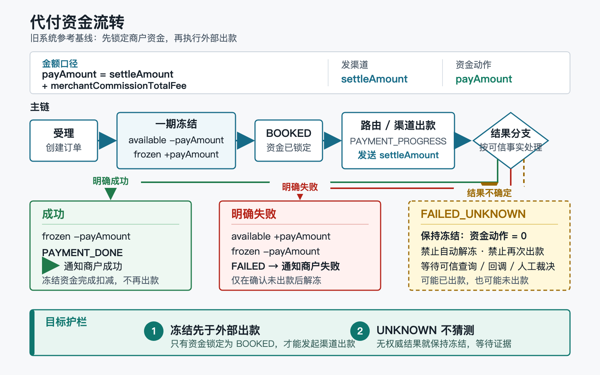

# 代付链路：产品与技术参考基线

## 0. 定位与一页结论

> 本文是旧系统 `cb-transcation` 的代付参考基线，不是 `payment-web-platform` 当前实现说明，也不表示旧实现已经被目标平台采纳。

证据标记：

- `CODE`：已由 `cb-transcation release-V2@4948fecc6afd57eaf57b44276756d60f3ac26698` 源码确认。
- `DOC`：来自旧系统基线文档、历史配置快照或业务说明，不能替代当前运行态证据。
- `TARGET`：目标平台必须满足的约束，不表示代码已经实现。
- `UNKNOWN`：当前没有生产数据库、运行配置、调度、日志或部署证据，不能下结论。

一页结论：

1. `CODE`：代付的产品本质是“商户委托平台向收款人出款”，平台先锁定商户资金，再调用银行或钱包渠道。
2. `CODE`：请求本金写入 `settleAmount`，商户手续费另计，`payAmount = settleAmount + merchantCommissionTotalFee`。
3. `CODE`：发给渠道的是 `settleAmount`；一期冻结、二期扣冻结和失败解冻使用 `payAmount`。
4. `CODE`：正常资金主线为“可用转冻结 -> 渠道出款 -> 成功扣冻结 / 明确失败解冻”。
5. `CODE`：`FAILED_UNKNOWN` 表示渠道可能已经出款，旧代码初次进入该状态时不解冻。
6. `CODE`：订单、共享账户、账簿、渠道 HTTP、MQ 和本地队列不在同一事务。
7. `CODE`：异步缓存日志和业务幂等键承担重试，但重复命中时没有完整校验金额、币种、账户和方向。
8. `CODE`：旧实现存在基于配置和错误文本把 `FAILED_UNKNOWN` 判失败并解冻的路径。
9. `TARGET`：目标平台必须把“不确定出款”建模为独立资金状态，未经权威证据不得自动解冻或再次出款。
10. `TARGET`：目标平台不得复制旧系统的跨库时序、文本启发式判定和提前返回完成态。

旧链路可以作为业务语义和迁移对照，但不能直接作为新系统设计模板。

### 图文速览

[](../../assets/payment-flows/payout-fund-flow.svg)

> 图中重点区分渠道出款金额 `settleAmount` 与商户资金动作金额 `payAmount`；`FAILED_UNKNOWN` 必须保持冻结，等待可信证据收敛。

## 1. 产品视角

### 1.1 用户与角色

| 角色 | 诉求 | 旧链路中的责任 |
| --- | --- | --- |
| 商户 | 批量或单笔向收款人付款 | 提交订单、提供收款信息、承担本金和手续费 |
| 收款人 | 在银行或钱包收到款项 | 不直接操作平台账户 |
| 渠道 | 执行外部出款并返回结果 | 同步受理、异步回调、状态查询 |
| 运营 | 处理异常单和人工判定 | 核对渠道请求、回调、订单和账户证据 |
| 财务 | 保证账实一致 | 核对冻结、扣冻结、解冻和账簿 |
| 客服/商户支持 | 向商户解释进度 | 只能展示事实，不得把处理中解释为最终失败 |

### 1.2 产品价值

- `CODE`：平台统一接入不同国家、银行和钱包渠道，屏蔽外部出款差异。
- `CODE`：路由、渠道账号、限额和失败切换用于提高出款可用性。
- `CODE`：冻结机制避免订单创建后商户继续消费同一笔余额。
- `TARGET`：产品价值必须建立在资金事实可证明、异常可恢复和状态可解释之上。

### 1.3 业务边界

本文只描述普通商户 API 代付，不包含：

- 代收及代收结算；
- 商户后台提现；
- USDT 链上提现；
- 代付成功后的内部冲正；
- 渠道外部退款；
- 事故人工调账。

`DOC`：这些业务都可能改变余额，但订单模型、审核、手续费、外部动作和恢复语义不同，不能合并成未经证明的“通用出金单”。

### 1.4 金额口径

| 字段 | 旧代付语义 | 使用位置 |
| --- | --- | --- |
| 请求金额 | 商户希望收款人收到的本金 | 受理输入 |
| `settleAmount` | 请求本金，不含商户手续费 | 发渠道金额 |
| `actualAmount` | 当前转换中与请求本金一致 | 订单记录 |
| `merchantCommissionTotalFee` | 比例手续费 + 固定手续费 | 商户成本 |
| `payAmount` | `settleAmount + merchantCommissionTotalFee` | 余额校验、冻结、扣冻结、解冻 |

`CODE`：`PaymentOrder.validate` 再次约束 `payAmount = settleAmount + merchantCommissionTotalFee`。

`TARGET`：新平台的金额对象必须同时携带币种、单位、scale、舍入规则和费用版本，不能只复用字段名。

## 2. 端到端流程

```mermaid
sequenceDiagram
    participant M as "商户"
    participant API as "代付接入"
    participant O as "分片订单"
    participant A as "共享账户"
    participant L as "商户账簿"
    participant R as "路由"
    participant C as "渠道"
    participant N as "商户通知"

    M->>API: "提交代付请求"
    API->>O: "校验并创建 PAYMENT_ACCEPTED"
    O->>A: "一期冻结 payAmount"
    A->>A: "available -= payAmount; frozen += payAmount"
    A->>L: "记录冻结账簿"
    A-->>O: "同步一期结果"
    O->>O: "推进 BOOKED"
    O->>R: "选择渠道账号"
    O->>O: "BOOKED -> PAYMENT_PROGRESS"
    R->>C: "newPayOut(settleAmount)"

    alt "渠道明确成功或后续成功回调"
        C-->>O: "受理成功 / 成功回调"
        O->>O: "CHANNEL_ACCEPTED -> PROMOTE_ACCEPTED"
        O->>A: "二期扣冻结 payAmount"
        A->>A: "frozen -= payAmount"
        A->>L: "记录成功账簿"
        A-->>O: "同步二期结果"
        O->>O: "推进 PAYMENT_DONE"
        O->>N: "发送成功通知"
    else "渠道明确失败"
        O->>A: "解冻 payAmount"
        A->>A: "frozen -= payAmount; available += payAmount"
        A->>L: "记录失败解冻账簿"
        A-->>O: "同步解冻结果"
        O->>O: "推进 FAILED"
        O->>N: "发送失败通知"
    else "渠道结果未知"
        O->>O: "推进 FAILED_UNKNOWN"
        Note over O,A: "保持冻结，等待可信成功或失败证据"
    end
```

`CODE`：渠道调用之前先把订单从 `BOOKED` 推到 `PAYMENT_PROGRESS`，避免正常重试再次直接出款。

`TARGET`：任何恢复流程都必须从已完成步骤继续，不能从接入入口重放整条链路。

## 3. 状态机

### 3.1 旧状态主干

```text
PAYMENT_ACCEPTED -> BOOKED / FAILED / BECONFIRMED
BECONFIRMED -> BOOKED / REJECT
BOOKED -> PAYMENT_PROGRESS / FAILED
PAYMENT_PROGRESS -> CHANNEL_ACCEPTED / PROMOTE_ACCEPTED / FAILED
                  -> FAILED_REFUNDING / FAILED_UNKNOWN
CHANNEL_ACCEPTED -> PROMOTE_ACCEPTED / PAYMENT_DONE / FAILED
PROMOTE_ACCEPTED -> PAYMENT_DONE
FAILED_REFUNDING -> FAILED
FAILED_UNKNOWN -> FAILED / PROMOTE_ACCEPTED
```

`CODE`：Java 枚举常量 `PROMOTE` 的外部业务值是 `PROMOTE_ACCEPTED`；阅读日志、接口和源码时需要区分常量名与持久化/展示值。

### 3.2 状态含义与不变量

| 状态 | 外部出款事实 | 资金事实 | 合法后续 |
| --- | --- | --- | --- |
| `PAYMENT_ACCEPTED` | 未发起 | 尚未冻结 | 冻结或拒绝 |
| `BOOKED` | 未发起 | 已冻结 `payAmount` | 路由和渠道执行 |
| `PAYMENT_PROGRESS` | 已发起或执行中 | 继续冻结 | 等同步/异步结果 |
| `CHANNEL_ACCEPTED` | 渠道已受理，未必最终成功 | 继续冻结 | 成功推进或明确失败 |
| `PROMOTE_ACCEPTED` | 系统接受成功信号 | 二期账务待完成 | 只执行扣冻结，不再出款 |
| `PAYMENT_DONE` | 成功 | 已扣冻结 | 终态、通知、对账 |
| `FAILED_REFUNDING` | 判定失败，解冻处理中 | 仍需核对 | 解冻成功后 `FAILED` |
| `FAILED` | 明确失败 | 已解冻或无需冻结 | 终态、通知、对账 |
| `FAILED_UNKNOWN` | 可能成功，也可能失败 | 必须保持冻结 | 可信成功或人工确认失败 |

`TARGET`：状态名必须表达“业务意图、外部事实、账务完成度”，不得用一个最终状态掩盖账务仍在队列中的事实。

## 4. 资金矩阵

下表变化量相对上一阶段，不是相对订单创建前的累计值。

| 业务阶段 | 可用余额 | 冻结余额 | 渠道金额 | 账簿语义 |
| --- | ---: | ---: | ---: | --- |
| 受理落单 | `0` | `0` | `0` | 只有订单意图 |
| 一期冻结成功 | `-payAmount` | `+payAmount` | `0` | 代付冻结/BOOKED |
| 渠道执行 | `0` | `0` | `settleAmount` | 渠道请求日志 |
| 成功二期 | `0` | `-payAmount` | 已出款 | 代付成功扣冻结 |
| 明确失败 | `+payAmount` | `-payAmount` | 确认未出款 | 代付失败解冻 |
| `FAILED_UNKNOWN` | `0` | `0` | 未知 | 不产生解冻账簿 |

业务级资金不变量：

```text
payAmount = settleAmount + merchantCommissionTotalFee
BOOKED => 恰有一次 payAmount 冻结
PAYMENT_DONE => 恰有一次 payAmount 扣冻结，且不得再次出款
FAILED => 已冻结订单恰有一次 payAmount 解冻
FAILED_UNKNOWN => 冻结保持不变
```

`TARGET`：不变量必须由数据库约束、状态 CAS、幂等载荷校验和对账共同保证，不能只依赖 Redis 锁。

## 5. 技术模块与调用链

`CODE`：主调用链如下。

| 阶段 | 入口与核心调用 | 落地事实 |
| --- | --- | --- |
| 受理 | `PaymentAcceptServiceImpl.accepted` -> `SinglePaymentServiceImpl.singlePayment` -> `PayOrderConvert` / `PaymentOrder.validate` | 校验、计算费用、保存订单和明细、提交后发送受理消息 |
| 一期冻结 | `SinglePaymentServiceImpl.singleAccounting(SinglePaymentOneArg)` -> `ExternalAccountServiceImpl` -> `FrozenAmountHandle` -> `SubAccountServiceImpl` | 账户缓存入队、锁子账户、可用转冻结、写账簿、`paymentBooked` 推进 `BOOKED` |
| 路由出款 | `SinglePaymentServiceImpl.singlePayment/prePayout` -> `PaymentOutServiceImpl` -> `channelClient.newPayOut` | 仅处理 `BOOKED`，先推进 `PAYMENT_PROGRESS`，渠道金额取 `settleAmount` |
| 结果分类 | `PaymentOutServiceImpl.doExecuteResult` -> `PaymentAcceptResultServiceImpl` | 同步结果分为受理、明确失败和未知 |
| 成功二期 | `PaymentPromotionResultServiceImpl.promotionAcceptedNew` -> `singleAccounting(SinglePaymentSecondArg)` -> `TransferOutHandle` | 推进 `PROMOTE_ACCEPTED`、扣冻结、写成功账簿、`paymentSuccess(AccountingResultSyncRequest)` 推进 `PAYMENT_DONE` |
| 失败解冻 | `PaymentAcceptResultServiceImpl.acceptFailed` -> `UnfrozenAmountHandle` -> `SubAccountServiceImpl` | 完整解冻 `payAmount`、写失败账簿、`paymentFailed(AccountingResultSyncRequest)` 推进 `FAILED` |

## 6. 三种结果语义

### 6.1 成功

`CODE`：同步渠道响应主要表示渠道受理；最终成功可通过异步回调进入公共推进。

成功闭环必须同时具备可信且绑定正确订单的渠道事实、唯一 `PROMOTE_ACCEPTED` 推进、唯一 `payAmount` 扣冻结、可追溯账簿和最终 `PAYMENT_DONE`；商户通知不得早于账务完成。

### 6.2 明确失败

`CODE`：明确失败会发起解冻，将完整 `payAmount` 从冻结退回可用，而不是调用渠道退款。

`DOC`：旧文档中“退款”有时只是内部解冻语义；它与成功代付后的内部冲正、渠道外部退款、事故调账不是同一业务。

### 6.3 `FAILED_UNKNOWN`

`CODE`：渠道调用异常、空结果或无法明确归类时，订单可进入 `FAILED_UNKNOWN`，初始处理不解冻。

正确理解：

- 它不是普通失败，也不证明渠道未出款；
- 不允许自动再次出款或仅因超时恢复余额；
- 可信成功回调可以继续推进成功；
- 只有权威失败证据或受控人工裁决才允许解冻。

`CODE`：旧定时任务的失败判定包含渠道请求/回调日志检查，也包含 `allowRefund` 配置兜底；失败入口还使用错误文本白名单或人工标识。

`DOC`：历史配置快照曾记录 `allowRefund=true`，但这不是当前实例生效证明。

`UNKNOWN`：当前生产有效配置、渠道响应样本、人工复核流程、双人审批、SLA 和误判恢复机制未核证。

## 7. 事务、幂等、队列与补偿

### 7.1 物理事务边界

| 边界 | 包含内容 | 不包含内容 |
| --- | --- | --- |
| 分片订单事务 | 订单、明细、状态 CAS | 共享账户、外部渠道 |
| 共享账户事务 | 子账户行锁、余额变化、账户事务日志 | 分片订单状态 |
| 账簿步骤 | 动账历史与前后余额 | 不能证明和订单同事务 |
| 外部边界 | 渠道 HTTP、回调、查询 | 本地事务原子性 |
| 消息边界 | RocketMQ、本地队列、定时扫描 | broker 与数据库原子提交 |

`CODE`：共享账户余额提交、账簿写入、分片订单状态同步是连续步骤，不是一个 ACID 事务。

### 7.2 幂等锚点

`CODE`：账户缓存日志按业务订单、商户、场景和国家构造业务锚点，并生成类似以下请求键：

```text
{orderId}_PAYMENT_ACCEPTED
{orderId}_PAYMENT_SUCCESS
{orderId}_PAYMENT_FAILED
```

`DOC`：测试库账户缓存表存在 `business_id + pay_type_scene + merchant_code + country_code`、`request_id` 和 `account_cache_log_id` 唯一约束。

`UNKNOWN`：生产全部物理分表是否具有同构约束未核证。

`CODE`：`AccountCacheLogRepositoryImpl` 遇唯一键冲突会返回既有记录，但不比较重复请求的金额、币种、账户和方向。

### 7.3 队列与恢复

- `CODE`：受理和两期账务可经过 MQ、本地队列与扫描任务；部分 MQ 异常被捕获，旧实现依赖本地兜底。
- `CODE`：账户缓存日志保留待处理状态，供后续扫描重试。
- `CODE`：`TransactionLogJob` 当前源码整体被注释，不能把其中的补偿逻辑视为在线能力。
- `UNKNOWN`：XXL-JOB 是否注册、执行频率、积压告警和人工重放流程未核证。

`TARGET`：新平台应使用持久 Outbox/Inbox、状态化恢复任务和可观测重试，不得让 JVM 内存队列成为资金恢复根。

## 8. 前端与运营关注

### 8.1 商户端展示

前端至少区分：

| 展示状态 | 可对商户表达的含义 | 不得表达 |
| --- | --- | --- |
| 已受理 | 平台收到请求 | 已出款 |
| 处理中 | 已冻结并正在路由/等待渠道 | 最终成功或失败 |
| 渠道已受理 | 渠道接受请求，等待终态 | 已到账 |
| 结果待确认 | 平台无法确认渠道终态 | 已退款、可安全重试 |
| 成功 | 渠道成功且平台账务完成 | 仅收到回调即可展示成功 |
| 失败 | 明确失败且应有资金解冻事实 | 单纯超时即失败 |

### 8.2 运营异常单

运营页面应同时展示订单/商户/渠道标识，本金、手续费、`payAmount`、币种，状态历史及来源，渠道请求/响应/回调/查询证据，冻结/扣冻结/解冻与账簿，配置版本、规则命中、操作人与复核人，以及下一安全动作和幂等键。

`TARGET`：`FAILED_UNKNOWN` 的人工结论必须使用结构化证据和双人复核，不能让操作员自由选择“成功/失败”按钮。

### 8.3 对账与告警

至少监控：

- 各中间态超时：未冻结、未发渠道、未扣冻结、未解冻；
- `FAILED_UNKNOWN` 的数量、金额、时长和渠道分布；
- 订单、账户缓存日志和账簿不一致；
- 同一渠道请求号或业务幂等键出现不同载荷。

## 9. 当前风险

| 风险 | 证据与可达影响 | 判定 |
| --- | --- | --- |
| `FAILED_UNKNOWN` 被错误解冻 | `CODE`：`SinglePaymentJob.isFailedOrder` 使用“渠道证据判失败或 `allowRefund`”；`PaymentAcceptResultServiceImpl.acceptFailed` 还依赖错误文本白名单或人工条件。若渠道实际已出款，解冻会形成“收款人到账、商户余额恢复”的双花。 | 条件可达 P0；是否现网触发为 `UNKNOWN` |
| 成功回调绑定不足 | `CODE`：`PaymentPromotionCheck` 的金额比较被注释；`PayOrderConvert` 对渠道流水号不一致主要记录日志后继续。错误成功信号可推进二期并按订单完整 `payAmount` 扣冻结。 | P1；入口认证与渠道契约为 `UNKNOWN` |
| 跨库一致性窗口 | `CODE`：共享账户、账簿和分片订单分别提交，事务日志补偿任务源码未启用。可形成“已冻结未 `BOOKED`”“已扣冻结未 `PAYMENT_DONE`”“已解冻仍为未知/受理态”。 | P1；线上能否稳定收敛为 `UNKNOWN` |
| DTO 提前完成 | `CODE`：`PaymentPromotionResultServiceImpl.promotionAcceptedNew` 只推进到 `PROMOTE_ACCEPTED` 并将二期入队，返回 DTO 却设置 `PAYMENT_DONE`。 | P1，外部状态领先资金事实 |
| `paymentingBalance` 陈旧 | `CODE`：一期冻结增加该字段，成功扣冻结和失败解冻未对称收口；`DOC`：旧 Web 读取它参与展示或判断。 | P1，不可作为在途、总资产或对账口径 |
| 幂等不验载荷 | `CODE`：重复账户缓存请求返回旧记录，不验证金额、币种、账户和方向。 | P1，目标应持久化请求摘要 |

## 10. 目标平台不得照搬

`TARGET`：以下规则是迁移与重构门禁：

1. 不照搬旧状态名；先分别建模订单意图、渠道事实和账务完成度。
2. 不把 `FAILED_UNKNOWN` 合并进普通失败，也不按固定超时自动解冻。
3. 不用渠道错误文本、配置开关或缺少日志作为唯一资金结论。
4. 不允许自动再次出款，除非能够证明第一次请求从未到达渠道并复用同一外部幂等键。
5. 不让成功回调绕过订单、渠道账号、请求号、金额、币种和当前状态绑定。
6. 不在二期账务完成前向调用方返回最终成功。
7. 不用 Redis 锁作为余额唯一保护；资金变化必须依赖数据库原子条件和持久幂等。
8. 不复用旧账户缓存“只看键、不验载荷”的行为。
9. 不让订单、余额和账簿之间的恢复依赖内存队列或未证明在线的定时任务。
10. 不把 `paymentingBalance`、`settleingBalance` 等旧辅助字段直接相加为总资产。
11. 不把失败解冻、成功后冲正、渠道退款和事故调账统称为退款。
12. 不直接复制旧系统国家分支和渠道特例；应隔离为版本化适配器和决策规则。

目标资金闭环至少满足：

```text
业务请求
+ 合法状态迁移
+ 余额原子变化
+ 唯一可追溯账簿
+ 可恢复外部副作用
+ 可验证对账与人工裁决
```

`TARGET`：订单、账簿和 Outbox 应在可控的一致性边界内提交；外部渠道动作通过持久事件驱动，并把不确定结果留给查询和人工裁决。

## 11. 证据与待确认

### 11.1 代码证据

以下路径相对旧源码仓库 `cb-transcation/` 根目录：

- `cb-paycore-business/src/main/java/org/cb/paycore/business/domain/service/impl/payment/PaymentAcceptServiceImpl.java`：`accepted`，代付受理编排。
- `cb-paycore-business/src/main/java/org/cb/paycore/business/domain/service/impl/payment/SinglePaymentServiceImpl.java`：`singlePayment`、`singleAccounting`、`paymentBooked`、`paymentSuccess`、`paymentFailed`。
- `cb-paycore-business/src/main/java/org/cb/paycore/business/common/converter/PayOrderConvert.java` 与 `cb-paycore-business/src/main/java/org/cb/paycore/business/domain/model/PaymentOrder.java`：金额转换、回调字段合并、`validate` 金额校验。
- `cb-paycore-business/src/main/java/org/cb/paycore/business/common/machine/PaymentOrderStatusMachine.java`：状态迁移表。
- `cb-paycore-business/src/main/java/org/cb/paycore/business/domain/service/impl/channel/PaymentOutServiceImpl.java`：渠道执行与 `doExecuteResult` 结果分类。
- `cb-paycore-business/src/main/java/org/cb/paycore/business/common/converter/TransactionDTOConvert.java`：渠道代付金额转换。
- `cb-paycore-business/src/main/java/org/cb/paycore/business/domain/service/impl/payment/PaymentAcceptResultServiceImpl.java` 与 `PaymentPromotionResultServiceImpl.java`：同步结果和回调推进。
- `cb-paycore-business/src/main/java/org/cb/paycore/business/common/check/PaymentPromotionCheck.java`：成功推进请求校验。
- `cb-paycore-business/src/main/java/org/cb/paycore/business/domain/service/impl/account/SubAccountServiceImpl.java`：冻结、解冻和扣冻结原语。
- `cb-paycore-business/src/main/java/org/cb/paycore/business/domain/service/impl/account/buffer/handle/FrozenAmountHandle.java`、`TransferOutHandle.java`、`UnfrozenAmountHandle.java`：冻结、成功扣冻结和失败解冻处理。
- `cb-paycore-business/src/main/java/org/cb/paycore/business/domain/repository/impl/AccountCacheLogRepositoryImpl.java`：缓存日志幂等保存。
- `cb-paycore-business/src/main/java/org/cb/paycore/business/domain/job/SinglePaymentJob.java`：未知单扫描与失败判定。
- `cb-paycore-business/src/main/java/org/cb/paycore/business/domain/job/TransactionLogJob.java`：当前被注释的事务日志补偿任务。

### 11.2 文档证据

`DOC`：本页综合以下旧系统基线，并以当前源码复核关键结论：

- `docs/ai-context/current-baseline/03-core-business-rules.md`
- `docs/ai-context/current-baseline/05-payout-flow.md`
- `docs/ai-context/current-baseline/06-ledger-and-settlement.md`

文档中的历史 Nacos、测试库 DDL 和负责人说明仍属于 `DOC`，不得升级为当前生产事实。

### 11.3 待确认清单

- `UNKNOWN`：生产实际部署 SHA 是否等于本次源码快照。
- `UNKNOWN`：`allowRefund`、失败文本白名单和渠道特例的当前有效配置及实例版本。
- `UNKNOWN`：全部生产分片的账户缓存与账簿唯一约束。
- `UNKNOWN`：RocketMQ、本地队列和 XXL-JOB 的启停、积压、重试与告警。
- `UNKNOWN`：各渠道成功、失败、受理和未知响应的正式契约与真实样本。
- `UNKNOWN`：回调入口的 IP 白名单、验签、防重放及网络暴露。
- `UNKNOWN`：`FAILED_UNKNOWN` 人工处置是否双人复核、是否强制证据清单、是否可审计。
- `UNKNOWN`：历史订单中是否存在已出款又解冻、已扣冻结未完成或陈旧 `paymentingBalance`。
- `UNKNOWN`：目标平台最终采用的支付聚合、账簿、Outbox 和人工裁决领域模型。

在上述运行事实和目标决策完成前，本页只能用于理解旧业务、设计迁移校验和建立风险测试，不能作为新平台已实现能力的证明。
