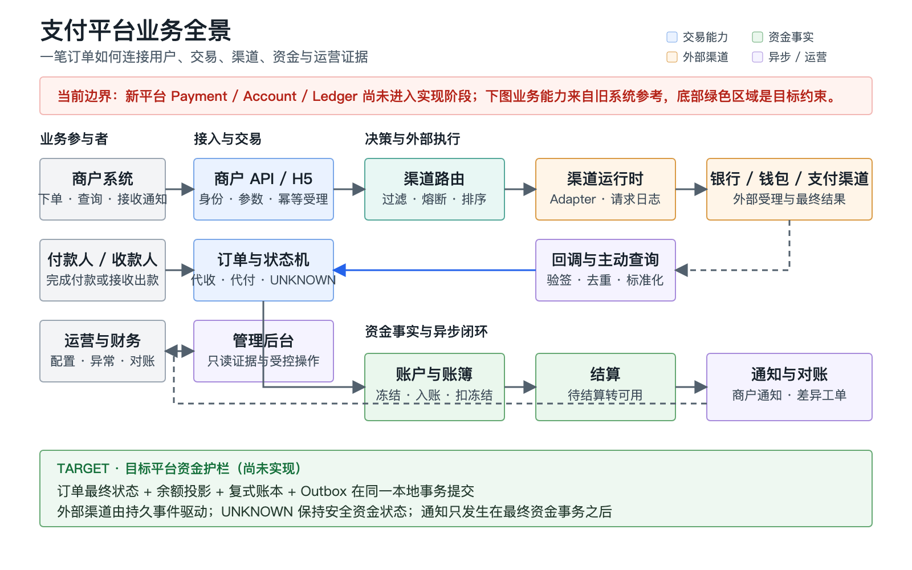
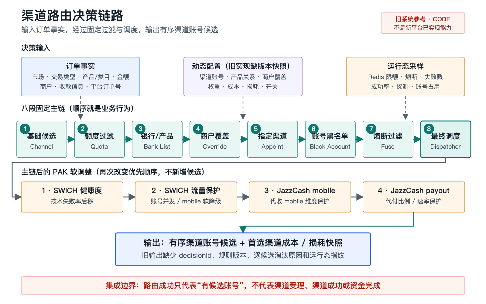

# 渠道路由链路：产品与技术参考基线

## 0. 定位与一页结论

> [!WARNING]
> 本文描述的是旧支付系统在固定源码快照下的参考行为，用于提炼业务资产、迁移样本和风险边界。
> 它不是 Payment Web Platform 当前已经实现的能力，也不是新平台可直接照搬的目标设计。

本文统一使用以下证据标签：

- `CODE`：由本文第 12 节固定 SHA 的源码直接确认。
- `DOC`：由旧系统现状文档确认；其中运行态快照只在其采样时间有效。
- `TARGET`：目标架构要求，尚不能写成当前实现事实。
- `UNKNOWN`：静态源码和现有文档无法确认，需要运行态、数据或负责人补证。

一页结论：

1. `DOC`：旧系统路由不是 `payProductCode -> channelCode` 的静态映射，而是根据订单、商户、市场、渠道账号、限额、黑名单、熔断、成功率、成本和配置开关生成有序候选账号。
2. `CODE`：代收和代付都由 `cb-transcation` 组装路由请求，通过 `ChannelRouteFacade.route` 调用 `cb-channel`；路由结果再交给渠道 Adapter 执行。
3. `CODE`：核心处理器链顺序是基础候选、限额、银行/产品、商户覆盖、指定渠道、收款账号黑名单、熔断、调度；当前 SHA 还在主链之后增加四个 PAK 软调整器。
4. `CODE`：旧输出是“有序渠道账号候选 + 首选渠道成本/损耗快照”，缺少目标平台要求的 `decisionId`、规则版本和逐候选淘汰原因。
5. `CODE`：找到渠道只证明路由阶段成功；渠道请求可能超时，回调可能重复或不可信，订单与账务仍可能处于 `UNKNOWN` 或待人工处理状态。
6. `TARGET`：新平台应保留旧系统多维路由能力，但必须改造成可解释、版本化、可影子比对、默认 fail-closed 的 Routing Decision。

### 平台全景

[](../../assets/payment-flows/platform-payment-panorama.svg)

> 全景图用于新人先建立“订单、路由、渠道、资金、通知与对账”的共同坐标；图中旧系统业务能力与目标平台约束已明确分区。

## 1. 产品视角

### 1.1 为什么路由是平台亮点

`DOC`：路由把多个市场、支付产品和渠道账号组织成统一决策能力。它解决的不是“调用哪个接口”，而是“在当前订单约束和运行状态下，哪个具体渠道账号更适合被尝试”。

产品价值包括：

- 多渠道承接：同一产品可以保留多个候选，降低对单一供应商的依赖。
- 可用性治理：限额、账号状态、熔断和技术健康度可影响候选与排序。
- 商户差异化：支持商户级强制渠道、黑名单、白名单和特殊产品规则。
- 成本治理：候选可携带渠道成本、商户手续费和损耗信息，支持避免亏损排序。
- 市场适配：PAK、BRA、PHL 等市场可在统一主链上叠加必要的本地规则。
- 运营干预：在不修改订单产品的前提下，通过受控配置改变候选范围或优先级。

`UNKNOWN`：这些机制对真实成功率、成本或收入的实际提升幅度，当前没有由 A/B、shadow 或财务报表给出的可归因数据，不能写成已实现收益。

### 1.2 面向用户的价值

对商户和付款人，路由的价值应表现为：

- 更高的可受理概率，而不是暴露复杂的渠道选择过程。
- 渠道异常时有明确的处理中、失败或未知结果，而不是虚假成功。
- 同一订单不会因重试而重复出款或重复入账。
- 订单、渠道请求、回调、通知和账务可以关联查询。

对平台运营，路由的价值应表现为：

- 能解释某笔订单为什么选择或淘汰某个渠道账号。
- 能按市场、商户、产品和时间版本回放当时规则。
- 能在切流前比较新旧决策差异，并在异常时快速回滚规则。
- 能区分业务失败、渠道技术故障、平台依赖故障和结果未知。

### 1.3 非目标

路由不负责：

- 决定 H5 收银台向用户展示什么产品。
- 重新解释商户下单时已经确定的订单产品。
- 直接调用外部渠道或解析所有渠道私有协议。
- 证明外部渠道已受理、已成功或资金已完成。
- 替代订单状态机、账本、回调认证、商户通知和对账。
- 仅以“最低成本”覆盖限额、健康度、商户约束和资金安全。

## 2. 核心概念

`DOC`：以下概念值可能相似，但所有权和用途不同，前端字段、接口 DTO 和数据库模型都不能合并处理。

| 概念 | 旧系统代表字段 | 用途 | 关键边界 |
| --- | --- | --- | --- |
| 订单产品 | `payProductCode` | 商户下单和订单事实 | PAK 代收产品由订单决定，收银台不得重写 |
| 费率产品 | 商户产品费率配置中的产品维度 | 计算商户费率或归集 | 可能是类目级口径，不等于具体渠道产品 |
| 支付类目 | `payCategoryCode` | BANK、WALLET 等能力归类 | 是路由过滤维度之一，不是最终渠道 |
| 渠道 | `channelCode` | 供应商或 Adapter 类型 | 一个渠道可有多个独立账号 |
| 渠道账号 | `channelAlias`、账号配置 ID | 真实可启停、限额和分流单元 | 路由最终候选必须落到账号级 |
| 展示产品 | 收银台 `content_json` 等展示配置 | 用户界面和交互 | 不是最终可路由渠道的权威来源 |

`DOC`：关系通常是“市场 -> 交易类型 -> 类目 -> 订单产品 -> 多个渠道账号”，但它不是固定树；商户覆盖、限额、黑名单和实时健康状态会继续缩小或重排候选。

`TARGET`：新平台应分别建模 `OrderProduct`、`PricingProduct`、`PaymentCategory`、`ChannelCapability`、`ChannelAccount` 和 `CashierDisplayProduct`，通过显式映射连接，不复用一个含义模糊的产品码。

## 3. 端到端流程

```mermaid
flowchart LR
    ORDER["代收/代付订单事实"] --> CONVERT["ChannelRouteConvert 组装路由请求"]
    CONVERT --> FACADE["ChannelRouteFacade.route"]
    FACADE --> SESSION["RouterSessionInfo 决策会话"]

    CONFIG["渠道/账号/商户/产品配置"] --> SESSION
    RUNTIME["Redis 限额/熔断/健康/失败运行态"] --> SESSION
    SESSION --> CHAIN["八段处理器链"]
    CHAIN --> GUARD["PAK 后置软调整"]
    GUARD --> DECISION["有序渠道账号候选与成本快照"]

    DECISION --> EXEC["PaymentOutService 或 CollectionInService"]
    EXEC --> LOG["初始化 fin_channel_request_log"]
    LOG --> ADAPTER["ChannelMsController 选择渠道 Adapter"]
    ADAPTER --> PROVIDER["外部支付渠道"]
    PROVIDER --> RESPONSE["同步响应标准化"]

    PROVIDER --> CALLBACK["ChannelNotifyController 回调入口"]
    CALLBACK --> VERIFY["解析、认证、去重与标准化"]
    VERIFY --> PROMOTE["PaymentPromotionFacade 推进订单与资金"]
    PROMOTE --> NOTIFY["商户通知"]
    PROMOTE --> RECON["订单、渠道、账本与通知对账"]
```



必须按四个阶段理解结果：

1. 路由成功：存在可执行候选账号。
2. 渠道受理：Adapter 已发请求并得到可解释响应。
3. 渠道结果：可信同步响应、回调或主动查询得到明确结果。
4. 资金完成：订单合法迁移，账务动作和账簿均已完成。

前一阶段成功不能替代后一阶段证据。

## 4. 输入、输出与决策快照

### 4.1 旧系统输入

`CODE`：`ChannelRouteConvert.modelToRequest` 和 `ChannelRouteRequest` 形成以下主要输入：

| 输入 | 代收 | 代付 | 决策意义 |
| --- | --- | --- | --- |
| 平台订单号 | `tPayOrderId` | `tPayOrderId` | 日志和问题追踪 |
| 市场 | `country` | `country` | 市场规则、币种和渠道能力 |
| 交易类型 | `COLLECTION` | `PAYMENT` | 选择不同能力与资金语义 |
| 类目/产品 | 订单类目、订单产品 | 订单类目、订单产品 | 渠道产品匹配 |
| 金额 | `payAmount` | `settleAmount` | 单笔/累计限额与渠道成本 |
| 商户手续费 | 商户佣金总费 | 商户佣金总费 | 损耗规避快照 |
| 收款信息 | 账号、账户类型 | 账号、账户类型 | 银行/钱包能力与黑名单 |
| 商户 | `merchantCode` | `merchantCode` | 商户覆盖、黑白名单和权重 |
| 市场扩展 | PAK mobile 摘要、CNIC、referer 等 | CNIC、新用户标签等 | 市场特有保护规则 |

`CODE`：代收 PAK mobile 仅向路由传 SHA-256 摘要，不传明文手机号；这是旧代码的局部数据最小化措施，不代表所有路由扩展字段均已完成敏感数据治理。

### 4.2 旧系统输出

`CODE`：`ChannelRouteDTO` 输出：

- 有序 `SysCartBankAccountConfDTO` 列表；首项由交易侧优先执行。
- 渠道码、渠道别名、账号配置 ID、产品/类目/交易类型和 Adapter 参数。
- 每个候选的 `channelCost`、`lossAmount`、`lossAvoidMode`。
- 顶层首选渠道的商户手续费、渠道成本、损耗和损耗规避模式。

`CODE`：交易侧在执行前把选中 `channelCode/channelAlias` 写回订单模型，并把渠道成本、损耗和规避模式写入字段或 `ext`，用于订单详情和排查。

### 4.3 快照缺口

| 能力 | 旧系统固定 SHA | 目标要求 |
| --- | --- | --- |
| 决策唯一 ID | `UNKNOWN`：未在路由输出发现 | `decisionId` |
| 规则版本 | 未包含在 `ChannelRouteDTO` | `ruleVersion` 与配置版本 |
| 完整候选 | 返回当次有序候选 | 持久化候选及其稳定标识 |
| 淘汰原因 | 主要散落在日志和错误码 | 每个候选的结构化 `rejectedReasons` |
| 决策时间 | 未包含在输出 DTO | `decidedAt` |
| 运行态版本 | 未包含 Redis/Nacos/成功率采样版本 | 可重放的输入与采样指纹 |

`TARGET`：完整 Routing Decision 必须作为订单证据链的一部分持久化，不能只依赖易丢失、难聚合的应用日志。

## 5. 处理器链及顺序

[](../../assets/payment-flows/channel-routing-flow.svg)

> 图中八段固定主链和四个 PAK 后置调整器均按当前固定源码快照排序；路由成功只代表产生候选账号，不代表渠道受理或资金完成。

### 5.1 固定主链

`CODE`：`ProcessorBus.init` 在当前 SHA 明确按以下顺序构造链：

```text
ChannelProcessor
  -> ChannelQuotaProcessor
  -> ChannelBankListProcessor
  -> MerchantRoutingOverrideProcessor
  -> ChannelAppointProcessor
  -> BlackAccountProcessor
  -> ChannelFuseProcessor
  -> DispatcherProcessor
```

| 顺序 | 处理器 | 当前职责 | 空候选语义 |
| --- | --- | --- | --- |
| 1 | `ChannelProcessor` | 取得市场/类型/类目的基础账号，处理测试渠道和市场特例 | 抛无可用渠道错误 |
| 2 | `ChannelQuotaProcessor` | 过滤日限额、单笔上下限等 | 抛额度过滤后无渠道 |
| 3 | `ChannelBankListProcessor` | 校验银行、订单产品和账号支持关系 | 抛产品/银行过滤后无渠道 |
| 4 | `MerchantRoutingOverrideProcessor` | 先强制指定，再应用黑名单；黑名单优先 | 抛商户覆盖后无渠道 |
| 5 | `ChannelAppointProcessor` | 兼容原有指定商户/渠道/产品规则 | 受指定渠道兜底开关影响 |
| 6 | `BlackAccountProcessor` | 代付按收款账号排除风险渠道 | 抛账号过滤后无渠道 |
| 7 | `ChannelFuseProcessor` | 根据熔断、失败数、token 等过滤或标记探测 | 可进入全熔断/探测逻辑 |
| 8 | `DispatcherProcessor` | 对剩余账号排序、随机、探测、白名单、损耗和账号去重 | 形成最终有序候选 |

顺序是业务行为：前一步决定后一步能看到的候选集合。交换“商户指定”和“黑名单”、把调度提前到熔断之前，都会改变实际流量与资金风险，不能按代码重构处理。

### 5.2 Dispatcher 内部顺序

`CODE`：当前 `DispatcherProcessor.doProcess` 的主要次序是：

1. 按成功率、时效、成本等评分模型排序。
2. 按配置执行结果随机或权重随机。
3. 处理熔断渠道探测流量。
4. 处理大额交易优先级。
5. 处理商户白名单渠道。
6. 按近期失败笔数调整优先级。
7. 执行损耗规避：有非亏损候选时将亏损候选移到队尾，不删除候选。
8. 多子账号去重。
9. 执行 PAK JazzCash 代收严格比例调度。
10. 记录最终渠道别名顺序；部分 PHL StarPay 代付写入短期防重复缓存。

`CODE`：损耗规避异常时记录 `NOT_APPLICABLE` 并保留原路由；渠道成本配置缺失时按 0 成本继续。这是旧系统可用性优先的行为，不自动等于目标平台接受的资金风险策略。

### 5.3 主链后的 PAK 调整

`CODE`：`ChannelRouteServiceImpl.route` 在处理器链结束后依次执行：

1. `PakSwichPayInHealthMonitor.adjust`：按分钟窗口技术失败率将异常 SWICH 账号后移。
2. `PakSwichPayInTrafficGuard.adjust`：对 SWICH Easypaisa 代收执行账号并发/mobile 保护和软降级。
3. `PakJazzCashPayInMobileGuard.adjust`：对 JazzCash 代收 mobile 维度做软保护。
4. `PakJazzCashPayOutRateGuard.adjust`：对 JazzCash 代付比例或速率做软保护。

这些调整发生在 `DispatcherProcessor` 已生成排序之后，并会同步首选渠道的成本/损耗快照。修改其相对顺序同样是业务变更。

## 6. 技术模块与调用链

### 6.1 进程和模块组合

| 边界 | 旧系统模块 | 职责 |
| --- | --- | --- |
| 交易编排进程 | `cb-transcation-business` 内嵌 `cb-paycore-business` | 订单受理、资金前置、组装路由请求、消费路由结果 |
| 渠道进程 | `cb-channel-business` 内嵌 `cb-financial-business` 与 `cb-financial-core-business` | 路由、渠道请求日志、Adapter 调用和结果标准化 |
| 回调进程 | `cb-channel-notify` 内嵌 `cb-notify-business` | 公网回调入口、认证/解析、通知日志和结果推进 |

`DOC`：模块名和部署边界不是一一对应。旧系统“路由模块”和“渠道执行模块”在代码上分层，但当前打包关系把它们组合进渠道进程。

### 6.2 代付调用链

```text
SinglePaymentServiceImpl.singlePayment
  -> PaymentOutServiceImpl.channelRouting
  -> ChannelRouteConvert.modelToRequest
  -> ChannelRouteFacade.route
  -> ChannelRouteFacadeImpl.route
  -> ChannelRouteServiceImpl.route
  -> ProcessorBus.processorChain.process
  -> PaymentOutServiceImpl.payOut / doExecutePayout
  -> ChannelClient.newPayOut
  -> ChannelMsController.newPayOut
  -> ChannelMsNewProcess.initRequestLog
  -> ${channelCode}_CHANNEL Adapter.payOut
  -> ChannelMsNewProcess.requestLogReceived
  -> PaymentOutServiceImpl.doExecuteResult
```

### 6.3 代收调用链

```text
SingleCollectionServiceImpl.singleCollection
  -> CollectionInServiceImpl.channelRouting
  -> ChannelRouteConvert.modelToRequest
  -> ChannelRouteFacade.route
  -> ChannelRouteServiceImpl.route
  -> ProcessorBus.processorChain.process
  -> CollectionInServiceImpl.payIn / doExecutePayIn
  -> ChannelClient.newPayIn
  -> ChannelMsController.newPayIn
  -> ChannelMsNewProcess.initRequestLog
  -> ${channelCode}_CHANNEL Adapter.payIn
  -> ChannelMsNewProcess.requestLogReceived
  -> CollectionInServiceImpl.doExecuteResult
```

`CODE`：交易侧路由异常会再调用一次 `route`；渠道请求日志初始化若命中重复键返回幂等错误；渠道空响应先标准化为超时/未知，不能直接当成功。

## 7. 运行态依赖与配置边界

| 依赖 | 决策用途 | 故障时不能默认假设 |
| --- | --- | --- |
| MySQL/Mapper 配置 | 渠道、账号、产品、商户覆盖、权重、损耗配置 | 不能假设缓存值仍与数据库一致 |
| Redis | 限额、失败数、熔断、探测、成功率、mobile/账号保护 | 不能默认“读不到就是无限额/健康/未占用” |
| Nacos | 路由开关、阈值、白名单、国家和灰度规则 | 不能默认所有实例同版本同时生效 |
| Feign/服务发现 | transaction 调 route、route 查业务配置、notify 推进交易 | 网络失败与业务无渠道必须区分 |
| 渠道 Adapter | 外部签名、协议、超时和错误映射 | 同步超时不等于渠道失败 |
| 回调与主动查询 | 确认外部最终结果 | 回调缺失不等于交易失败 |

`CODE`：`cb-channel-business/src/main/resources/prod/application.yml` 设置 Nacos import 的 `refresh-enabled: false`。

`DOC`：旧系统同时存在自定义 `NacosListenerConfig -> LoadNacosData -> NacosDataAspect` 动态读取链；监听只覆盖主 dataId，删除键不会清除旧缓存，共享 dataId 也未统一覆盖。

因此必须区分：

- 配置中心发布版本。
- 每个实例监听到的版本。
- 每次路由实际读取的规则和运行态采样。
- 订单最终持久化的决策快照。

`UNKNOWN`：本文未访问当前 Nacos、Redis、数据库、注册中心和运行实例，无法确认现网启用哪些规则、各实例是否一致、某一订单当时的真实候选顺序。

## 8. 降级、幂等、回调与对账

### 8.1 降级和结果未知

- `CODE`：交易侧路由调用异常会重试一次；仍失败则返回路由错误，而不是制造默认渠道。
- `CODE`：PAK 后置 guard 和损耗规避属于软排序增强，内部异常通常保留原有候选顺序。
- `CODE`：渠道同步响应为空或无法映射为明确失败时进入未知处理，而不是自动解冻或自动入账。
- `TARGET`：资金执行关键依赖失败应 fail-closed；只有明确标为非资金、非权威的展示或排序增强才允许降级。
- `TARGET`：`FAILED_UNKNOWN/UNKNOWN` 必须保持待确认资金状态，通过查询、回调、人工处理和对账闭环。

### 8.2 幂等锚点

`CODE/DOC`：旧链路至少使用以下锚点：

- 商户订单号和平台订单号：订单创建与追踪。
- `fin_channel_request_log`：渠道请求；重复插入映射为 `DUPLICATE_KEY_EXCEPTION`。
- `fin_channel_notify_log`：渠道回调；重复记录和已 `END` 记录用于短路。
- `cartbankRequestChannelNo`、`txId`、`endToEndId`：订单、渠道请求与回调关联。
- Redis 锁和短期 key：队列、点击、探测或临时并发保护。

`TARGET`：Redis 只能优化并发，不能替代数据库唯一键、Inbox、状态 CAS 和账务幂等。路由重试、渠道重试、重复回调、主动查询、人工补单必须落到同一业务幂等语义。

### 8.3 回调可信度

`CODE`：当前通知链会解析来源、补充渠道账号、执行部分渠道专用验签/解密、初始化回调日志，再调用 `PaymentPromotionFacade` 推进代收或代付结果。

`DOC`：旧系统仍存在跳过 IP 或因请求头进入主动推进分支等认证偏差；配置名 `notifyVerifySignChannels` 也不能证明列表内外所有渠道都完成统一验签。

`TARGET`：回调必须使用路由绑定的渠道配置验签，并校验可信来源、平台请求号、渠道订单号、订单、金额、币种和当前状态；请求参数不得决定是否验签。

### 8.4 对账证据链

每笔订单至少应能串起：

```text
merchantOrderNo
  -> tPayOrderId
  -> routingDecisionId / 旧路由候选快照
  -> cartbankRequestChannelNo
  -> channelCode + channelAlias
  -> txId / endToEndId / channelOrderNo
  -> channel request log
  -> channel notify log / proactive query
  -> order state history
  -> ledger journal
  -> merchant notify log
  -> reconciliation case
```

`UNKNOWN`：旧系统能否对所有历史订单完整串起上述对象，尚无生产数据抽样和对账报告证明。

## 9. 前端与运营关注

### 9.1 订单详情应展示

`TARGET`：平台运营端应以只读方式展示：

- 决策 ID、规则版本、决策时间和触发来源。
- 市场、交易类型、订单产品、类目、金额和币种。
- 选中渠道与账号别名，以及是否来自强制指定、白名单、探测或降级。
- 候选账号、排序、结构化淘汰原因和关键运行态采样。
- 商户手续费、渠道成本、损耗和采用的成本规则版本。
- 渠道请求、同步响应、回调、主动查询、订单状态和账务状态。
- 当前是否处于 `UNKNOWN`，下一处理人、SLA 和恢复动作。

商户端只应看到自身订单和可公开结果，不暴露渠道密钥、账号参数、内部失败阈值、其他商户规则或原始敏感回调。

### 9.2 配置与变更界面

`TARGET`：路由运营界面至少需要：

- 草稿、复核、发布、回滚和生效时间。
- 市场、商户、产品、渠道账号的精确作用域。
- 变更前后的候选与命中率模拟。
- shadow 差异、空候选率、`UNKNOWN`、成功率和损耗指标。
- 谁申请、谁批准、发布到哪些实例、何时回滚的审计记录。

`TARGET`：已经向外部渠道发起请求的订单不得由普通前端“重新路由”。任何换渠道或重放必须先判断外部副作用是否已发生，并走受控恢复流程。

### 9.3 前端文案边界

- “已找到渠道”只能表示路由完成，不能显示“支付成功”。
- “渠道已受理”不能显示“资金已到账/已扣款”。
- “处理中/结果未知”必须与“明确失败”区分。
- 费率产品、订单产品、渠道产品和展示产品必须使用不同标签。
- 运营错误应显示稳定错误分类和关联 ID，不直接展示原始密钥、签名或完整报文。

## 10. 当前风险

### 10.1 候选列表并发修改

`CODE/P1`：`ChannelProcessor.doProcess` 在 PAK 无 CNIC 和 merchant referer 黑名单分支中，使用增强 `for` 遍历 `availableChannels` 的同时对同一列表调用 `removeIf`。这可能抛 `ConcurrentModificationException`，使特定订单从“稳定过滤”变成整次路由失败。

### 10.2 锁异常 fail-open

`CODE/P1`：`SinglePaymentServiceImpl.payoutByQueue` 获取 Redis 锁异常时把 `isLock` 设为 `null`，随后 `null == isLock || isLock` 仍调用 `prePayout`。这会绕过渠道账号级串行控制，使不同订单可能并发调用同一账号，扩大渠道限流、失败和结果未知风险。同一订单仍经过数据库锁和 `BOOKED -> PAYMENT_PROGRESS` 条件推进，不能仅凭该锁异常推导同单重复出款。

### 10.3 配置刷新不一致

`DOC/P1`：原生 Nacos refresh 关闭，但自定义 listener/getter cache 只覆盖部分 dataId，删除键不清理旧缓存。集群实例可能在同一时刻使用不同规则，且旧输出没有规则版本，事后难以重放。

### 10.4 集成护栏：路由成功不等于资金成功

`TARGET/P2`：路由结果仅提供候选账号；外部调用、同步响应、回调可信度、状态推进和账务仍是后续独立边界。当前代收、代付代码在路由后仍继续进入渠道执行，未发现把路由成功直接映射为资金成功的可达路径。本条是新接口和前端联调必须保持的设计护栏，不是旧代码已触发的资金故障。

## 11. 目标平台约束

以下均为 `TARGET`，不是当前实现声明：

1. 可解释决策：每个候选都有保留/淘汰原因，首选结果能回答“为什么”。
2. 版本化规则：路由、产品能力、限额、费率和成本是带审核、生效时间和回滚点的业务数据。
3. 决策快照：订单持久化 `decisionId`、规则版本、候选、拒绝原因、运行态指纹和时间。
4. Shadow 发布：新规则先只读计算，逐单比较旧结果；差异未达阈值前不切真实流量。
5. Fail-closed：资金关键依赖、锁、权限、幂等或规则版本不可用时停止资金动作并可恢复。
6. 明确 UNKNOWN：外部结果不确定时不自动释放冻结、不伪造失败或成功。
7. Adapter 隔离：路由只选能力和账号，渠道协议、签名、加密和错误码留在 Channel Runtime。
8. 可信回调：回调先持久化、验签、去重和标准化，再以 Inbox/CAS 推进资金事务。
9. 订单级证据链：路由、渠道请求、回调、状态、账本、通知和对账共享稳定关联 ID。
10. 服务端授权：路由配置、强制渠道、重放和恢复动作必须按租户、市场、商户和资金权限校验并审计。
11. 配置面与基础设施分离：Nacos 可保存基础设施参数，不直接承载无版本、无审核的资金规则。
12. 观测与回滚：按市场/产品/渠道观测空候选率、成功率、延迟、UNKNOWN 和损耗；规则回滚不假设能撤销已发生的渠道副作用。

## 12. 证据与待确认

### 12.1 固定源码快照

| 仓库 | SHA | 本文使用范围 |
| --- | --- | --- |
| `cb-channel` | `782c8ea46573eea7f18599af01670e391da99aa0` | 路由、渠道执行、请求日志和运行态 guard |
| `cb-transcation` | `4948fecc6afd57eaf57b44276756d60f3ac26698` | 代收/代付调用、路由输入、结果处理和锁风险 |
| `cb-notify` | `8f89457cf806eb95264bb9734c14a342b96b23be` | 回调入口、认证/解析、幂等日志和结果推进 |

`CODE`：校验时三个仓库 HEAD 与上表完整 SHA 一致。`cb-channel-business/src/test/java/productTest.java` 存在用户工作区修改，本文只读忽略，未作为证据。

### 12.2 关键代码证据

- `cb-channel-business-open/src/main/java/org/cb/channel/business/open/request/ChannelRouteRequest.java`：旧路由请求字段。
- `cb-channel-business-open/src/main/java/org/cb/channel/business/open/response/ChannelRouteDTO.java`：旧路由输出与成本快照。
- `cb-financial-business/src/main/java/org/cb/financial/business/domain/context/ProcessorBus.java#init`：八段处理器顺序。
- `cb-financial-business/src/main/java/org/cb/financial/business/domain/service/impl/ChannelRouteServiceImpl.java#route`：主链和 PAK 后置调整。
- `cb-financial-business/src/main/java/org/cb/financial/business/domain/processor/ChannelProcessor.java#doProcess`：基础候选、市场规则和并发修改风险。
- `cb-financial-business/src/main/java/org/cb/financial/business/domain/processor/DispatcherProcessor.java#doProcess`：评分、随机、探测、白名单、损耗和去重顺序。
- `cb-financial-business/src/main/java/org/cb/financial/business/domain/service/impl/RouteLossAvoidServiceImpl.java#adjustWeight`：成本、损耗与异常降级。
- `cb-paycore-business/src/main/java/org/cb/paycore/business/common/converter/ChannelRouteConvert.java#modelToRequest`：代收/代付输入差异。
- `cb-paycore-business/src/main/java/org/cb/paycore/business/domain/service/impl/channel/PaymentOutServiceImpl.java`：代付路由、渠道请求与同步结果。
- `cb-paycore-business/src/main/java/org/cb/paycore/business/domain/service/impl/channel/CollectionInServiceImpl.java`：代收路由、渠道请求与同步结果。
- `cb-paycore-business/src/main/java/org/cb/paycore/business/domain/service/impl/payment/SinglePaymentServiceImpl.java#payoutByQueue`：Redis 锁异常后继续执行风险。
- `cb-channel-business/src/main/java/org/cb/channel/business/ms/ChannelMsController.java#newPayIn`：请求日志、Adapter 选择和调用。
- `cb-channel-business/src/main/java/org/cb/channel/business/ms/ChannelMsNewProcess.java`：请求日志初始化、响应标准化和超时语义。
- `cb-channel-notify/src/main/java/org/cb/channel/notify/switched/ChannelNotifyNewProcess.java#notifyOrderNew`：回调预处理和渠道账号补充。
- `cb-notify-business/src/main/java/org/cb/notify/business/domain/service/impl/ChannelNotifyServiceImpl.java#notify`：解析、日志、去重与结果推进。

### 12.3 文档证据

- `docs/ai-context/current-baseline/07-channel-routing.md`：旧路由、Nacos 快照、刷新机制和已知风险。
- `docs/ai-context/current-baseline/03-core-business-rules.md`：金额、状态、回调、幂等、降级和资金规则。
- `docs/ai-context/current-baseline/09-system-architecture.md`：旧系统进程组合、同步/异步边界和证据限制。
- `docs/ai-context/ai-business/channel-flow.md`：产品/类目/渠道关系、请求、响应、回调、重试和监控。
- `docs/new-payment-system-target-architecture.md`：目标 Routing Decision、Adapter、shadow、版本化和 fail-closed 约束。

### 12.4 待确认

> [!NOTE]
> 以下均为 `UNKNOWN`，未确认前不能转写成产品承诺或实现需求的默认值。

1. 生产镜像是否部署本文三个 SHA，以及流量是否全部进入新路由入口。
2. 当前每个市场、产品和商户实际启用的渠道账号与规则版本。
3. Nacos 发布后各实例的监听、缓存版本和删除键行为。
4. Redis 限额、熔断、成功率、失败数和账号占用的权威来源与恢复策略。
5. 每个渠道同步错误码是否允许换渠道、退款、查询或必须人工介入。
6. 所有回调入口的公网暴露、IP 策略、验签覆盖、金额/币种校验和密钥绑定。
7. 旧系统是否持久化完整候选、淘汰原因和规则版本，或仅保留日志及部分 `ext`。
8. 订单、渠道请求、回调、账本、通知和对账在生产数据中的完整关联率。
9. 路由策略对成功率、成本、损耗和 `UNKNOWN` 的真实增量效果。
10. 新平台首期市场、产品、渠道、容量与 shadow 差异阈值。
