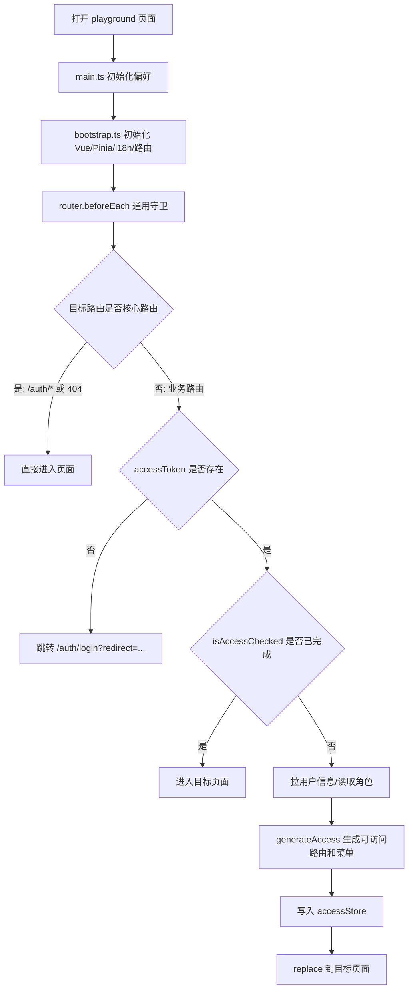
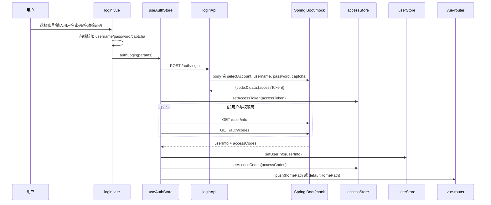
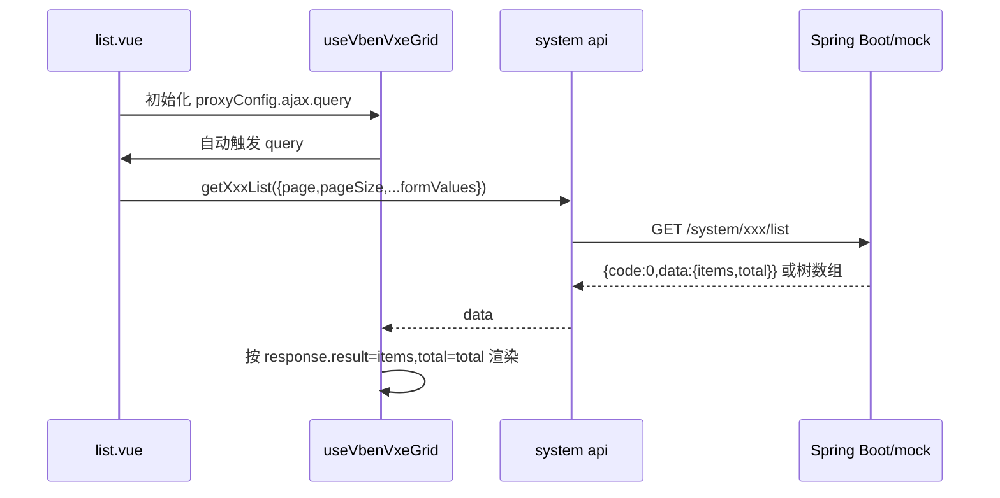
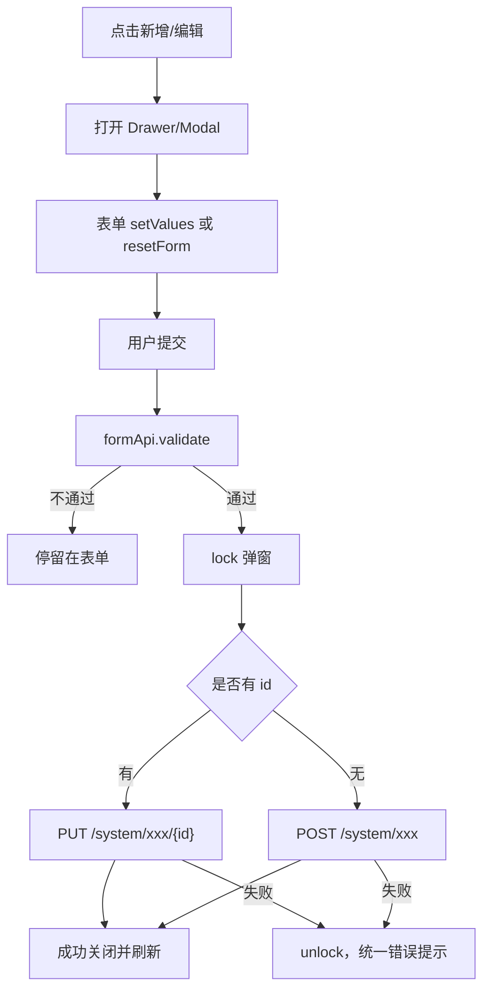
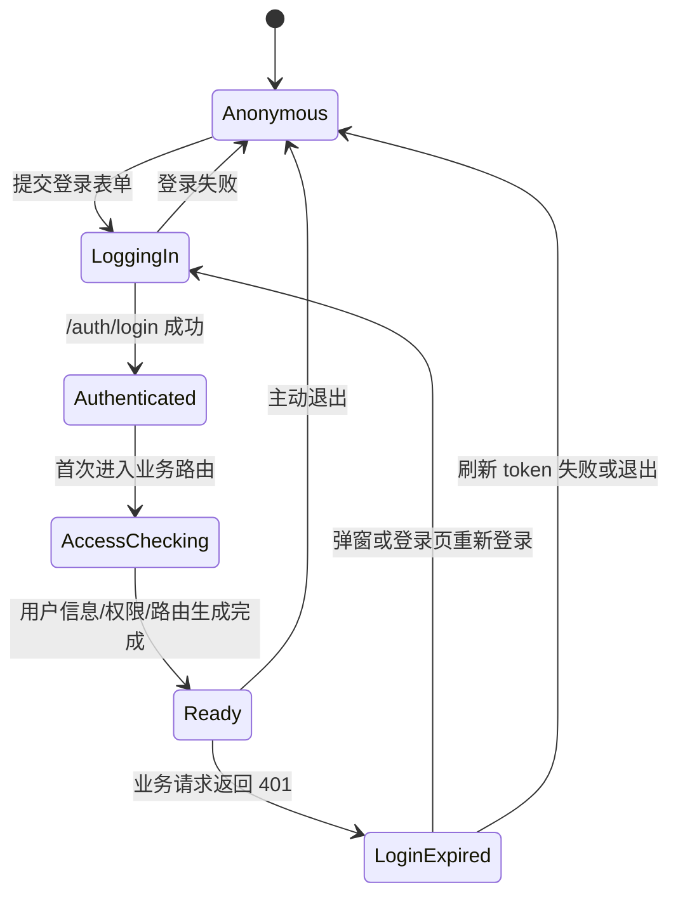

# Playground 业务流程

## 用户进入页面主流程



涉及文件：

- `playground/src/main.ts`
- `playground/src/bootstrap.ts`
- `playground/src/router/index.ts`
- `playground/src/router/guard.ts`
- `playground/src/router/access.ts`
- `packages/effects/access/src/accessible.ts`
- `packages/stores/src/modules/access.ts`
- `packages/stores/src/modules/user.ts`

## 完整调用链

启动调用链：

```text
playground/src/main.ts
  -> initPreferences()
  -> playground/src/bootstrap.ts/bootstrap()
  -> initComponentAdapter()
  -> initSetupVbenForm()
  -> providePluginsOptions()
  -> setupI18n()
  -> initStores()
  -> initTimezone()
  -> registerAccessDirective()
  -> app.use(router)
  -> app.mount('#app')
```

登录调用链：

```text
playground/src/views/_core/authentication/login.vue
  -> packages/effects/common-ui/src/ui/authentication/login.vue
  -> useAuthStore().authLogin()
  -> playground/src/api/core/auth.ts/loginApi()
  -> playground/src/api/request.ts/requestClient
  -> Spring Boot/mock POST /auth/login
  -> useAuthStore().fetchUserInfo()
  -> playground/src/api/core/user.ts/getUserInfoApi()
  -> playground/src/api/core/auth.ts/getAccessCodesApi()
  -> useUserStore().setUserInfo()
  -> useAccessStore().setAccessCodes()
  -> router.push(homePath/defaultHomePath)
```

路由鉴权调用链：

```text
playground/src/router/guard.ts/setupAccessGuard()
  -> useAccessStore()
  -> useUserStore()
  -> useAuthStore().fetchUserInfo()
  -> playground/src/router/access.ts/generateAccess()
  -> packages/effects/access/src/accessible.ts/generateAccessible()
  -> frontend: packages/utils/src/helpers/generate-routes-frontend.ts
  -> backend: playground/src/api/core/menu.ts/getAllMenusApi()
  -> backend: packages/utils/src/helpers/generate-routes-backend.ts
  -> packages/utils/src/helpers/generate-menus.ts
  -> accessStore.setAccessMenus()
  -> accessStore.setAccessRoutes()
```

系统表格查询调用链：

```text
playground/src/views/system/*/list.vue
  -> playground/src/adapter/vxe-table.ts/useVbenVxeGrid()
  -> packages/effects/plugins/src/vxe-table/use-vxe-grid.vue
  -> proxyConfig.ajax.query()
  -> playground/src/api/system/*.ts
  -> playground/src/api/request.ts/requestClient
  -> Spring Boot/mock GET /system/*/list
  -> VXE response.result=items / response.total=total
```

系统表单提交调用链：

```text
playground/src/views/system/*/modules/form.vue
  -> useVbenForm().validate()
  -> createXxx()/updateXxx()
  -> playground/src/api/system/*.ts
  -> playground/src/api/request.ts/requestClient
  -> Spring Boot/mock POST/PUT /system/*
  -> emits('success')
  -> list.vue gridApi.query()
```

按钮权限调用链：

```text
后端 /auth/codes
  -> useAuthStore().authLogin()
  -> accessStore.setAccessCodes()
  -> playground/src/adapter/vxe-table.ts/VbenTableAction
  -> packages/effects/access/src/use-access.ts/hasAccessByCodes()
  -> 操作按钮 show/hide
```

时区调用链：

```text
playground/src/bootstrap.ts/initTimezone()
  -> playground/src/timezone-init.ts/setTimezoneHandler()
  -> packages/stores/src/modules/timezone.ts
  -> playground/src/api/core/timezone.ts
  -> Spring Boot/mock /timezone/*
```

## 登录流程



登录请求字段：

| 字段 | 来源 | 后端 mock 是否使用 |
| --- | --- | --- |
| `selectAccount` | 登录页账号下拉 | 否 |
| `username` | 登录页自动填充或手输 | 是 |
| `password` | 登录页自动填充或手输 | 是 |
| `captcha` | 前端滑块校验结果 boolean | 否 |

登录成功后的默认跳转：

1. `userInfo.homePath`
2. `preferences.app.defaultHomePath`
3. 默认配置里 `defaultHomePath = /analytics`

登录失败：

- `authLogin` 抛错后，`login.vue` 重置滑块验证码。
- 统一错误拦截器会弹 `message.error`。
- mock 账号密码错误返回 HTTP `403` 和错误文案 `Username or password is incorrect.`。

## 刷新页面后的鉴权流程

1. `accessToken` 从持久化 store 恢复。
2. `userInfo` 不持久化，路由守卫会调用 `authStore.fetchUserInfo()`。
3. 根据 `userInfo.roles` 生成路由。
4. 如果访问模式是 `backend` 或 `mixed`，还会调用 `/menu/all` 取后端菜单。
5. `accessStore.isAccessChecked = true` 后，后续路由切换不重复生成动态路由。

关键代码：

- `playground/src/router/guard.ts`
- `playground/src/store/auth.ts`
- `playground/src/router/access.ts`
- `packages/effects/access/src/accessible.ts`

## 权限路由生成流程

当前默认值来自 `packages/@core/preferences/src/config.ts`：

```ts
app: {
  accessMode: 'frontend'
}
```

三种模式：

| 模式 | 路由来源 | 菜单来源 | 是否调用 `/menu/all` |
| --- | --- | --- | --- |
| `frontend` | `playground/src/router/routes/modules/*.ts` | 前端路由生成菜单 | 否 |
| `backend` | `/menu/all` 返回的后端菜单路由 | 后端菜单生成菜单 | 是 |
| `mixed` | 后端菜单 + 前端路由按 name 合并 | 合并后路由生成菜单 | 是 |

注意：用户要求“和后端交互接口逻辑”，但当前刚拉代码默认是 `frontend`，所以实际首屏登录后并不一定调用 `/menu/all`。如果后端要控制菜单和路由，需要明确改成 `backend` 或 `mixed`。

## 系统管理通用流程

系统管理页面是后端最应该参考的 CRUD 业务雏形。

### 查询列表



分页列表必须返回：

```json
{
  "code": 0,
  "data": {
    "items": [],
    "total": 100
  },
  "error": null,
  "message": "ok"
}
```

树列表如菜单、部门返回：

```json
{
  "code": 0,
  "data": [
    {
      "id": "1",
      "pid": "0",
      "children": []
    }
  ],
  "error": null,
  "message": "ok"
}
```

### 新增/编辑



mock 环境风险：系统管理写操作被 `apps/backend-mock/middleware/1.api.ts` 拦截返回 `403`，不能验证成功写入。

### 删除

1. 页面弹确认。
2. 调 `DELETE /system/xxx/{id}`。
3. 成功后刷新表格。
4. 失败时关闭 loading，由请求拦截器弹错误。

部门删除有前端 UI 禁用规则：存在 `children` 的部门删除按钮置灰。

### 状态切换

用户、角色列表有状态开关：

1. 点击开关。
2. 弹 `Modal.confirm`。
3. 确认后调用 `updateUser(id,{status})` 或 `updateRole(id,{status})`。
4. 返回成功才更新当前行状态。
5. 取消或接口失败返回 `false`，开关回滚。

状态值：

| 值 | 含义 |
| --- | --- |
| `1` | 启用 |
| `0` | 禁用 |

## 状态流转

### 认证状态



关键状态字段：

| 字段 | 位置 | 含义 |
| --- | --- | --- |
| `loginLoading` | `playground/src/store/auth.ts` | 登录按钮 loading。 |
| `accessToken` | `packages/stores/src/modules/access.ts` | 访问令牌，持久化。 |
| `accessCodes` | `packages/stores/src/modules/access.ts` | 按钮权限码，持久化。 |
| `isAccessChecked` | `packages/stores/src/modules/access.ts` | 动态路由是否生成完成，不持久化。 |
| `loginExpired` | `packages/stores/src/modules/access.ts` | 是否打开登录过期弹窗。 |
| `userInfo` | `packages/stores/src/modules/user.ts` | 当前用户，不持久化。 |

### 系统数据状态

系统管理没有独立业务 store，状态主要留在页面组件和表格内部：

| 状态 | 位置 | 说明 |
| --- | --- | --- |
| 查询条件 | `list.vue` 的 `formOptions` | 由 Vben Form 管理，提交时并入 query。 |
| 分页 | VXE Grid 内部 | 请求时传 `page.currentPage/page.pageSize`。 |
| 当前编辑行 | Drawer/Modal `setData(row)` | 打开表单时注入。 |
| 部门筛选 | `user/list.vue` 的 `selectedDeptId` | 点击左侧树后触发用户列表查询。 |
| 详情数据 | `user/modules/detail.vue` | 直接来自列表行，不请求后端。 |
| 菜单表单临时字段 | `menu/modules/form.vue` 的 `linkSrc/titleSuffix` | 提交前转换到 `meta.link/meta.iframeSrc`。 |

## 用户管理流程

入口：

- 路由：`/system/user`
- 页面：`playground/src/views/system/user/list.vue`
- 数据配置：`playground/src/views/system/user/data.ts`
- 表单：`playground/src/views/system/user/modules/form.vue`
- 详情：`playground/src/views/system/user/modules/detail.vue`
- API：`playground/src/api/system/user.ts`

页面行为：

1. 页面挂载后调用 `getDeptList()` 加载左侧部门树。
2. 表格初始化后调用 `getUserList({page,pageSize,...filters,deptId})`。
3. 点击部门树节点后写入 `selectedDeptId` 并重新查询用户。
4. 搜索部门只在前端过滤当前 `deptList`，不是后端搜索。
5. 新增/编辑用户打开 Drawer，提交 `createUser(values)` 或 `updateUser(id, values)`。
6. 详情 Drawer 只展示当前行数据，不额外请求详情接口。
7. 删除调用 `deleteUser(id)`。

不确定点：

- 用户表单模块里加载了菜单权限树 `getMenuList()`，但 `useFormSchema()` 没有 `permissions` 字段，所以权限树插槽不会生效。是否计划给用户直接分配菜单权限未确认。
- `SystemUser` 类型定义了 `permissions: string[]`，mock 用户列表没有返回该字段。

## 角色管理流程

入口：

- 路由：`/system/role`
- 页面：`playground/src/views/system/role/list.vue`
- 数据配置：`playground/src/views/system/role/data.ts`
- 表单：`playground/src/views/system/role/modules/form.vue`
- API：`playground/src/api/system/role.ts`

页面行为：

1. 表格用 `getRoleList({page,pageSize,...filters})` 查询分页角色。
2. 查询条件包括 `name/id/status/remark/createTime`，时间范围映射为 `startTime/endTime`。
3. 新增/编辑角色打开 Drawer。
4. 表单加载菜单树 `getMenuList()`，把选中的菜单/按钮 ID 写入 `permissions`。
5. 提交 `createRole(values)` 或 `updateRole(id, values)`。
6. 删除调用 `deleteRole(id)`。
7. 状态切换调用 `updateRole(id,{status})`。

## 菜单管理流程

入口：

- 路由：`/system/menu`
- 页面：`playground/src/views/system/menu/list.vue`
- 数据配置：`playground/src/views/system/menu/data.ts`
- 表单：`playground/src/views/system/menu/modules/form.vue`
- API：`playground/src/api/system/menu.ts`

页面行为：

1. 表格用 `getMenuList()` 查询树形菜单，不分页。
2. 新增菜单 `formDrawerApi.setData({})`。
3. 新增下级 `formDrawerApi.setData({ pid: row.id })`。
4. 编辑时把 `link` 或 `iframeSrc` 映射到临时字段 `linkSrc`。
5. 提交前再把 `linkSrc` 写回：
   - `type === 'link'` -> `meta.link`
   - `type === 'embedded'` -> `meta.iframeSrc`
6. 表单校验菜单 `name`、`path` 唯一性，分别调用：
   - `GET /system/menu/name-exists?name=&id=`
   - `GET /system/menu/path-exists?path=&id=`
7. 创建/更新/删除分别调 `POST /system/menu`、`PUT /system/menu/{id}`、`DELETE /system/menu/{id}`。

菜单类型：

| type | 含义 | 关键字段 |
| --- | --- | --- |
| `catalog` | 目录 | `path`、`name`、`meta.title`、可有 `authCode` |
| `menu` | 页面菜单 | `path`、`component`、`meta.title`、可有 `authCode` |
| `embedded` | iframe 内嵌 | `path`、`component=IFrameView` 或可解析组件、`meta.iframeSrc` |
| `link` | 外链 | 运行时需要稳定 `path`、`component=IFrameView`、`meta.link` |
| `button` | 按钮权限 | `authCode`，通常无 `path/component` |

高风险点：

- `activePath` 表单字段是顶层 `activePath`，而路由 meta 里是 `meta.activePath`。当前代码没有把顶层 `activePath` 转进 `meta.activePath`。
- `SystemMenu` 类型要求 `authCode: string`，但 mock 的部分目录/菜单没有 `authCode`。
- Playground 表单对 link 隐藏 path/component，但 `backend-mock` 的外链 seed 实际同时提供 path 和 `IFrameView`；当前项目必须遵循运行时 seed 形状，不能复制这处表单缺口。
- 菜单 component 必须能在 `playground/src/views/**/*.vue` 中匹配，否则后端路由模式会落到 404 组件并打印错误。

## 部门管理流程

入口：

- 路由：`/system/dept`
- 页面：`playground/src/views/system/dept/list.vue`
- 数据配置：`playground/src/views/system/dept/data.ts`
- 表单：`playground/src/views/system/dept/modules/form.vue`
- API：`playground/src/api/system/dept.ts`

页面行为：

1. 表格用 `getDeptList()` 查询树形部门，不分页。
2. 新增部门打开 Modal。
3. 新增下级部门时传 `{pid: row.id}`。
4. 编辑根部门时，如果 `pid === 0`，前端改成 `undefined` 再回填表单。
5. 提交 `createDept(data)` 或 `updateDept(id,data)`。
6. 删除调用 `deleteDept(id)`；有 children 的部门删除按钮禁用。

## 时区流程

入口：

- 初始化：`playground/src/timezone-init.ts`
- UI：共享布局偏好设置里的时区控件
- API：`playground/src/api/core/timezone.ts`

流程：

1. `bootstrap()` 调用 `initTimezone()`。
2. `initTimezone()` 调用 `setTimezoneHandler` 注入三个后端函数。
3. 偏好设置面板需要选项时调用 `/timezone/getTimezoneOptions`。
4. 获取用户当前时区调用 `/timezone/getTimezone`。
5. 修改时区调用 `/timezone/setTimezone`。

mock 的时区值只存在内存变量里，服务重启丢失。

## 登录过期/异常路径

HTTP `401` 处理在 `playground/src/api/request.ts`：

1. 若 `preferences.app.enableRefreshToken === true`，且当前请求不是重试请求，则尝试 `doRefreshToken()`。
2. 当前默认 `enableRefreshToken = false`，所以遇到 `401` 直接 `doReAuthenticate()`。
3. `doReAuthenticate()` 清空 `accessToken`。
4. 如果 `loginExpiredMode === 'modal'` 且已完成权限检查，则打开登录过期弹窗。
5. 否则执行 `authStore.logout()` 跳登录页。

HTTP 非 401 错误：

- 进入 `errorMessageResponseInterceptor`。
- 根据状态码生成默认错误。
- 如果后端响应里有 `error` 或 `message`，优先弹后端文案。

## 退出流程

1. 用户在右上角下拉菜单点击退出。
2. `playground/src/layouts/basic.vue` 调用 `authStore.logout(false)`。
3. `logoutApi()` 调 `POST /auth/logout`。
4. 不论接口成功或失败，前端都会 `resetAllStores()` 并关闭 `loginExpired`。
5. 跳转 `/auth/login`；若 `redirect=true`，带当前路径作为 redirect。

`logout` 有 `isLoggingOut` 防重入，避免 `/logout` 死循环。

## 结束条件

一个完整用户会话结束于：

- 用户主动退出；
- access token 失效且无法刷新；
- 刷新 token 失败；
- 用户清空缓存或 store；
- 后端返回 401 且登录过期策略要求重新登录。

## 已确认项目决策

- refresh token 是目标能力，传输只使用独立 HttpOnly Cookie；完整生命周期和安全协议批准前，当前前后端继续关闭。
- 产品采用 `mixed`：后端菜单控制业务路由，本地只补充显式白名单路由。
- 当前阶段不增加系统用户详情接口，详情和编辑继续使用列表快照；遇到 `40902` 时关闭旧表单并刷新列表。
- 注册、忘记密码、手机验证码、二维码登录和第三方登录本阶段不接后端，收到后续明确需求再实施。
