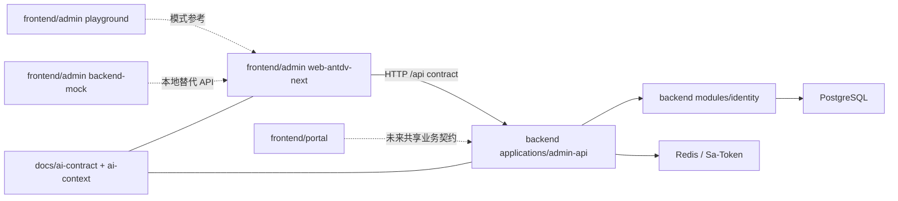

# Payment Web Platform 仓库总览

> 仓库：`git@github.com:NIV49/payment-web-platform.git`
> 当前分支基线：`codex/permission-reference-design`
> 记录日期：2026-07-20

## 1. 顶层结构

```text
payment-web-platform/
├── frontend/
│   ├── admin/       Vben 5.7.0 pnpm monorepo
│   └── portal/      Nuxt 4 多应用 monorepo 占位目录
├── backend/         Java 25 / Spring Boot 4.1 / jOOQ / Maven 多模块后端
├── docs/            产品、架构、AI 上下文和接口契约
├── infra/           本地与后续部署基础设施
├── AGENTS.md        仓库级开发前置规则
├── README.md        人工开发入口
└── .gitignore       整仓忽略规则
```

这是一个产品级总仓，不是把前后端源码简单堆在一起。顶层目录分别拥有自己的构建系统，暂时没有根级 package manager 或 Maven aggregator。

## 2. 目录职责

### `frontend/admin`

当前管理后台，来自 Vben 5.7.0 并完成精简。只保留：

- `apps/web-antdv-next`：产品 Admin；
- `apps/backend-mock`：Nitro 本地 Mock；
- `playground`：Vben 示例和 E2E；
- `packages`、`internal`、`scripts`：Vben 运行与工程基础。

详细内容见 [Admin 前端工程上下文](./frontend/README.md) 和 [Vben 基线](./vben/README.md)。

### `frontend/portal`

当前只有 `.gitkeep`。目标是 Nuxt 4 大型 pnpm monorepo，未来官网、收银台以及按国家拆分的应用放在这里。它与 Admin 可以共享业务契约和设计语言，但不共享 Vben 路由、组件适配或状态管理实现。

### `backend`

Maven reactor。`applications/admin-api` 是当前唯一启动单元，`modules/identity` 拥有 Identity core 与 PostgreSQL、Redis、Sa-Token adapters。未来新增支付业务上下文时延续 `modules/<context>`，只有确实需要独立部署时才新增 `applications/<app>`。

详细内容见 [后端工程上下文](./backend/README.md)。

### `docs`

| 目录/文件 | 作用 |
| --- | --- |
| `new-payment-system-target-architecture.md` | 新支付系统目标架构基线 |
| `permission-refactor-product-requirements.md` | 权限、租户、代理商产品规则 |
| `ai-context/permission` | 开源参考提炼后的自有权限设计 |
| `ai-context/playground` | Vben Playground 分析 |
| `ai-context/vben` | 当前 Vben 版本框架约定 |
| `ai-context/frontend` | Admin 前端工程上下文 |
| `ai-context/backend` | 后端工程上下文 |
| `ai-contract` | 前后端可执行接口契约 |

`docs/ai-context/README.md` 是开发任务入口。文档不是代码之外的附属品；架构、协议或目录变化必须和代码在同一任务更新。

### `infra`

当前只有 `docker-compose.local.yml`：

- PostgreSQL 18.4：`127.0.0.1:15432`；
- Valkey 7.2：`127.0.0.1:16379`（Redis 协议兼容）；
- 数据使用命名 volume 持久化；
- 端口只绑定本机回环，不是共享测试或生产配置。

后续生产基础设施不能直接复制 local compose 的 trust/no-password 配置。

## 3. 跨工程依赖



关键边界：

- 前端通过 HTTP 契约依赖后端，不依赖 Java 实体或数据库表；
- 后端不以 Vben 页面结构作为领域模型，但运行时菜单 DTO 必须遵守 Vben 协议；
- Playground 和 Mock 是开发依赖，不进入生产运行链；
- Portal 与 Admin 是并列前端产品，不应相互深度 import；
- PostgreSQL 和 Redis 只能由后端访问，浏览器不直连。

## 4. Git 上游策略

- `origin`：业务仓库 `NIV49/payment-web-platform`，用于业务开发；
- `upstream`：Vben 官方仓库，只允许 fetch；push URL 已禁用。

Vben 上游根目录与本仓库的 `frontend/admin` 存在目录位移。更新流程必须在独立分支完成：fetch upstream、评估版本差异、把需要的提交迁移到 `frontend/admin`、运行 Admin 全套验证。禁止在业务分支直接无审查 merge 上游根目录。

## 5. 源码与生成物

分析和提交时忽略：

- 前端 `node_modules`、`dist`、`.turbo`、Nitro `.output/.nitro`；
- 后端任意 `target`；jOOQ 生成源码位于 `src/main/java`，属于受 CI drift gate 保护的已提交代码，不是可忽略构建产物；
- 本地 `.env*`、日志和编辑器缓存；
- Docker named volumes（不在仓库中）。

`sourceRepository` 和 `resultRepository` 已删除，`.gitignore` 仍保留其历史忽略项。开源参考结论已经沉淀到 `docs/ai-context/permission`，后续实现以自有模块为准，不重新引入参考仓库源码。

## 6. 新模块落位规则

| 新能力 | 默认位置 |
| --- | --- |
| Admin 业务页面/API | `frontend/admin/apps/web-antdv-next/src` |
| Vben 示例验证 | `frontend/admin/playground` |
| 两个以上 Admin 应用共用的稳定能力 | 经评审后进入 `frontend/admin/packages` |
| Nuxt 官网/收银台/国家应用 | `frontend/portal`（初始化后按其专属规则） |
| 后端业务规则 | `backend/modules/<bounded-context>/core` |
| 业务上下文所属数据库/缓存 adapter | `backend/modules/<bounded-context>/<adapter>` |
| 可独立启动部署的后端入口 | `backend/applications/<app>` |
| 本地/部署基础设施 | `infra` |
| 跨端契约 | `docs/ai-contract` |
| 领域与架构决策 | `docs/ai-context` 或独立 ADR 目录 |

应用数量由部署边界决定，模块数量由业务边界决定；两者不能互相替代。
