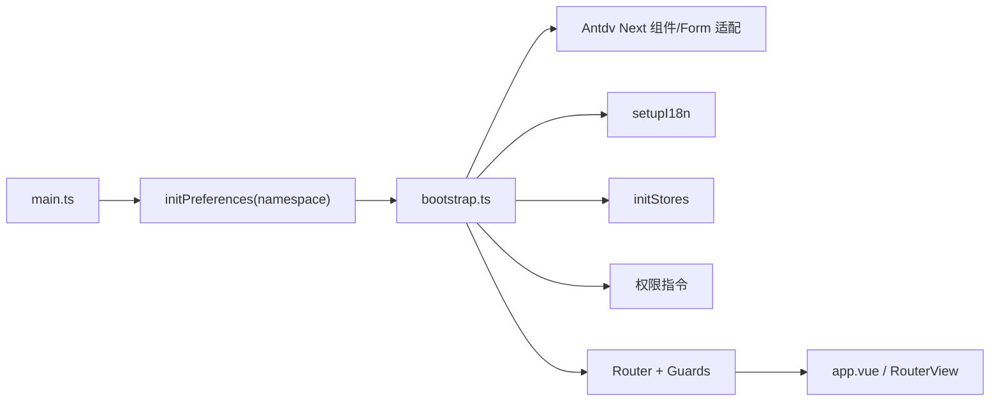

# Vben Admin 5.7.0 框架基线

> 当前源码版本：`5.7.0`
> 官方文档核验日期：2026-07-17
> 适用目录：`frontend/admin/**`

## 1. 结论先行

当前前端不是“一个 Vue 应用加几个页面”，而是 Vben 的 pnpm monorepo：应用层、共享效果层、无 UI 核心层、工程工具层相互配合。改页面前必须先判断变化属于应用、适配器还是共享包。

本项目的明确选择是：

- 产品 Admin：`apps/web-antdv-next`；
- 本地 Mock：`apps/backend-mock`；
- 示例知识库：`playground`；
- UI 组件库：`antdv-next`，不是 `ant-design-vue`；
- 产品路由模式：`src/router/product-access.ts` 固定为 `mixed`，不受缓存偏好或切换控件影响；`preferences.app.accessMode = 'backend'` 只保留按钮权限码兼容语义，不再决定路由生成；
- 后端路由协议：标题传 i18n key，组件传视图路径；
- Playground 保留用于查模式，但产品功能只进入 `web-antdv-next`。

## 2. 官方文档覆盖地图

仓库 `package.json` 和在线站点都显示 `5.7.0`，因此本次在线文档与源码版本一致。下面是当前版本的完整指南导航；开发时按主题回到原文，本文只记录项目决策和高频约定。

### 指南

| 主题 | 官方页面 | 当前项目关注点 |
| --- | --- | --- |
| 框架介绍 | [关于 Vben](https://doc.vben.pro/guide/introduction/vben.html) | Vue、Vite、TS、pnpm monorepo、动态菜单、多 UI 库 |
| 快速开始 | [快速开始](https://doc.vben.pro/guide/introduction/quick-start.html) | Vben 最低 Node `22.18+`；本项目固定 Node `>=24.11.0 <25` |
| 精简 | [精简版本](https://doc.vben.pro/guide/introduction/thin.html) | 只保留 web-antdv-next、backend-mock 和 playground |
| 基础概念 | [基础概念](https://doc.vben.pro/guide/essentials/concept.html) | app/package/subpath imports 边界 |
| 本地开发 | [本地开发](https://doc.vben.pro/guide/essentials/development.html) | scripts、环境、静态资源、DevTools |
| 路由菜单 | [路由和菜单](https://doc.vben.pro/guide/essentials/route.html) | core/static/dynamic、RouteMeta、页面路径 |
| 配置 | [配置](https://doc.vben.pro/guide/essentials/settings.html) | 环境变量、应用偏好、缓存 |
| 图标 | [图标](https://doc.vben.pro/guide/essentials/icons.html) | Iconify 与项目图标组件 |
| 样式 | [样式](https://doc.vben.pro/guide/essentials/styles.html) | Tailwind、全局样式、UI 库主题 |
| 外部模块 | [外部模块](https://doc.vben.pro/guide/essentials/external-module.html) | 第三方依赖引入边界 |
| 构建部署 | [构建与部署](https://doc.vben.pro/guide/essentials/build.html) | Vite 构建、环境、部署资源路径 |
| 服务端交互 | [服务端交互与 Mock](https://doc.vben.pro/guide/essentials/server.html) | RequestClient、代理、响应拦截、refresh token |
| 登录 | [登录](https://doc.vben.pro/guide/in-depth/login.html) | AuthPageLayout、登录表单和 Auth Store |
| 主题 | [主题](https://doc.vben.pro/guide/in-depth/theme.html) | Preferences 与 design tokens |
| 权限 | [权限](https://doc.vben.pro/guide/in-depth/access.html) | backend 模式、菜单 DTO、按钮权限 |
| 国际化 | [国际化](https://doc.vben.pro/guide/in-depth/locale.html) | 应用语言包与第三方语言包加载 |
| 常用功能 | [常用功能](https://doc.vben.pro/guide/in-depth/features.html) | 水印、标签、锁屏等框架能力 |
| 检查更新 | [检查更新](https://doc.vben.pro/guide/in-depth/check-updates.html) | 版本检查组件 |
| 全局 Loading | [全局 Loading](https://doc.vben.pro/guide/in-depth/loading.html) | 首屏 Loading 生命周期 |
| UI 库切换 | [组件库切换](https://doc.vben.pro/guide/in-depth/ui-framework.html) | 当前固定为 Ant Design Vue Next |
| 工程规范 | [规范](https://doc.vben.pro/guide/project/standard.html) | Oxfmt、Oxlint、ESLint、Stylelint、CSpell |
| CLI | [CLI](https://doc.vben.pro/guide/project/cli.html) | vsh/turbo-run 工程命令 |
| 目录 | [目录说明](https://doc.vben.pro/guide/project/dir.html) | monorepo 各层职责 |
| 测试 | [单元测试](https://doc.vben.pro/guide/project/test.html) | Vitest 与测试放置规则 |
| Tailwind | [Tailwind CSS](https://doc.vben.pro/guide/project/tailwindcss.html) | 样式工具链 |
| Changeset | [Changeset](https://doc.vben.pro/guide/project/changeset.html) | 上游包版本管理；业务仓库暂不发布包 |
| Vite | [Vite Config](https://doc.vben.pro/guide/project/vite.html) | `@vben/vite-config` 统一配置入口 |
| 更新 | [项目更新](https://doc.vben.pro/guide/other/project-update.html) | `upstream` 只拉取，独立分支人工迁移 |
| 移除代码 | [移除代码](https://doc.vben.pro/guide/other/remove-code.html) | 删除页面前先清依赖与路由 |
| FAQ | [常见问题](https://doc.vben.pro/guide/other/faq.html) | 故障排查入口 |

### Vben 组件

[组件总览](https://doc.vben.pro/components/introduction.html) 明确：Vben 封装不是强制束缚，但它们承担跨 UI 库的一致接口。产品页面应先复用现有深层组件，底层控件再使用 `antdv-next`。

| 类别 | 官方页面 | 项目使用原则 |
| --- | --- | --- |
| 页面容器 | [Page](https://doc.vben.pro/components/layout-ui/page.html) | 业务页面默认根容器 |
| 远程选项 | [ApiComponent](https://doc.vben.pro/components/common-ui/vben-api-component.html) | Select/TreeSelect 远程数据包装 |
| 轻提示 | [Alert](https://doc.vben.pro/components/common-ui/vben-alert.html) | 简单确认；复杂交互用 Modal |
| 模态框 | [Modal](https://doc.vben.pro/components/common-ui/vben-modal.html) | 通过 `useVbenModal` 管理状态 |
| 抽屉 | [Drawer](https://doc.vben.pro/components/common-ui/vben-drawer.html) | 通过 `useVbenDrawer` 管理状态 |
| 表单 | [Form](https://doc.vben.pro/components/common-ui/vben-form.html) | Schema + 应用组件适配器 |
| 表格 | [Vxe Table](https://doc.vben.pro/components/common-ui/vben-vxe-table.html) | 统一分页、查询、Cell 渲染和权限操作 |
| 数字动画 | [CountToAnimator](https://doc.vben.pro/components/common-ui/vben-count-to-animator.html) | 仪表盘数字展示 |
| 文本省略 | [EllipsisText](https://doc.vben.pro/components/common-ui/vben-ellipsis-text.html) | 长文本与 tooltip |
| 描述列表 | [Descriptions](https://doc.vben.pro/components/common-ui/vben-descriptions.html) | 详情展示 |
| 表格操作 | [TableAction](https://doc.vben.pro/components/common-ui/vben-table-action.html) | action 的 `auth` 对接权限码 |
| 图片裁剪 | [Cropper](https://doc.vben.pro/components/common-ui/vben-cropper.html) | 图片上传裁剪 |
| 富文本 | [Tiptap](https://doc.vben.pro/components/common-ui/vben-tiptap.html) | 富文本编辑，按需引入插件 |

## 3. 应用启动链



源码证据：

- `apps/web-antdv-next/src/main.ts`：先初始化命名空间偏好，再异步加载 bootstrap，最后移除全局 Loading。
- `apps/web-antdv-next/src/bootstrap.ts`：注册组件适配、表单、i18n、Pinia、权限指令、Router 和 Motion。
- `apps/web-antdv-next/src/preferences.ts`：保留 `accessMode: 'backend'`，使权限指令继续按 code 判断；它不是产品路由模式的事实来源。
- `apps/web-antdv-next/src/router/product-access.ts`：固定产品 `mixed` 路由模式，并递归保护静态 core、fallback 与本地 `Profile` 的 canonical name/path。
- `apps/web-antdv-next/src/router/routes/index.ts`：只注册 `modules/profile.ts`；其他模块源码仅作为参考保留。
- `apps/web-antdv-next/src/app.vue`：Antdv Next 的 `ConfigProvider`、locale 和主题 token 入口。

顺序是约束。组件适配和 i18n 未完成前，不应提前挂载应用。

## 4. 动态菜单、标题与国际化协议

### 4.1 为什么必须返回 key

mixed 模式在登录后调用：

```text
router guard
  -> generateAccess
  -> getAllMenusApi
  -> assertNoReservedBackendRoutes
  -> generateAccessible('mixed')
  -> generateRoutesByBackend
  -> router.addRoute / generateMenus
```

标题会被菜单、标签和 `bootstrap.ts` 的动态页面标题再次交给 `$t(route.meta.title)`。因此后端的 `meta.title` 必须是语言包 key：

```json
{ "title": "system.title" }
```

不能返回：

```json
{ "title": "System Management" }
```

当前系统管理 key 已定义在：

- `apps/web-antdv-next/src/locales/langs/zh-CN/system.json`
- `apps/web-antdv-next/src/locales/langs/en-US/system.json`

父子路由应分别使用 `system.title`、`system.user.title`、`system.role.title`、`system.menu.title`、`system.dept.title`。

静态路由示例 `src/router/routes/modules/system.ts` 已使用 `$t('system.title')`，但它没有进入产品本地路由 allowlist；System 等业务路由仍来自 `/menu/all`，不能指望静态文件覆盖错误的数据库值。本地业务 allowlist 目前只有隐藏的 `Profile`；后端若与 Root、Authentication、Login、FallbackNotFound、Profile 任一 canonical name/path 冲突，所有部署都会在合并前失败。退出或换用户按启动时冻结的核心 route name 清除旧动态路由，避免 Root 重挂后把旧路由误当静态白名单。

### 4.2 语言包加载

应用 `src/locales/index.ts` 用 `import.meta.glob('./langs/**/*.json')` 收集应用语言包，同时切换 Antdv Next 和 Day.js locale。新模块必须同时添加 `zh-CN` 与 `en-US`；key 层级应按业务域组织，不能把大量文案塞进 `common`。

## 5. 动态 component 协议

`src/router/access.ts` 收集：

```ts
const pageMap = import.meta.glob('../views/**/*.vue');
const layoutMap = { BasicLayout, IFrameView };
```

`packages/utils/src/helpers/generate-routes-backend.ts` 的转换规则是：

1. 去掉 `./`、`../` 和可选的 `/views` 前缀；
2. 保证以 `/` 开头；
3. 若没有 `.vue` 则补上；
4. 在标准化后的 `pageMap` 中查找；
5. 找不到时打印 `route component is invalid` 并落到 404。

正确映射：

| 后端 component | 前端文件 |
| --- | --- |
| `/system/user/list` | `src/views/system/user/list.vue` |
| `/dashboard/analytics/index` | `src/views/dashboard/analytics/index.vue` |
| `IFrameView` | `layoutMap.IFrameView` |

`BasicLayout` 是兼容名称。当前 `generateAccessible` 会在顶级节点有 children 时删除其 component，避免嵌套多层 Layout；新菜单树可直接让根路由承载统一 Layout，不要创造新的布局字符串。

路由类型字段不能一刀切：catalog 有 `path` 但无 component；普通 menu 有 `path` 且 component 必须来自页面清单；embedded/link 都必须有稳定的内部 `path`，component 固定为 `IFrameView`，外部地址分别写入 `meta.iframeSrc`/`meta.link`；button 不带 path/component。内部 route path 和 redirect 必须以单 `/` 开头，`//host/path` 是 protocol-relative URL，后端契约会直接拒绝。`backend-mock` 的 link/embedded seed 即采用这套形状。

Vben 依赖稳定且唯一的 route name/path。当前后端在 tenant 内按大小写不敏感方式唯一约束有效 route name，并唯一约束所有非空 route path；V9 数据库索引是最终边界，菜单页面的 `name-exists/path-exists` 只能作为提前提示。

菜单管理表单的 component 候选来自 `MENU_PAGE_COMPONENTS`。应用启动/构建时会逐项核对真实 `views` glob，清单中有不存在的文件会立即失败，不能静默忽略。它是有意维护的路由入口清单，不等于“所有 Vue 文件”。后端用 `payment.menu.allowed-page-components` 执行同一语义的 allowlist；新增路由页必须同步两端并增加契约测试。

## 6. 组件使用决策

1. 页面结构先查 Vben 组件文档和 `playground/src/views`。
2. 表单、表格、弹窗、抽屉使用 `@vben/common-ui` 暴露的能力。
3. Schema 中可用的控件名由 `src/adapter/component/index.ts` 注册；不能在 Schema 中写未注册名称。
4. VbenForm 的 model 约定由 `src/adapter/form.ts` 统一：Antdv Next 通常为 `value`，Checkbox/Radio/Switch/Upload 有专门映射。
5. VxeTable 的分页数据默认为 `items/total`，按钮和开关权限由 `src/adapter/vxe-table.ts` 对接 `useAccess()`。
6. 只有框架未覆盖或产品明确需要时，页面直接使用 `antdv-next` 原生组件。
7. 不从其他 Vben UI 应用复制 `ant-design-vue`、Element Plus 或 Naive UI 组件代码。

## 7. 已治理的历史违规

`backend/.../V2__iam_admin_api.sql` 曾把系统菜单 `meta.title` 写成英文展示文案，并给一级目录写入旧式 `BasicLayout`。这违反当前 backend 动态路由协议，是本次问题的直接来源。

V2 已经应用，因此没有回改历史迁移。`V4__align_vben_menu_contract.sql` 以前向迁移修正已有数据，前后端契约测试保证：

- 所有可见菜单 title 必须匹配已知 i18n key；
- 所有 PAGE component 必须匹配前端导出的视图清单；
- `/menu/all` 不允许返回语言相关的展示文案作为 title。

菜单管理表单还会用 `$te()` 检查当前语言包是否存在 key。项目约定新业务 key 必须同时存在于 `zh-CN` 与 `en-US`，并由语言包 key 对称性测试守护，不能靠回退文案掩盖漏翻译。

偏好管理器在 `initPreferences(namespace)` 之前只使用内存驱动，初始化后才创建带应用命名空间的 LocalStorage 管理器。不要恢复无 prefix 的浏览器存储，否则 `clear()/keys()` 会越过当前应用边界。
