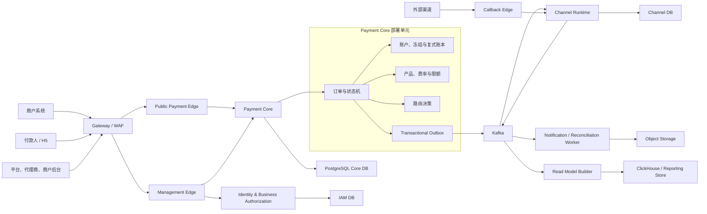
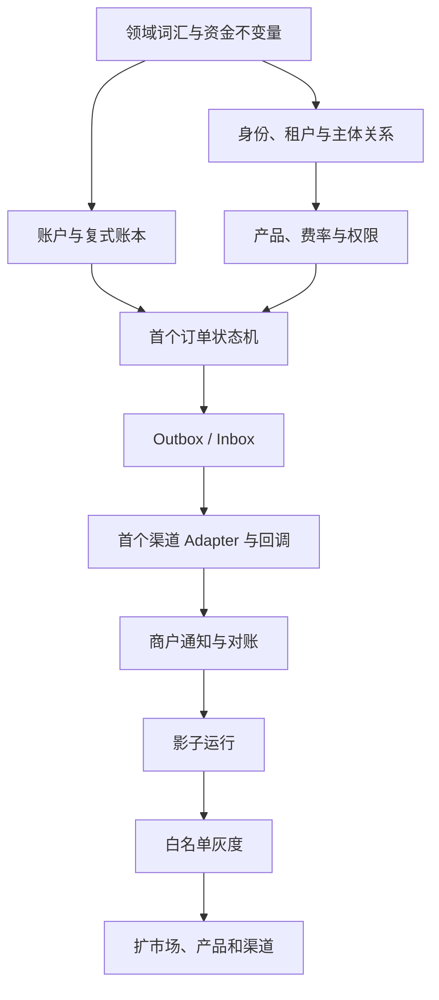

# 新支付系统目标架构方案

> 文档状态：目标架构基线，待产品、架构、资金、运维、安全联合评审  
> 版本：v0.1  
> 日期：2026-07-16  
> 适用范围：准备重新搭建的新支付系统  
> 关联产品需求：[权限、租户与代理商体系重构——产品需求基线](./permission-refactor-product-requirements.md)

## 1. 结论摘要

新系统推荐采用：

> **模块化单体起步、少量独立部署单元、资金核心强一致、外部副作用事件驱动、分析查询与交易存储分离。**

不建议复制旧系统的多仓库、多入口、多任务框架和大规模预分片模式，也不建议为了“看起来像微服务”在第一天拆出二三十个服务。

目标架构的核心不是技术栈更新，而是能对任何一笔订单回答：

1. 谁发起；
2. 为什么允许；
3. 当前处于哪个合法状态；
4. 钱现在位于哪个账户；
5. 走了哪个渠道，为什么选择该渠道；
6. 重复请求、重复消息和重复回调会发生什么；
7. 外部成功、本地失败时如何恢复；
8. 最终如何通知、对账和审计。

### Architecture Review Verdict

**有条件通过。**

本方案可以作为新系统设计起点，但在金额口径、账本科目、状态机、峰值容量、国家/市场范围和迁移数据质量未定版之前，不允许直接进入资金核心编码。

## 2. 背景与现状判断

现有系统已经覆盖商户 API、H5、代收、代付、提现、USDT、渠道路由、回调、商户通知、账务、调账、报表和监控，业务资产非常有价值。

但现有架构不适合直接作为新系统模板：

- 多个独立仓库共享 DTO、枚举和客户端，契约变更依赖发布顺序；
- 新旧交易核心同进程共存，模块名与真实部署边界不一致；
- 订单、账户、账簿跨分片和共享库，资金闭环难以由单一事务证明；
- RocketMQ、XXL-Job、Quartz、内存队列和人工入口都可能推进状态；
- 配置中心同时承载基础设施参数和业务规则，缺少统一版本、审计和生效语义；
- 权限采用可选注解与 Controller 手工校验，存在默认放行和数据范围遗漏；
- 报表、搜索和交易查询对交易库形成耦合；
- 幂等、回调真实性、消息失败、人工恢复和账务一致性缺少统一证明方式。

旧系统应被视为：

- 业务规则和兼容契约来源；
- 历史数据和异常样本来源；
- 迁移对账的比较基线；
- 不能被照搬的架构反例。

### 2.1 证据分类

为避免设计与现状混淆，本文使用三类结论：

| 类型 | 含义 | 示例 |
|---|---|---|
| 现有事实 | 已由当前代码或现状文档确认 | 当前存在多仓库、分片、新旧核心并存和多种异步入口 |
| 目标决策 | 本文推荐的新系统方向，尚需架构评审批准 | Payment Core 与 Ledger 初期同事务、采用 PostgreSQL 和复式账本 |
| 未确定项 | 缺少业务、容量或生产证据 | 峰值 TPS、金额精度、首期市场和迁移周期 |

### 2.2 Finance / Payment Review Scope

| 领域 | 是否涉及 | 本方案处理方式 |
|---|---|---|
| 商户与租户 | 是 | 服务端租户上下文和独立业务授权 |
| 代收 | 是 | 回调成功后在本地事务入账 |
| 代付 | 是 | 先冻结、成功扣冻结、明确失败释放、未知保持冻结 |
| 商户提现 | 是 | 独立订单和审批状态机 |
| 退款/冲正 | 是 | 独立业务单和新账本 Journal，不回改历史分录 |
| 调账 | 是 | 独立权限、审批、订单和审计 |
| USDT | 是，后续阶段 | 独立状态机和链上外部副作用恢复 |
| 渠道 | 是 | Adapter、可信回调和标准结果 |
| 账本 | 是 | 不可变复式账本和余额投影 |
| 权限 | 是 | 租户、角色、完整授权项和数据范围 |
| 报表与导出 | 是 | 读模型、脱敏、限额和审计 |

Finance Review Verdict：**有条件通过**。条件是资金规则、状态机、账本科目、幂等和迁移门禁在实施前完成定版。

## 3. 假设与约束

本方案基于以下假设：

1. 新系统继续提供多市场代收、代付、商户提现、渠道路由、回调和商户通知；
2. 后续需要支持 USDT，但可以作为独立阶段建设；
3. 需要支持平台、销售、代理商、直连商户和间连商户；
4. 旧系统不会一次性停机迁移，必须长期并行和逐步灰度；
5. 团队主要技术能力仍在 Java/Spring 生态；
6. 新系统优先保证资金正确、可恢复、可审计，再追求极限吞吐；
7. 外部渠道天然不可靠，可能超时、重复回调、乱序和结果未知；
8. 消息系统采用至少一次交付语义设计，消费者必须幂等；
9. 数据库、消息、对象存储和身份服务优先采用托管或高可用部署；
10. 当前尚未确认峰值 TPS、订单保存周期、国家数量和数据增长率。

如果上述假设发生变化，必须先更新本架构文档，再修改实施计划。

## 4. 建设目标

### 4.1 业务目标

- 支撑代收、代付、提现、退款、冲正、调账和后续 USDT；
- 支撑商户、代理商、销售和平台运营体系；
- 新增市场和渠道时，尽量只新增配置和渠道 Adapter；
- 每一笔资金变更可追溯到订单、操作者、渠道和账本；
- 允许旧系统按市场、产品和商户逐步迁移；
- 支撑代理商查看有效关系期内的订单和历史只读数据。

### 4.2 架构目标

- 资金状态和账本在一个可证明的强事务边界内；
- 业务模块边界清晰，物理服务数量保持克制；
- 所有异步交互有 Outbox、Inbox、幂等和人工恢复能力；
- 权限与租户隔离在服务端统一执行；
- 渠道差异被 Adapter 隐藏，不污染支付核心；
- 报表和经营分析不直接压交易库；
- 状态、配置、路由和费用都有版本与审计；
- 任何生产故障可以定位到订单级证据链。

### 4.3 非目标

第一阶段不追求：

- 一开始拆成数十个微服务；
- 一开始做跨地域多活写入；
- 一开始建立数百张物理分片表；
- 一个万能订单模型覆盖所有支付类型；
- 用分布式事务包住第三方渠道；
- 用 Redis 锁替代数据库幂等；
- 把所有人工审批和每一笔交易都放进工作流引擎；
- 大爆炸替换旧系统。

## 5. 核心架构原则

### 5.1 模块边界和部署边界分开设计

业务上可以有十几个模块，但初期不需要十几个独立服务。只有在以下条件成立时才拆部署：

- 安全暴露面明显不同；
- 扩缩容模型明显不同；
- 故障半径需要隔离；
- 发布节奏由不同团队独立承担；
- 数据所有权和事务边界清晰；
- 拆分收益高于网络调用、契约和运维成本。

### 5.2 深模块优先

每个核心模块应通过小而稳定的 Interface 隐藏复杂实现。

例如账本模块的调用者只需要知道：

```text
postJournal(command)
placeHold(command)
captureHold(command)
releaseHold(command)
getBalance(accountId)
```

调用者不应知道分录表结构、锁顺序、余额投影和幂等表细节。

### 5.3 强一致只用于资金事实

必须强一致：

- 订单受理与幂等结果；
- 资金冻结、扣除、释放；
- 账本分录；
- 本地状态迁移；
- Outbox 事件写入。

允许最终一致：

- 商户通知；
- 经营报表；
- 搜索索引；
- 代理商日报；
- 运营看板；
- 非关键缓存。

### 5.4 外部副作用不能靠数据库回滚

渠道支付、链上转账和邮件发送一旦成功，数据库回滚不能撤销外部事实。

因此必须采用：

- 明确状态机；
- 幂等请求号；
- 状态 CAS；
- 查询确认；
- 补偿业务单；
- 人工恢复和对账。

不能把外部失败后的补偿简单理解为数据库事务回滚。

## 6. 目标系统全景



## 7. 初期部署单元

建议第一阶段控制在 6～8 个应用，而不是一开始建设几十个服务。

| 部署单元 | 核心职责 | 独立部署原因 |
|---|---|---|
| Gateway / WAF | TLS、限流、路由、基础防护 | 统一公网入口 |
| Public Payment Edge | 商户 API、H5 API、签名认证、协议兼容 | 公网暴露和扩缩容独立 |
| Management Edge | 平台、代理商、商户后台接口 | 与支付公网入口隔离 |
| Identity & Authorization | 身份接入、租户成员、部门、角色、数据范围 | 安全边界和权限版本独立 |
| Payment Core | 订单、账本、冻结、费率、路由、Outbox | 资金强事务核心 |
| Callback Edge / Channel Runtime | 渠道 Adapter、请求执行、回调验签和标准化 | 渠道故障与公网回调隔离 |
| Async Worker | 商户通知、补偿、对账、导出、读模型构建 | 异步扩缩容与失败恢复 |
| Identity Provider | 密码、TOTP、OIDC、会话 | 优先使用成熟产品，不自行重造 |

其中 Payment Core 内部是模块化单体。Ledger 初期不拆成远程服务，否则每次冻结和扣款都会变成分布式资金事务。

## 8. 领域上下文与模块

### 8.1 Identity & Organization

负责：

- User；
- Tenant；
- TenantMembership；
- Department；
- Role；
- PermissionGrant；
- 会话版本和权限版本。

业务规则以 [权限重构产品需求](./permission-refactor-product-requirements.md) 为准。

### 8.2 Party & Relationship

负责：

- 平台销售人员；
- Agent；
- Direct Merchant；
- Indirect Merchant；
- AgentMerchantRelation；
- SalesCustomerRelation；
- 商户入驻和代理关系解除。

该模块表达主体和关系，不直接承担资金记账。

### 8.3 Product & Pricing

负责：

- 支付产品；
- 支付类目；
- 市场；
- 商户产品开通；
- 费率；
- 手续费；
- 限额；
- 汇率来源；
- 规则版本和生效时间。

产品、费率和限额是版本化业务数据，不应只是无审计的配置中心字符串。

### 8.4 Payment Order

分别维护：

- Collection Order；
- Payout Order；
- Merchant Withdrawal；
- Refund Order；
- Reversal Order；
- Adjustment Order；
- USDT Order。

这些模型可以共享基础类型和状态机框架，但不共用一个万能状态枚举。

### 8.5 Account & Ledger

负责：

- 账户；
- 可用余额；
- 冻结/保留；
- 待结算余额；
- 会计事务；
- 分录；
- 余额投影；
- 账务幂等；
- 资金不变量和对账证据。

### 8.6 Routing

负责根据订单上下文、商户配置、产品、市场、限额、渠道健康度和路由规则生成可解释的 Routing Decision。

### 8.7 Channel Runtime

负责：

- Channel Adapter；
- 渠道请求签名和加密；
- 请求/响应原文的安全存储；
- 渠道请求号；
- 查询和补偿策略；
- 回调验签、去重和标准化；
- 标准渠道结果事件。

### 8.8 Notification

负责：

- 商户通知；
- 通知签名；
- 重试和退避；
- 通知回执协议；
- DLQ 和人工重放；
- 通知审计。

### 8.9 Reconciliation & Settlement

负责：

- 平台订单与渠道订单对账；
- 订单与账本对账；
- 渠道账单导入；
- 差异识别；
- 人工处理工单；
- 结算批次；
- 资金不变量巡检。

### 8.10 Reporting & Read Models

负责经营分析、商户报表、代理商日报、运营看板和大数据导出。它只消费已提交事件，不参与交易决策和账务事实判断。

## 9. Payment Core 事务设计

### 9.1 代付受理事务

```text
验证商户和请求签名
→ 校验幂等键
→ 读取产品、费率和限额版本
→ 创建代付订单
→ 冻结商户资金
→ 写入复式账本
→ 写入 Outbox 事件
→ 同一个数据库事务提交
```

事务提交后，Channel Runtime 才能接收事件并调用渠道。

### 9.2 代收成功事务

```text
接收已经验签和标准化的渠道成功事件
→ Inbox 去重
→ 校验订单、金额、币种、渠道请求号和当前状态
→ 状态 CAS
→ 商户入账或进入待结算
→ 写入复式账本
→ 写入 Outbox 事件
→ 同一个数据库事务提交
```

商户通知必须发生在最终订单和账务事务提交之后。

### 9.3 代付结果处理

```text
明确成功
→ 扣除冻结资金
→ 写最终账本
→ 订单成功

明确失败
→ 释放冻结资金
→ 写释放账本
→ 订单失败

结果未知
→ 保持冻结
→ 订单进入 UNKNOWN / MANUAL_REVIEW
→ 查询渠道或人工处理
```

`FAILED_UNKNOWN` 或同义状态不能自动按失败解冻。

## 10. 复式账本设计

### 10.1 账本对象

```text
LedgerAccount   账本账户
Journal         一次完整会计事务
Entry           借/贷分录
Hold            资金冻结或保留
BalanceView     余额投影
```

### 10.2 典型账户

- 商户可用资金账户；
- 商户冻结资金账户；
- 商户待结算账户；
- 平台手续费收入账户；
- 平台应收/应付账户；
- 渠道清算账户；
- 差异待处理账户；
- USDT 或其他资产账户。

### 10.3 资金不变量

1. 同一币种/资产的每个 Journal 借贷平衡；
2. 账本只追加，不直接修改或删除历史分录；
3. 冲正和调账通过新 Journal 表达；
4. 余额投影必须可以由分录重新计算；
5. 业务请求号和动账类型必须具备数据库唯一约束；
6. 同一 Hold 只能被 capture 或 release 一次；
7. 余额不能因并发更新丢失；
8. 账本、余额和业务订单必须可以互相追溯；
9. 任何未平账 Journal 都阻断事务提交；
10. 账务失败不能被订单成功静默掩盖。

### 10.4 金额表达

禁止使用 `float` 或 `double` 表达资金。

建议领域类型：

```text
Money {
  assetCode
  atomicAmount
  scaleSnapshot
}
```

- `atomicAmount` 使用整数语义，可存为 `NUMERIC(..., 0)`；
- 每个资产维护允许的小数位；
- 订单保存资产 scale 快照；
- 费率和汇率使用独立精度模型；
- 舍入规则按市场、产品和字段显式定义；
- 不允许用一个全局 `HALF_UP` 规则覆盖所有业务。

### 10.5 目标资金影响矩阵

| 操作 | 可用资金 | 冻结资金 | 待结算 | 账本要求 |
|---|---|---|---|---|
| 代收实时结算成功 | 增加 | 不变 | 不变 | 写入代收入账 Journal |
| 代收非实时结算成功 | 按正式规则确定 | 按正式规则确定 | 增加 | 写入待结算 Journal；具体账户口径待定 |
| 代付受理 | 减少 | 增加 | 不变 | 写入冻结 Journal |
| 代付明确成功 | 不变 | 减少 | 不变 | 写入冻结扣除 Journal |
| 代付明确失败 | 增加 | 减少 | 不变 | 写入冻结释放 Journal |
| 代付结果未知 | 不变 | 保持 | 不变 | 不得自动释放，进入查询/人工流程 |
| 商户提现提交 | 减少 | 增加 | 不变 | 写入提现冻结 Journal |
| 调增 | 增加 | 不变 | 不变 | 写入调账 Journal |
| 调减 | 减少 | 不变 | 不变 | 校验余额并写调账 Journal |
| 冲正/退款 | 按独立业务规则 | 按独立业务规则 | 按独立业务规则 | 新建补偿 Journal，不修改原分录 |

> 未确定：非实时结算、退款、冲正和 USDT 的最终科目与余额方向必须由财务、产品和账务负责人共同确认，不能仅由技术推断。

## 11. 状态机设计

### 11.1 基本原则

- 每种订单有独立状态机；
- 状态迁移使用明确 Command；
- 每次迁移校验允许的前置状态；
- 使用版本号或条件更新完成 CAS；
- 所有入口，包括回调、查询、任务和人工操作，都经过同一个状态迁移模块；
- 终态不可被普通流程回退；
- 外部状态和内部状态通过显式映射解耦。

### 11.2 不应合并的概念

- 明确失败后的解冻；
- 渠道退款；
- 成功后的内部冲正；
- 事故调账；
- 商户提现；
- API 代付；
- USDT 链上转账。

这些操作可能都“改变余额”，但业务责任、外部事实和审计要求不同。

### 11.3 状态迁移记录

每次迁移至少记录：

```text
orderId
fromStatus
toStatus
commandType
triggerType
triggerId
operatorId / serviceId
occurredAt
reasonCode
traceId
version
```

## 12. 幂等与并发

### 12.1 幂等层级

| 场景 | 幂等依据 |
|---|---|
| 商户创建订单 | `tenantId + merchantId + merchantOrderNo + operationType` |
| Payment Core Command | `commandId` |
| 渠道请求 | 平台渠道请求号 |
| 渠道回调 | 渠道 + 渠道事件 ID/订单号 + 回调类型 |
| Outbox 事件 | `eventId` |
| Inbox 消费 | `consumer + eventId` |
| 账务 Journal | `businessId + journalType` |
| 商户通知 | `orderId + notificationType + version` |

### 12.2 基本规则

- 幂等依赖数据库唯一约束，不只依赖 Redis；
- 同一个幂等键重复请求必须返回原始业务结果；
- 相同幂等键但核心参数不同必须拒绝；
- 状态迁移采用 CAS；
- 批量操作逐项鉴权和逐项幂等；
- 不允许先执行资金操作再补幂等记录；
- 人工重试和自动重试使用同一个业务幂等语义。

## 13. 事件驱动与消息

### 13.1 语义

整个系统按“至少一次交付”设计，不宣称跨数据库、消息和第三方渠道的全局 Exactly Once。

```text
本地事务写业务数据 + outbox_event
→ Outbox Relay / CDC 发布 Kafka
→ 消费端 inbox_event 去重
→ 消费端本地事务处理
→ 成功后提交消费位点
```

### 13.2 Outbox

Outbox 与业务数据必须同事务写入。

事件至少包含：

```text
eventId
eventType
aggregateType
aggregateId
aggregateVersion
tenantId
occurredAt
schemaVersion
traceContext
payload
```

### 13.3 事件顺序

- 同一订单事件使用 `orderId` 作为 Kafka Key；
- 通过 aggregateVersion 检测乱序；
- 消费者不能假设不同订单之间存在全局顺序；
- 旧版本事件必须兼容消费或明确进入隔离队列。

### 13.4 Outbox Relay 选型

必须采用 Outbox 模式，但发布实现分阶段：

- 初期可使用可观测的数据库轮询 Relay，降低基础设施复杂度；
- 团队具备 Kafka Connect/CDC 运维能力后，可采用 Debezium；
- 不允许业务事务直接“先写库再调用 MQ”且没有恢复记录。

### 13.5 消费失败

- 业务可重试错误使用指数退避；
- 永久错误进入隔离队列；
- 达到阈值后告警；
- 提供有权限、可审计的人工重放工具；
- 消费异常不能吞掉后返回成功；
- 重放必须继续满足幂等和状态前置条件。

## 14. 渠道架构

### 14.1 Channel Adapter Interface

```text
createCollection(command)
createPayout(command)
queryTransaction(command)
verifyCallback(rawRequest)
parseCallback(rawRequest)
normalizeResult(channelResult)
```

每个 Adapter 隐藏：

- 渠道字段；
- 签名算法；
- 加密方式；
- HTTP 协议差异；
- 状态码；
- 错误语义；
- 查询规则；
- 回调响应格式。

### 14.2 标准渠道结果

```text
ACCEPTED
PROCESSING
SUCCEEDED
FAILED
UNKNOWN
```

每个映射必须说明：

- 是否明确终态；
- 是否可以释放资金；
- 是否需要主动查询；
- 是否需要人工介入；
- 渠道原始码和映射版本。

### 14.3 回调安全

回调入口必须：

- 使用路由绑定的渠道配置验签；
- 必要时校验可信来源；
- 请求参数不能决定是否验签；
- 校验金额、币种、商户、渠道订单号和平台请求号；
- 保存脱敏后的原始回调证据；
- 持久化去重后再异步推进；
- 快速响应渠道，资金处理不堵塞回调线程；
- 对伪造、重复、乱序和解析失败产生告警。

## 15. 路由设计

### 15.1 输入

- 订单类型；
- 订单支付产品；
- 市场和币种；
- 商户产品配置；
- 商户或产品指定渠道；
- 渠道产品能力；
- 单笔和累计限额；
- 渠道余额；
- 熔断状态；
- 实时成功率；
- 损耗规避；
- 路由规则版本。

### 15.2 输出

```text
RoutingDecision {
  decisionId
  selectedChannel
  selectedAccount
  ruleVersion
  candidates
  rejectedReasons
  decidedAt
}
```

每一笔订单都必须保留路由决策快照。

### 15.3 发布方式

- 路由规则是版本化业务数据；
- 变更需要审核、灰度和回滚；
- 新路由先影子计算；
- 影子结果按订单对比旧路由；
- 未达到差异阈值前不得切真实流量；
- 配置中心只保存基础设施参数，不直接承载无版本资金规则。

## 16. 身份、租户与权限

### 16.1 身份认证

优先使用成熟 Identity Provider，例如 Keycloak 或等价托管 OIDC 产品，负责：

- 密码策略；
- 临时密码；
- 首次修改密码；
- TOTP/MFA；
- OIDC 登录；
- 登录会话；
- MFA 重新配置 required action。

不自行开发密码和 TOTP 算法。

### 16.2 业务授权

业务 IAM 模块负责：

- Tenant；
- Membership；
- Department；
- 多角色；
- 完整授权项；
- 代理关系和销售关系带来的数据范围；
- 高风险操作限制；
- 权限版本和审计。

### 16.3 后端授权判断

```text
身份有效
AND 当前租户有效
AND 用户状态有效
AND 至少一个角色同时拥有动作和目标数据范围
AND 资源属于当前商户/代理关系
AND 高风险附加条件满足
```

不能将完整商户关系和数据范围长期编码进 Token。角色、部门或代理关系变化后必须通过权限版本及时撤权。

## 17. 数据架构

### 17.1 存储选型

| 场景 | 推荐选择 | 说明 |
|---|---|---|
| 核心订单、账户、账本、配置 | PostgreSQL | 强事务、约束、索引和分区能力 |
| 身份与权限业务数据 | PostgreSQL | 与 IdP 身份数据分开管理 |
| 缓存、限流、短期锁 | Redis | 不作为资金事实或唯一幂等依据 |
| 业务事件 | Kafka | 事件流和异步解耦 |
| 经营分析与大报表 | ClickHouse | 不作为订单和资金事实来源 |
| 文件、账单、导出和凭证 | S3 兼容对象存储 | 生命周期、加密和审计 |
| 密钥 | KMS / Vault / Secrets Manager | 不进入普通配置和日志 |
| 全文搜索 | 按真实需求增加 OpenSearch | 不作为第一期默认组件 |

### 17.2 PostgreSQL 使用原则

- 初期一个 Payment Core 数据库，模块按 schema 或明确表前缀隔离；
- Ledger 与 Order 共用本地事务，但实现保持独立模块；
- 使用 PK、FK、UNIQUE、CHECK 和 NOT NULL 表达不变量；
- 订单大表达到证据门槛后按时间范围分区；
- 不预先生成大量空分片；
- 分区键必须来自真实查询和归档模式；
- 先使用索引、分区、归档和读副本，再考虑分库；
- 报表查询通过事件读模型进入分析库。

### 17.3 数据所有权

- 一个表只有一个写入模块；
- 其他模块通过 Interface 或事件读取；
- 不允许跨模块直接更新表；
- 不允许报表任务直接修改交易状态；
- 不允许通过搜索索引或分析库判断资金事实。

## 18. 工作流与调度

### 18.1 高频交易

代收、代付和账务的高频主链路使用数据库状态机 + Outbox，不把每笔分录交给工作流引擎。

### 18.2 长流程

以下流程可考虑 Temporal：

- 商户入驻；
- 代理关系解除；
- MFA 重置审批；
- 结算批次；
- 跨天对账差异处理；
- 需要人工等待的资金恢复流程。

Temporal 属于条件选型：

- 团队具备运维和开发能力时引入；
- 第一阶段也可先使用持久化状态机和统一调度器；
- 不同时保留多套等价的任务框架；
- 不允许服务启动即无条件消费或执行高风险历史任务。

### 18.3 调度治理

- 所有任务有唯一 Owner；
- 有启停开关、幂等键和执行记录；
- 支持单任务重放，不靠直接改数据库；
- 明确超时、重试、并发和错过调度策略；
- 隔离测试环境默认禁用外部 MQ、渠道和资金任务。

## 19. 可观测性

### 19.1 统一关联标识

全链路至少携带：

```text
traceId
tenantId
merchantId
orderId
merchantOrderNo
channelRequestNo
journalId
eventId
```

高基数字段主要进入日志和 Trace，不直接作为无界 Metrics Label。

### 19.2 OpenTelemetry

统一使用 OpenTelemetry 采集：

- Trace；
- Metrics；
- Logs 关联上下文。

### 19.3 关键指标

- 订单受理成功率和延迟；
- 按市场、产品、渠道的成功率；
- 渠道请求和回调延迟；
- UNKNOWN 状态数量与停留时长；
- 冻结资金长期未处理数量和金额；
- 订单与账本不一致数量；
- Outbox 积压和最老事件年龄；
- Inbox 重复率；
- Kafka 消费延迟和 DLQ 数量；
- 商户通知成功率；
- 资金不变量异常；
- 权限拒绝和跨租户访问尝试。

### 19.4 订单级时间线

运营工具必须支持按订单查看：

```text
订单创建
→ 费率和路由版本
→ 资金冻结/入账
→ 渠道请求
→ 渠道响应/回调
→ 状态迁移
→ 账本 Journal
→ 商户通知
→ 对账结果
→ 人工操作
```

## 20. 安全要求

- 所有公网入口经过 WAF、限流和 TLS；
- 商户 API 采用服务端密钥签名、时间窗和 nonce；
- 代理头只信任明确的反向代理链；
- 回调使用渠道级签名和来源策略；
- 密钥由 KMS/Vault 管理；
- 密码、Token、Google Secret、银行卡和请求原文禁止进入普通日志；
- 管理后台使用安全 Cookie 或受保护会话，不把长期 Token 存入 LocalStorage；
- 高风险操作要求 MFA step-up；
- 租户、商户、市场和资金权限在服务端统一校验；
- 内部服务也必须具有可验证的服务身份；
- 导出文件加密、限时下载、带水印并记录审计；
- 数据脱敏规则由字段分级统一执行。

## 21. 技术栈建议

### 21.1 候选基线

| 层次 | 推荐 |
|---|---|
| 语言 | Java 25 LTS（已接受的工程基线） |
| 框架 | Spring Boot 4.1.x；版本由根 Maven BOM 统一管理 |
| 构建 | Maven Wrapper，多模块单仓库 |
| 核心数据库 | PostgreSQL 18；Flyway 是 Schema 唯一事实来源 |
| 数据访问 | jOOQ 3.21.x（跟随 Spring Boot BOM）；从临时 PostgreSQL 18 完整迁移后生成类型模型，生成物纳入版本控制 |
| 消息 | Kafka |
| Outbox | 首期 Polling Relay，成熟后可切 Debezium CDC |
| 缓存 | Redis 协议；本地使用 Valkey，生产产品必须由部署决策明确并通过兼容性测试 |
| 身份认证 | Keycloak 或等价托管 OIDC IdP；应用只维护业务授权和短期会话 |
| 长流程 | Temporal，按团队能力条件引入 |
| 分析 | ClickHouse，按报表规模条件引入 |
| 对象存储 | S3 兼容存储 |
| 可观测性 | OpenTelemetry + Metrics/Logs/Trace 后端 |
| 部署 | 容器化；Kubernetes 仅在团队已有成熟能力时采用 |

### 21.2 选型原则

- Java 25、Spring Boot 4.1、jOOQ 3.21 和 PostgreSQL 18 是同一条受测试约束的基线，禁止模块自行降级或引入第二套 ORM；
- 基线升级必须经过数据库、Kafka、OIDC IdP、Temporal 和可观测性兼容性验证；
- jOOQ 代码只能从执行全部 Flyway 迁移后的全新 PostgreSQL 18 实例生成，禁止从共享开发库、生产库或 H2 DDL 回放生成；
- 如果团队 PostgreSQL 运维能力不足，应先做压测和故障演练，而不是直接宣布迁移；
- 如果 ClickHouse 和 Temporal 没有明确价值，可推迟引入；
- 任何新基础设施必须有 Owner、备份、监控、升级和灾难恢复方案。

## 22. 仓库与工程结构

建议使用一个主代码仓库承载核心应用和共享契约，减少跨仓库版本漂移。

```text
payment-web-platform/
├── frontend/
│   ├── admin/                    Vben 管理后台 monorepo
│   └── portal/                   Nuxt 4 门户/收银台 monorepo
├── backend/
│   ├── applications/             仅放可启动、可部署的组合根
│   │   ├── admin-api/
│   │   ├── public-payment-edge/  未来按部署需要建立
│   │   └── async-worker/         未来按部署需要建立
│   ├── modules/
│   │   ├── identity/
│   │   │   ├── core/
│   │   │   ├── persistence-postgres/
│   │   │   ├── cache-redis/
│   │   │   └── session-satoken/  过渡会话适配器，不是身份事实源
│   │   └── <bounded-context>/
│   │       ├── core/
│   │       └── <owned-adapter>/
│   ├── contracts/                只有跨部署且版本化的契约
│   └── test-support/             确有跨模块复用后再建立
├── docs/
│   ├── adr/
│   ├── ai-context/
│   └── ai-contract/
└── infra/
```

规则：

- `applications` 中的每个目录必须有可启动入口；用户、登录、角色和权限等业务不能伪装成 application；
- Module 不能依赖 Application；
- 领域 Core 不依赖具体 Adapter；
- Adapter 实现 Core 定义的 Port，并由所属 bounded context 持有，不建立全仓库共享的 `persistence-postgres` 大模块；
- 跨部署调用只使用版本化 Contract；
- 不创建只为透传而存在的 Module；
- 测试通过 Module Interface 验证行为。

## 23. 开发者命令契约

项目脚手架建立时至少应提供：

```bash
./mvnw verify
./mvnw -pl applications/payment-core -am test
./mvnw -Pcontract-tests verify
./mvnw -Parchitecture-tests verify
docker compose up -d postgres redis kafka keycloak
docker compose down
```

具体命令可在脚手架评审后调整，但必须确保：

- 新开发者可以一条命令启动本地依赖；
- 默认测试环境不会连接共享测试库或真实渠道；
- 构建可重复；
- Contract、架构依赖和数据库迁移在 CI 中自动验证。

### 23.1 Interface 与代码风格

核心接口使用显式业务 Command 和 Result，不使用万能 Map、裸字符串状态或跨层 DTO 透传。

示意：

```java
public record AcceptPayoutCommand(
        CommandId commandId,
        TenantId tenantId,
        MerchantId merchantId,
        MerchantOrderNo merchantOrderNo,
        Money amount,
        ProductCode productCode) {
}

public sealed interface AcceptPayoutResult {
    record Accepted(PayoutOrderId orderId, OrderStatus status)
            implements AcceptPayoutResult {}

    record Duplicate(PayoutOrderId orderId, OrderStatus status)
            implements AcceptPayoutResult {}
}
```

约束：

- 金额、币种、订单号、租户和商户 ID 使用领域类型；
- 状态迁移通过 Command，不暴露通用 `updateStatus`；
- 模块 Interface 返回业务结果，不让调用方理解内部表结构；
- 时间统一使用带时区的时间类型，外部协议单独适配；
- 持久化历史拼写通过 Adapter 映射，不污染新领域语言；
- 领域模块不依赖 Spring Controller、Feign 或具体消息客户端。

## 24. 测试策略

### 24.1 单元和模块测试

- 金额、费率和舍入；
- 每种订单状态机；
- 路由决策；
- 权限完整授权项；
- 账本借贷平衡；
- Hold 的创建、扣除和释放；
- 重复请求和参数冲突。

### 24.2 数据库集成测试

使用真实 PostgreSQL 容器验证：

- 唯一约束；
- 事务回滚；
- 并发 CAS；
- 锁顺序；
- Outbox 同事务；
- Inbox 去重；
- 账本不变量；
- 数据范围查询。

资金测试不能只依赖内存数据库。

### 24.3 契约测试

- 商户 API 请求和响应；
- 渠道 Adapter；
- 渠道回调样本；
- 商户通知；
- Kafka 事件 schema；
- 身份和权限接口。

### 24.4 故障测试

必须覆盖：

- 数据库提交前后进程崩溃；
- Outbox 发布重复；
- Kafka 重复和乱序；
- 渠道超时但实际成功；
- 回调先于同步响应；
- 重复回调；
- 账务成功后订单更新冲突；
- 通知失败；
- Redis 不可用；
- 下游不可用；
- 时钟偏差；
- 权限刚被撤销但旧会话仍存在。

### 24.5 对账测试

每种资金流程都要证明：

```text
业务订单
↔ 渠道请求/结果
↔ Journal/Entry
↔ 余额投影
↔ 商户通知
↔ 对账记录
```

## 25. 非功能目标

以下是初始候选目标，需要结合真实容量进一步确认：

| 指标 | 初始目标 |
|---|---|
| 公网订单受理可用性 | 月度 ≥ 99.95% |
| 订单受理延迟 | 不含渠道调用，P95 ≤ 300ms，P99 ≤ 800ms |
| 回调接收 | 验签并持久化 P95 ≤ 300ms |
| 最终状态传播 | 99% 已处理事件在 5 秒内进入读模型 |
| 已提交资金数据 RPO | 0 |
| 核心数据库故障 RTO | ≤ 30 分钟，目标值待演练确认 |
| 权限撤销 | 目标 60 秒内生效；资金权限建议立即生效 |
| 审计完整率 | 100% 高风险操作可追溯 |
| 账本不平衡 | 0 容忍 |
| 跨租户数据泄露 | 0 容忍 |

容量评审前必须补充：

- 平均和峰值 TPS；
- 各市场流量分布；
- 日订单量和保存年限；
- 回调峰值；
- 报表并发和导出量；
- 商户、代理商和用户数量；
- 允许的单次故障半径。

## 26. 迁移策略

### 26.1 总体原则

- 不做大爆炸切换；
- 旧订单继续由创建它的系统完成；
- 新订单按市场、产品和商户白名单进入新系统；
- 不允许同一订单在新旧系统同时写资金；
- 所有迁移都有对账和回滚开关；
- 修复旧漏洞不等于兼容旧漏洞。

### 26.2 分阶段路线

#### 阶段 0：规则和生产基线

- 固化金额、费用、汇率、舍入和状态；
- 获取生产 Schema、部署版本和运行配置指纹；
- 确认历史异常、重复键和分片漂移；
- 建立订单、账务、渠道、通知和权限测试样本。

#### 阶段 1：基础底座

- Tenant、User、Membership、Department、Role；
- 商户、代理商、销售关系；
- IdP、MFA 和会话；
- 账本和资金不变量；
- Outbox/Inbox；
- 审计和 OpenTelemetry。

#### 阶段 2：最小交易闭环

选择：

```text
一个市场
+ 一个产品
+ 一种交易类型
+ 一个渠道
+ 少量测试商户
```

打通受理、路由、渠道、回调、账务、通知和对账。

#### 阶段 3：影子运行

- 新路由只读计算；
- 新费用只读计算；
- 新账本影子分录；
- 新旧状态和结果逐单比较；
- 不影响真实资金。

#### 阶段 4：商户白名单灰度

- 新订单进入新系统；
- 旧订单留在旧系统；
- 按市场、产品、商户逐批扩大；
- 每批观察成功率、UNKNOWN、账本差异和通知结果。

#### 阶段 5：规模化迁移

- 增加渠道和市场；
- 迁移商户后台和代理商后台；
- 建设报表读模型；
- 逐步关闭旧入口、任务和消费者。

#### 阶段 6：旧系统退役

- 证明无新流量；
- 证明无待处理订单；
- 证明无积压消息和任务；
- 保留历史只读查询与审计；
- 完成数据归档和运行手册。

### 26.3 回滚原则

- 回滚只停止新订单进入新系统；
- 已进入新系统的订单继续由新系统完成；
- 不把执行到一半的订单直接切回旧系统；
- 渠道外部副作用不能靠代码版本回滚；
- 数据库迁移优先采用 expand/contract；
- 事件 schema 向前、向后兼容；
- 每次灰度都有明确停止条件和恢复负责人。

## 27. 实施顺序与依赖



不允许在账户模型和资金不变量未通过评审前先开发大量渠道。

## 28. 架构验收标准

### 28.1 资金

- 任意订单能定位到完整 Journal 和 Entry；
- 任意余额能由账本重算；
- 重复请求、回调和消息不会重复动账；
- 结果未知不会自动释放资金；
- 外部成功、本地失败存在可执行恢复流程；
- 冲正、退款、解冻和调账语义分离。

### 28.2 状态

- 所有状态迁移经过统一模块；
- 非法前置状态被拒绝；
- 并发迁移通过 CAS 只成功一次；
- 状态历史记录触发源和版本；
- 人工入口不能绕过状态机。

### 28.3 消息

- 业务提交和 Outbox 原子；
- 消费端有 Inbox；
- 重复、乱序、失败和重放测试通过；
- 消费异常不会被吞；
- DLQ 有告警和人工 Runbook。

### 28.4 渠道

- 每个 Adapter 有契约测试和回调样本；
- 回调强制验签和资源匹配；
- 渠道状态映射可解释；
- 路由决策有版本和淘汰原因；
- 渠道请求和结果与订单、账本可追溯。

### 28.5 权限

- 租户由服务端上下文确定；
- 多角色不产生跨角色动作/数据范围拼接；
- 代理商只能看到有效关系期订单和允许的历史订单；
- 销售关系不自动授予资金权限；
- 禁用、撤权、改密和 MFA 重置后旧会话及时失效；
- 所有高风险操作有审计。

### 28.6 运维

- 每个应用有 Owner、SLO、Dashboard、Alert 和 Runbook；
- 可以按订单追踪全链路；
- 可以识别账本不平衡和长期冻结；
- 灰度和回滚演练通过；
- 备份恢复、Kafka 灾难恢复和密钥轮换演练通过。

## 29. 必须产出的 ADR

以下决策成本高、难以反转。已接受项必须以 ADR 为目标事实，未接受项不得由实现先斩后奏：

1. Payment Core 与 Ledger 初期同部署、同数据库事务；
2. 采用复式账本并以账本作为资金事实来源；
3. PostgreSQL 18 作为核心数据库，以及 Java 25 / Spring Boot 4.1 / jOOQ 3.21 基线（[ADR-0003](./adr/0003-java-spring-jooq-postgresql-baseline.md)）；
4. Kafka + Outbox + Inbox 的消息一致性模型；
5. 代理商、直连商户、间连商户使用独立租户；
6. 认证交给 OIDC IdP、业务授权由应用维护（[ADR-0004](./adr/0004-external-idp-and-application-authorization-boundary.md)）；
7. 路由和费率采用版本化业务数据；
8. 旧订单不跨系统迁移执行；
9. 是否以及何时采用 Temporal、ClickHouse、Debezium；
10. 启动组合根、bounded context 和 adapter 所有权（[ADR-0005](./adr/0005-bounded-context-owned-adapters-and-composition-roots.md)）；
11. Redis 协议与具体缓存产品边界（[ADR-0006](./adr/0006-redis-protocol-cache-product-boundary.md)）；
12. 生产迁移与本地演示数据隔离（[ADR-0007](./adr/0007-separate-production-migrations-from-local-fixtures.md)）。

## 30. 开放问题

<!-- decision-status id=IAM-GLOBAL-USER-MULTI-TENANT status=pending ref=none -->

进入技术实施计划前必须回答：

1. 首期上线哪些国家/市场、产品和交易类型？
2. 峰值 TPS、日订单量、数据保存周期分别是多少？
3. 第一条迁移链路选择代收还是代付？
4. 首期是否包含提现、退款、冲正、调账和 USDT？
5. 每个币种、费用、汇率的精度和舍入规则是什么？
6. 代收和代付的订单金额、实际金额、手续费和结算金额口径是什么？
7. 账本科目、平台收入、渠道成本、代理佣金和销售佣金如何入账？
8. 非实时结算和待结算余额的正式业务规则是什么？
9. UNKNOWN 状态由谁处理，处理时需要哪些证据和审批？
10. 商户通知成功回执协议如何定义？
11. 代理商允许查看哪些订单字段，历史订单脱敏清单是什么？
12. 是否允许一个全局用户加入多个租户？
13. 是否需要平台强制解除代理关系？
14. 目标云平台、区域、可用区和合规要求是什么？
15. 团队是否具备 PostgreSQL、Kafka、Keycloak、ClickHouse 和 Temporal 运维能力？
16. 旧系统历史订单是否迁移到新库，还是保留统一查询层？
17. 新旧系统并行期预计多久？
18. 谁拥有账本、渠道、权限、数据迁移和生产发布的最终决策权？

## 31. 发布门禁

以下任一条件未满足，不得把真实资金流量切入新系统：

- 资金不变量和账本模型未评审通过；
- 金额、币种、费用、汇率和舍入口径不明确；
- 状态机没有重复、乱序、并发和 UNKNOWN 测试；
- 订单、账本和 Outbox 不能在一个本地事务提交；
- 没有数据库唯一幂等约束；
- 回调验签、金额和资源归属校验未完成；
- 商户/租户隔离未通过自动化测试；
- 多角色存在动作与数据范围拼接越权；
- 商户通知早于最终账务提交；
- 没有订单—渠道—账本—通知—对账完整证据链；
- 没有 UNKNOWN、长期冻结、账本异常和消息积压告警；
- 没有影子比对、灰度、停止和回滚方案；
- 没有备份恢复和外部成功、本地失败的演练证据；
- 旧系统入口、订单归属和回滚责任不清晰。

## 32. 参考资料

- [现有系统 AI Context](./ai-context/CONTEXT.md)
- [现有系统架构基线](./ai-context/current-baseline/09-system-architecture.md)
- [现有风险清单](./ai-context/current-baseline/10-known-risks.md)
- [历史包袱与兼容约束](./ai-context/current-baseline/11-legacy-constraints.md)
- [现有重构边界](./ai-context/current-baseline/12-refactor-boundary.md)
- [权限专项审查](./ai-context/permission-security-review.md)
- [权限、租户与代理商产品需求](./permission-refactor-product-requirements.md)
- [Spring Boot System Requirements](https://docs.spring.io/spring-boot/system-requirements.html)
- [Oracle Java SE Support Roadmap](https://www.oracle.com/java/technologies/java-se-support-roadmap.html)
- [PostgreSQL Table Partitioning](https://www.postgresql.org/docs/current/ddl-partitioning.html)
- [Apache Kafka Design](https://kafka.apache.org/documentation/#design)
- [Debezium Outbox Event Router](https://debezium.io/documentation/reference/stable/transformations/outbox-event-router.html)
- [Keycloak Server Administration Guide](https://www.keycloak.org/docs/latest/server_admin/)
- [Temporal Durable Execution](https://docs.temporal.io/temporal)
- [OpenTelemetry Overview](https://opentelemetry.io/docs/what-is-opentelemetry/)

## 33. 文档边界

本文是目标架构和高层技术基线，不是最终数据库 DDL、API Contract 或研发排期。

下一阶段需要在本文通过评审后分别产出：

1. 领域词汇与 Context Map；
2. 复式账本与账户设计；
3. 各交易类型状态机；
4. 核心数据库模型和索引设计；
5. 商户 API 与内部事件 Contract；
6. 渠道 Adapter Interface；
7. 权限技术方案；
8. 可观测性和对账方案；
9. 旧系统迁移与回滚方案；
10. 第一条交易链路的实施任务拆分。

在这些设计完成并经过预实施生产门禁前，不应开始大规模编写资金核心代码。
