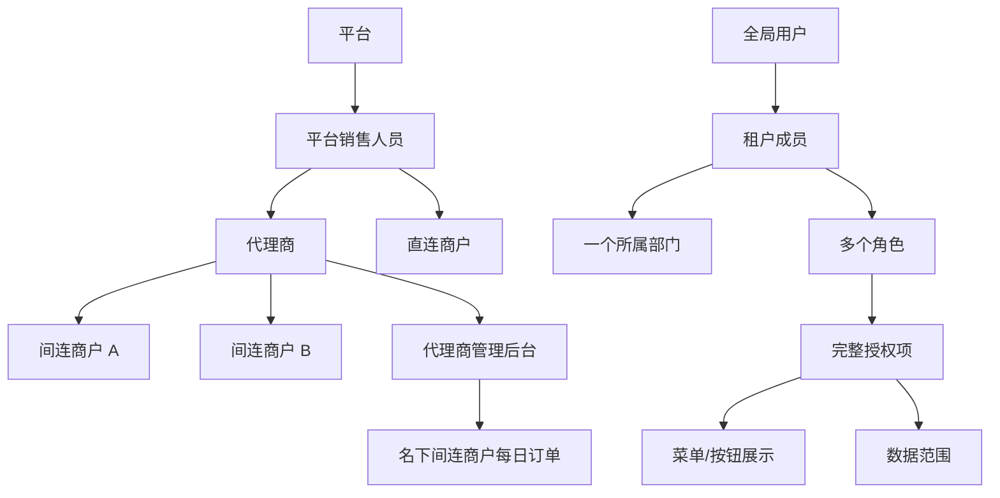
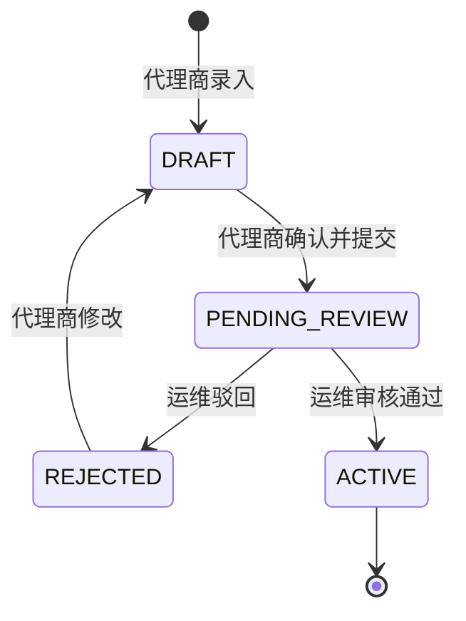
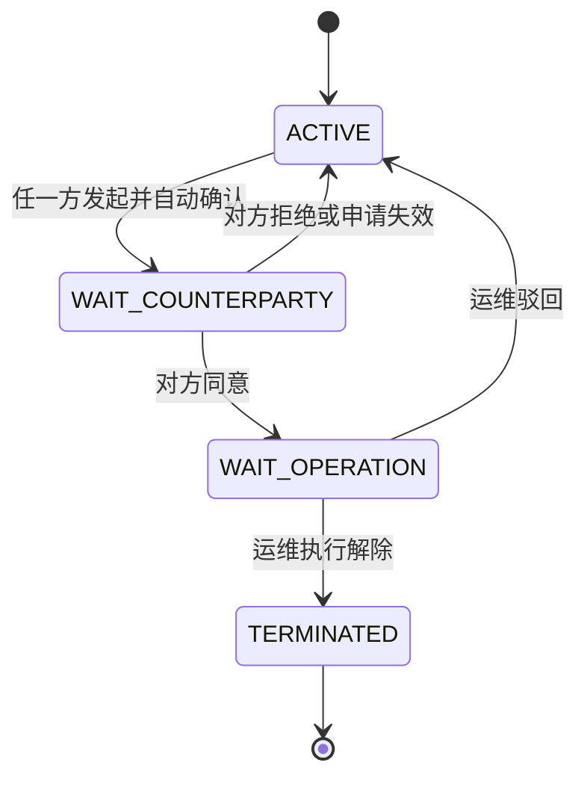
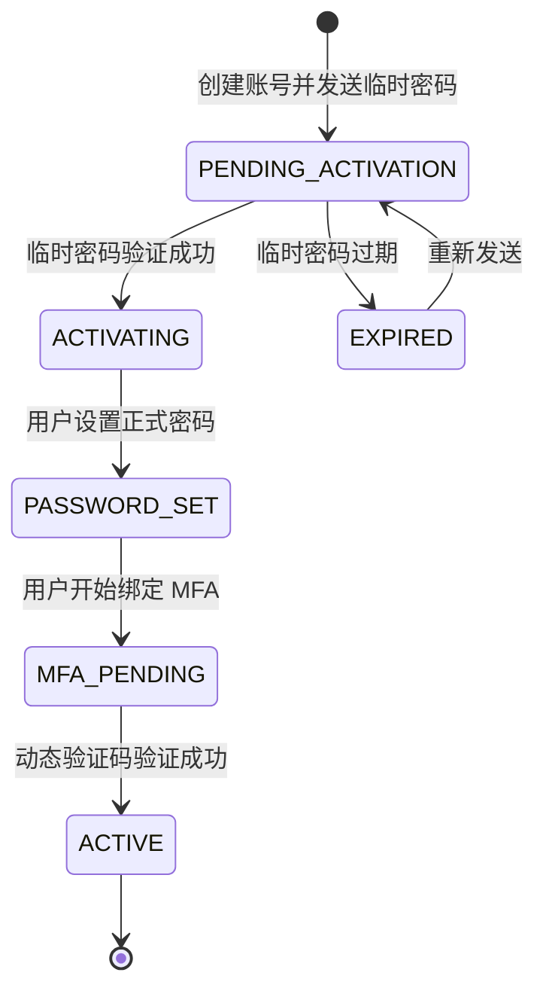

# 权限、租户与代理商体系重构——产品需求基线

> 文档状态：产品需求基线，待产品与技术联合评审<br>
> 版本：v0.1<br>
> 整理日期：2026-07-16<br>
> 适用项目：新的权限重构项目，不代表当前旧系统已经具备这些能力<br>
> 目标读者：产品、后端、前端、测试、运维、安全与数据团队<br>
> 关联架构：[新支付系统目标架构方案](./new-payment-system-target-architecture.md)

## 1. 文档目的

本次重构不是在旧系统上增加几个部门表、角色关系表和 `tenant_id` 字段，而是重新建立以下产品能力：

1. 平台、代理商、直连商户、间连商户之间清晰的数据隔离和业务关系；
2. 用户、部门、多角色、菜单、按钮、数据范围之间稳定且可解释的权限模型；
3. 代理商拓展间连商户、查看订单、解除合作和保留历史数据的完整生命周期；
4. 平台销售人员对代理商和商户的客户归属与经营数据权限；
5. 安全的账号激活、MFA 绑定、MFA 重置和会话撤销机制；
6. 可迁移、可测试、可审计、可回滚的权限重构方案。

本文件优先描述产品规则和验收口径。数据库表、接口形式、缓存技术和框架选型由技术方案另行确定，但不能改变本文确定的业务边界。

## 2. 第一性原则

新权限系统必须围绕下面的问题做出明确判断：

> 谁，以什么身份，在什么租户中，能对什么资源执行什么动作，作用于哪些数据，并受什么限制。

必须遵守以下原则：

1. **默认拒绝**：除显式公开接口外，所有功能默认需要认证和授权。
2. **租户隔离**：租户边界由服务端可信上下文确定，不能信任前端任意传入的 `tenantId`。
3. **关系不等于权限**：销售绑定客户、代理商发展商户，只确定业务关系和数据候选范围，不自动授予全部操作权限。
4. **菜单不等于权限**：菜单和按钮是权限结果的前端展示，后端仍按稳定权限码鉴权。
5. **功能权限与数据范围不能拆开拼接**：敏感动作必须由同一条完整授权同时覆盖动作和目标数据。
6. **撤权及时生效**：用户禁用、角色变更、代理关系解除、改密和 MFA 重置后，旧权限与旧会话必须及时失效。
7. **历史归属不可漂移**：订单、佣金和销售业绩使用业务发生时的关系快照，不根据当前关系重新归属。
8. **高风险操作可追溯**：账号、角色、代理关系、订单可见性和认证信息的变更都必须有完整审计。

## 3. 范围与非目标

### 3.1 本期范围

- 多租户基础模型；
- 平台、代理商、直连商户、间连商户主体模型；
- 平台销售人员与客户归属；
- 部门树和单部门归属；
- 用户多角色；
- 菜单、按钮、接口动作和数据范围授权；
- 代理商管理后台的间连商户订单查看；
- 间连商户入驻与运维审核；
- 代理商—间连商户关系解除；
- 历史订单及后续状态的只读、脱敏查看；
- 临时密码激活、首次改密、MFA 绑定与重置；
- 权限和关系变更审计；
- 旧系统迁移准备。

### 3.2 本期不建议包含

- 无限层级的代理商或商户关系；
- 角色之间继承；
- 显式 Deny 与复杂策略优先级；
- 用户自定义权限脚本；
- 通过菜单 URL 作为后端权限标识；
- 代理商直接操作间连商户资金；
- 销售人员直接操作商户资金或后台配置；
- 因部门变更自动增加或删除角色；
- 仅凭前端隐藏按钮实现权限控制。

## 4. 统一产品术语

| 术语 | 产品定义 | 避免使用 |
|---|---|---|
| 平台 | 提供支付和管理能力的内部运营主体 | 总商户 |
| 平台销售人员 | 公司内部负责拓展和维护代理商、商户的员工 | 销售商户 |
| 代理商 | 可以拓展间连商户，并在授权范围内查看名下商户经营数据的外部合作主体 | 代理商户 |
| 直连商户 | 由平台或平台销售人员直接接入的实际交易商户 | 平台子商户 |
| 间连商户 | 由代理商拓展并经平台运维审核接入的实际交易商户 | 代理子账户 |
| 租户 | 用户、部门、角色、配置和数据的安全隔离空间 | 组织 ID 的简单别名 |
| 部门 | 单个租户内部的组织单元，部门层级只用于组织管理和数据范围扩展 | 权限组 |
| 用户 | 可登录系统的自然人身份 | 角色、部门 |
| 租户成员 | 用户加入某个租户后的工作身份 | 全局用户本身 |
| 角色 | 一组完整授权项的集合 | 部门、菜单组 |
| 权限码 | 对某个资源执行某个动作的稳定标识，如 `order:view` | URL、页面名称 |
| 数据范围 | 授权可以覆盖的部门、客户、商户、市场或其他业务数据集合 | 菜单权限 |
| 代理关系 | 代理商与间连商户之间具有有效期的合作关系 | 租户父子关系 |
| 销售关系 | 平台销售人员与代理商或商户之间的客户归属关系 | 代理关系 |

## 5. 总体业务模型



### 5.1 主体关系

- 平台销售人员可以绑定多个代理商和多个直连商户；
- 一个代理商可以拓展多个间连商户；
- 一个间连商户同一时间只能绑定一个有效代理商；
- 间连商户允许保留多段历史代理关系，但历史有效期不能重叠；
- 代理关系变化不改变商户自身身份和业务数据归属；
- 直连商户与间连商户都是实际交易商户，区别是接入来源和代理关系；
- 代理关系不是租户父子关系，不应通过修改商户 `tenant_id` 表示更换代理商。

### 5.2 租户边界

产品要求代理商、直连商户和间连商户具备彼此独立的用户、部门、角色和数据边界。

推荐技术模型：

- 平台内部使用平台租户或等价的平台安全域；
- 每个代理商拥有独立租户；
- 每个直连商户拥有独立租户；
- 每个间连商户拥有独立租户；
- 代理商通过有效代理关系和授权访问间连商户数据，而不是切换成间连商户成员；
- 跨租户访问必须同时记录真实操作者租户、目标商户租户和授权关系。

## 6. 销售与客户归属

### 6.1 关系规则

- 一个销售人员可以绑定多个代理商；
- 一个销售人员可以绑定多个直连商户；
- 一个代理商或商户同一时间只能有一个主负责销售；
- 一个代理商或商户可以有多个协作销售；
- 间连商户默认继承其代理商的主负责销售；
- 间连商户可以额外配置协作销售；
- 协作销售不改变代理关系、代理佣金和历史订单归属；
- 销售变更必须保留有效期和历史记录；
- 销售离职、转岗或解绑后，立即失去客户数据访问权，但历史业绩归属继续保留。

### 6.2 销售关系类型

```text
PRIMARY        主负责销售
COLLABORATOR   协作销售
```

### 6.3 销售数据权限

销售关系只决定“可以看哪些客户”，角色决定“可以看什么功能”，数据敏感级别决定“可以看到多细”。

```text
销售最终数据权限
= 角色中的完整功能授权
∩ 销售绑定或继承的客户范围
∩ 当前租户边界
∩ 数据敏感级别
```

默认允许销售查看：

- 名下代理商和商户基本经营状态；
- 订单量、交易额、成功率等经营汇总；
- 已开通市场和产品；
- 客户跟进和审核进度；
- 角色明确允许的销售业绩和佣金汇总。

默认不允许销售查看或执行：

- 完整订单敏感详情；
- 商户余额和资金账户；
- 付款人、收款人完整信息；
- 商户密钥、渠道密钥和签名材料；
- 提现审核、余额冻结、扣减和调账；
- 商户管理员改密和角色分配；
- 商户或代理商后台的配置变更。

订单详情、佣金明细和数据导出必须分别授权。

## 7. 代理商管理后台

### 7.1 产品定位

代理商拥有独立的代理商管理后台，用于查看其有效代理关系下的间连商户经营数据，核心能力是查看每日订单和代理佣金，不是进入间连商户后台代替商户经营。

### 7.2 最小功能范围

- 查看当前名下间连商户列表；
- 查看名下间连商户每日订单；
- 按商户、日期、市场、产品和订单状态筛选；
- 查看代理佣金及其调整结果；
- 查看代理关系状态和历史关系；
- 发起解除代理关系申请；
- 管理代理商自己的用户、部门和角色。

### 7.3 权限边界

代理商查看某个商户订单时，必须同时满足：

```text
当前用户是该代理商的有效租户成员
AND 当前用户的某个角色拥有 order:view
AND 该角色的数据范围覆盖目标商户
AND 代理商与目标商户存在有效关系，或该订单属于可查看的历史关系
AND 订单真实属于目标商户
```

代理商默认不能：

- 操作间连商户余额；
- 发起或审核间连商户提现；
- 冻结、解冻、扣减或调账；
- 重置间连商户管理员密码或 MFA；
- 修改间连商户角色；
- 修改渠道路由和平台级配置。

## 8. 间连商户入驻

### 8.1 核心规则

- 间连商户由代理商录入和提交；
- 不需要商户本人在线确认；
- 代理商对资料真实性和合作关系负责；
- 平台运维审核通过后，商户和代理关系才能正式启用；
- 审核前商户不能交易，也不能计入正式经营数据；
- 一个商户主体不能重复创建；
- 已存在的直连商户、间连商户或已有有效代理关系的商户，不能按新商户重复入驻。

### 8.2 入驻状态



### 8.3 运维审核内容

- 商户主体是否真实、完整；
- 是否存在重复商户；
- 是否已经是直连商户；
- 是否绑定其他有效代理商；
- 是否存在重复待审申请；
- 是否处于黑名单、冻结或终止合作状态；
- 代理商是否具备当前市场的拓客资格；
- 产品、市场、费率、佣金和风控配置是否完整；
- 商户管理员邮箱是否有效。

审核必须记录审核人、审核时间、审核项、审核意见和资料版本。

## 9. 代理商—间连商户关系

### 9.1 基数和有效期

- 一个代理商可以拥有多个间连商户；
- 一个间连商户同一时间只能有一个有效代理商；
- 一个间连商户可以保留多段历史代理关系；
- 任意两段有效期不得重叠；
- 更换代理商必须先终止旧关系，再建立新关系；
- 不允许通过直接覆盖 `agentId` 丢失历史；
- 关系必须保留生效时间、失效时间、状态和变更原因。

### 9.2 正常解除流程

正常解除必须由商户和代理商双方同意，并由平台运维执行。



规则：

1. 商户或代理商均可发起；
2. 发起方视为已同意；
3. 另一方必须明确同意；
4. 双方同意后进入运维待处理；
5. 运维审核通过并执行后关系才正式终止；
6. 任一方拒绝，原关系继续有效；
7. 运维驳回必须填写原因；
8. 解除生效前，原关系和权限保持有效；
9. 解除生效后，当前订单查看权限和关系缓存立即失效；
10. 全流程记录申请人、双方意见、运维人员、原因和生效时间。

### 9.3 平台强制解除

建议保留风险场景下的平台强制解除能力，例如欺诈、账号被盗、监管要求或重大安全事件。

该能力尚需产品最终确认。若保留，必须满足：

- 使用独立状态 `FORCE_TERMINATED`；
- 仅限平台高权限风控或运维角色；
- 必须填写原因；
- 完整审计并通知商户和代理商；
- 不能伪装成双方同意的正常解除。

## 10. 解除后的历史订单查看

### 10.1 已确认规则

代理关系解除后，代理商仍可查看关系有效期内创建的订单，但只能只读查看，且敏感字段必须脱敏。

关系有效期内创建的订单，即使在解除后发生以下变化，代理商仍可只读查看：

- 成功、失败或关闭；
- 退款；
- 拒付；
- 冲正；
- 补单；
- 手续费调整；
- 代理佣金调整；
- 结算和对账状态变化。

后续事件不是解除后的“新订单”，其可见性必须继承原订单的代理关系快照。

### 10.2 判断规则

```text
订单绑定的代理关系属于当前代理商
AND 订单创建时间落在该关系有效期内
AND 当前用户仍是该代理商的有效成员
AND 当前用户拥有 historical_order:view
```

不能仅根据商户当前代理商查询历史订单，也不能把历史订单归给新代理商。

### 10.3 只读边界

解除后允许：

- 查看脱敏订单详情；
- 查看订单完整生命周期状态；
- 查看退款、拒付、冲正和补单结果；
- 查看手续费、佣金调整和结算结果；
- 查看与该历史订单直接相关的脱敏异常信息。

解除后禁止：

- 审核或修改订单；
- 发起退款、冲正或补单；
- 修改商户或渠道配置；
- 操作商户资金；
- 查看解除生效后的新订单；
- 查看与历史订单无关的商户经营信息。

### 10.4 脱敏要求

至少需要脱敏或隐藏：

- 付款人和收款人姓名；
- 手机号、邮箱、证件号码；
- 银行卡、银行账户、钱包地址；
- IP 和设备信息；
- 渠道请求和回调原文；
- 商户密钥、签名、公私钥；
- 内部风控备注；
- 非必要的完整支付凭证。

可以保留：

- 平台订单号；
- 商户订单号的必要展示；
- 金额、币种和状态；
- 交易时间；
- 产品和市场；
- 手续费；
- 代理佣金及其调整结果。

查看和导出必须拆成两个权限：

```text
historical_order:view
historical_order:export
```

解除后默认只允许页面查看，不默认允许批量导出。

## 11. 用户、部门与多角色

### 11.1 用户与部门

- 一个租户成员只能归属一个部门；
- 部门可以有上下级；
- 部门上下级不产生角色继承；
- 部门上下级只用于“本部门及下级”数据范围扩展；
- 部门负责人不自动获得额外权限；
- 用户变更部门不会自动解绑任何角色；
- 部门变更后，“本部门”和“本部门及下级”数据范围立即按新部门重新计算。

### 11.2 多角色

- 一个用户可以绑定多个角色；
- 角色之间没有父子关系；
- 角色之间不继承、不覆盖；
- 菜单和按钮权限取多角色并集；
- 数据权限按各角色的完整授权范围合并；
- 禁用角色或解绑角色后必须立即失效。

### 11.3 数据范围类型

建议支持：

```text
SELF                    仅本人数据
DEPARTMENT              本部门
DEPARTMENT_AND_CHILDREN 本部门及下级
SPECIFIED_DEPARTMENTS   指定部门
ASSIGNED_CUSTOMERS      分配的代理商/商户
SPECIFIED_MERCHANTS     指定商户
TENANT_ALL              当前租户全部数据
```

所有范围都不能突破当前租户边界。空数据范围默认表示无权限，不能表示全租户。

### 11.4 多角色合并规则

菜单和纯展示按钮可以按权限码直接取并集，但涉及数据的业务动作必须按完整授权项判断：

```text
允许执行
= 至少存在一个有效角色
  同时拥有当前动作
  且该角色对应的数据范围覆盖目标资源
```

错误示例：

```text
角色 A：withdraw:approve + 仅部门 A
角色 B：report:view + 全租户
```

最终权限应该是：

- 可以审核部门 A 的提现；
- 可以查看全租户报表；
- 不能审核全租户提现。

系统不能先合并所有动作，再合并所有数据范围，否则会产生从未被明确授予的组合权限。

## 12. 用户保存与角色全量覆盖

### 12.1 已确认语义

部门变更不会自动解绑角色。保存用户时，以前端提交的 `roleIds` 作为用户最终角色全集，覆盖原角色关系。

因此前端编辑用户时必须加载并回传当前完整角色列表。

### 12.2 请求语义

- `roleIds` 缺失或为 `null`：请求无效，后端拒绝；
- `roleIds=[]`：明确表示清空全部角色，需要前端二次确认；
- `roleIds=[...]`：最终角色严格等于提交集合；
- 重复角色 ID：后端去重；
- 部门和角色必须在同一事务中更新。

### 12.3 后端校验

- 所有角色必须存在、有效并属于同一租户；
- 操作者必须有权管理目标用户；
- 操作者只能授予其有权授予的角色；
- 操作者不能通过少传 `roleIds` 删除自己无权管理的高权限角色；
- 不能删除租户最后一个最高管理员角色；
- 用户不能通过普通编辑流程提升自己的高权限角色；
- 保存成功后刷新权限版本和缓存；
- 审计记录变更前后部门、角色和操作者。

### 12.4 并发保护

用户详情必须返回版本号，保存时同时提交该版本号。

```text
userVersion
```

版本不一致时拒绝覆盖，并提示用户刷新。禁止两个管理员基于旧数据互相覆盖角色变更。

## 13. 权限资源与角色产品

### 13.1 权限码

权限码使用稳定的“资源:动作”语义，不使用 URL 或菜单名称。

示例：

```text
tenant:view
department:manage
user:create
user:update
user:disable
user:assign-role
role:create
role:update
role:assign
agent:view
agent:manage
merchant:view
merchant:onboard
merchant:unbind-agent
order:view
order:export
historical_order:view
historical_order:export
commission:view
commission:export
mfa-reset:request
mfa-reset:approve
```

涉及资金的权限必须单独定义，不能归入普通订单管理权限。

### 13.2 角色配置

角色配置至少包含：

- 角色名称与适用租户类型；
- 菜单和按钮权限；
- 接口动作权限；
- 每个动作对应的数据范围；
- 是否允许分配给其他用户；
- 是否为系统预置角色；
- 状态和有效期；
- 创建人和最后修改人。

系统预置角色可以作为模板，但不能因为角色名字叫“管理员”就绕过后端授权。

## 14. 账号创建、激活与 MFA

### 14.1 商户管理员创建

间连商户审核通过后，系统根据审核资料中的管理员邮箱创建待激活账号。

邮件只发送一次性临时密码，不发送正式密码、Google Secret 或 Google 动态验证码。

### 14.2 激活状态



### 14.3 临时密码

- 使用安全随机数生成；
- 短时间有效，具体时长待确认；
- 只能成功使用一次；
- 服务端只保存哈希；
- 不写入业务日志或普通审计详情；
- 重新发送后旧临时密码立即失效；
- 多次失败后限流和临时锁定；
- 临时密码不能直接进入业务系统。

临时密码验证成功后，只创建受限激活会话。受限会话只允许：

- 设置正式密码；
- 绑定 Google Authenticator；
- 退出激活流程；
- 按规则重新开始激活。

### 14.4 正式激活条件

账号只有同时满足以下条件才能变为 `ACTIVE`：

```text
临时密码已成功使用
AND 正式密码已设置
AND Google Authenticator 已绑定并完成动态码验证
```

MFA 绑定页面中的 Secret 只能展示一次，不得通过邮件发送，不得进入日志。

### 14.5 会话处理

- 新账号完成激活前没有业务会话；
- 重置或重新激活账号时，签发临时密码应撤销旧会话；
- 临时密码使用后再次提升会话版本；
- MFA 绑定完成后销毁激活会话，再签发正式会话；
- 用户禁用、改密、角色变化、MFA 重置后，旧权限缓存与会话应及时失效。

## 15. MFA 重置

### 15.1 审批规则

| 用户类型 | 发起方式 | 审批要求 |
|---|---|---|
| 普通商户或代理商员工 | 本人或租户管理员发起 | 本租户管理员审批 |
| 商户或代理商最高管理员 | 本人发起 | 平台运维单人审批 |
| 平台普通员工 | 本人或直属管理员发起 | 平台权限管理员单人审批 |
| 平台内部高权限用户 | 本人发起 | 另一名有审批权限的平台人员单人审批 |

### 15.2 最低控制

- 申请人不能审批自己的申请；
- 审批人必须拥有 `mfa-reset:approve`；
- 不能仅凭普通邮件直接完成重置；
- 审批通过后立即撤销目标用户全部会话；
- 旧 Google Secret 立即失效；
- 用户下次登录只能进入 MFA 重新绑定流程；
- 新 Secret 只能由用户登录后自行绑定；
- 记录申请人、目标用户、审批人、原因、时间、IP 和结果；
- 平台高权限用户重置后向安全负责人发送通知并加强短期审计。

## 16. 概念数据模型

以下是产品概念，不限定数据库表名：

| 概念实体 | 核心职责 |
|---|---|
| Tenant | 表达平台、代理商和商户的隔离空间 |
| User | 表达全局登录身份 |
| TenantMembership | 表达用户在某租户中的成员身份、状态和所属部门 |
| Department | 表达租户内部组织树 |
| Role | 表达角色基本信息和适用租户类型 |
| PermissionGrant | 表达权限码与其绑定的数据范围和限制 |
| UserRoleRelation | 表达成员拥有的多个角色 |
| Agent | 表达代理商业务主体 |
| Merchant | 表达直连或间连商户业务主体 |
| AgentMerchantRelation | 表达有有效期的代理商—间连商户关系 |
| SalesCustomerRelation | 表达销售与代理商或商户的主负责/协作关系 |
| MerchantOnboardingApplication | 表达代理商提交、运维审核的入驻申请 |
| AgentUnbindApplication | 表达双方确认、运维执行的解除流程 |
| AuthenticationCredential | 表达密码、临时密码状态与 MFA 状态 |
| SessionRegistry | 表达用户会话和权限版本 |
| SecurityAuditEvent | 表达权限、认证和关系变更审计 |

订单及相关报表需要保存交易发生时的关系快照，至少能稳定识别：

```text
merchant_id
merchant_type_at_trade
agent_id_at_trade
agent_merchant_relation_id
sales_relation_snapshot
commission_rule_snapshot_or_version
```

## 17. 审计要求

以下事件必须审计：

- 用户创建、激活、禁用和恢复；
- 临时密码签发、重新签发和成功使用；
- 密码修改和重置；
- MFA 绑定、重置申请、审批和重新绑定；
- 部门变更；
- 角色分配、撤销和全量覆盖；
- 角色权限及数据范围修改；
- 代理商和商户入驻审核；
- 代理关系创建、解除、驳回和强制解除；
- 销售主负责人和协作销售变更；
- 历史订单查看和导出；
- 敏感数据查看和导出。

审计至少记录：

```text
真实操作者
操作者租户和部门
目标主体
资源与动作
变更前后值
申请和审批原因
结果
请求时间
IP 与设备摘要
traceId
关系或权限版本
```

密码、临时密码、Token、Google Secret 和完整敏感数据不得进入审计内容。

## 19. 建议实施阶段

### 阶段 0：产品与数据定版

- 确认术语、关系基数和状态机；
- 确认权限目录和数据范围类型；
- 盘点旧系统数据；
- 确认迁移和回滚方案。

### 阶段 1：身份、租户和组织

- Tenant、User、Membership、Department；
- 登录上下文和租户隔离；
- 临时密码、首次改密和 MFA；
- 会话与权限版本。

### 阶段 2：多角色与授权

- Role、PermissionGrant、UserRoleRelation；
- 菜单和按钮展示；
- 完整授权项和数据范围；
- 用户角色全量覆盖与并发控制；
- 权限审计和自动化测试。

### 阶段 3：销售、代理商和商户关系

- SalesCustomerRelation；
- AgentMerchantRelation；
- 间连商户入驻；
- 代理商管理后台订单范围；
- 订单关系快照。

### 阶段 4：解除关系和历史权限

- 双方确认、运维执行的解除流程；
- 历史订单只读和脱敏；
- 后续退款、拒付、冲正、佣金和结算变化；
- 导出、审计和缓存失效。

### 阶段 5：迁移与灰度

- 旧数据清洗；
- 新旧权限影子比对；
- 分主体灰度；
- 强制重新登录；
- 监控越权拒绝、误拒绝和数据范围差异。

## 20. 核心验收场景

### 20.1 租户与主体

- 代理商不能访问非名下间连商户；
- 间连商户不能访问兄弟商户；
- 直连商户不存在代理商数据范围；
- 更换代理商不改变商户租户和历史订单归属；
- 一个间连商户不能同时建立两个有效代理关系。

### 20.2 销售

- 一个销售可以绑定多个代理商和直连商户；
- 主销售唯一，协作销售可以有多个；
- 间连商户继承代理商主销售；
- 协作销售不能改变代理关系和代理佣金；
- 销售离职后不能继续查看客户数据；
- 销售关系不授予资金权限。

### 20.3 部门与多角色

- 一个用户在当前租户只能属于一个部门；
- 用户可以拥有多个角色；
- 角色不继承；
- 部门上下级只扩展数据范围；
- 部门变更后角色保持不变；
- “本部门”范围按新部门立即更新；
- 多角色不能把一个角色的敏感动作与另一个角色的全租户范围拼接。

### 20.4 用户保存

- `roleIds=null` 被拒绝；
- 空数组明确清空角色并触发确认；
- 跨租户和禁用角色被拒绝；
- 操作者不能授予或删除无权管理的角色；
- 并发保存基于版本号拒绝旧数据覆盖；
- 不能删除最后一个最高管理员。

### 20.5 入驻与解除

- 代理商可以提交间连商户入驻；
- 无需商户本人确认；
- 运维审核前不能交易；
- 重复商户或已有代理关系不能重复创建；
- 正常解除必须双方同意并由运维执行；
- 一方拒绝或运维驳回后原关系保持有效；
- 解除后当前关系权限立即失效。

### 20.6 历史订单

- 旧代理商可以查看关系有效期内创建的历史订单；
- 历史订单为只读并脱敏；
- 解除后的新订单不可见；
- 原订单后续退款、拒付、冲正、佣金和结算变化仍可见；
- 新代理商不能获得旧代理商时期的历史订单；
- 历史查看和导出权限分离。

### 20.7 激活与 MFA

- 邮件只发送一次性临时密码；
- 临时密码过期或使用后不能复用；
- 临时密码只能进入受限激活流程；
- 未设置正式密码和绑定 MFA 前不能访问业务功能；
- Google Secret 不通过邮件发送；
- MFA 重置后旧 Secret 和全部会话立即失效；
- 平台高权限用户由另一名授权人员单人审批，不能自审。

## 21. 技术评审必须回答的问题

<!-- decision-status id=IAM-GLOBAL-USER-MULTI-TENANT status=pending ref=none -->

以下内容尚未完全定案，需要在技术方案前由产品与技术共同确认：

1. 一个全局用户是否允许同时加入多个租户，以及登录后的工作空间切换方式；
2. 临时密码具体有效时长和失败锁定策略；
3. 代理关系解除申请的有效期和超时策略；
4. 是否启用平台风险强制解除，以及具体授权角色；
5. 代理商有效关系期间可见的订单字段清单；
6. 历史订单脱敏字段的最终清单；
7. 解除后是否开放历史订单导出，开放时的数量限制、水印和审批要求；
8. 代理商、销售和商户佣金的具体计算、调整与结算规则；
9. 直连商户转间连、间连商户转直连和更换代理商的审批流程；
10. 数据范围是否还需要市场、国家、渠道和资金账户维度；
11. 平台、代理商和商户各自的预置角色清单；
12. 权限缓存失效和 Session 撤销的目标时效；
13. 历史订单关系快照无法补齐时的迁移策略；
14. 新旧权限影子比对周期和灰度范围。

## 22. 产品发布门禁

以下任一条件未满足，不建议进入正式切换：

- 租户边界仍依赖前端传入且未做服务端校验；
- 一个间连商户可以同时存在多个有效代理商；
- 多角色权限存在动作与数据范围跨角色拼接；
- 菜单隐藏被当成后端权限控制；
- 代理关系解除后仍能看到新订单或执行写操作；
- 历史订单没有关系快照，归属会随当前代理商变化；
- 部门或角色变化后权限缓存长期不失效；
- 全量 `roleIds` 保存没有版本控制和越权校验；
- 临时密码可直接进入业务系统；
- 密码或 Google Secret 通过同一邮件发送；
- MFA 重置不撤销旧会话；
- 没有跨租户、跨商户、跨代理商和多角色组合的自动化权限测试；
- 没有数据迁移、灰度和回滚方案。

## 23. 文档边界

本文记录当前讨论中已确认的产品规则，并明确标注尚待决策的事项。本文不是数据库设计、API 合同或代码实施方案。技术团队应基于本文件继续产出：

1. 领域模型与数据库设计；
2. 权限计算与租户隔离技术方案；
3. API 合同；
4. 权限测试矩阵；
5. 预实施安全与生产门禁评审。
