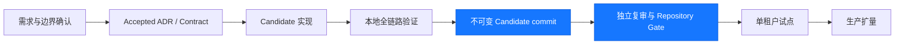

# 产品生命周期

## 当前结论

项目当前处于 **Candidate 源码基线、生产仍 NO-GO** 阶段。三后台账号域和应用隔离、系统管理基础能力、系统字典与 PLATFORM 跨域只读目录已进入可由不可变 commit 验证的候选实现。某个版本是否通过以该 SHA 的外部 repository gate 和独立复审为准，不因本页标注 Candidate 而自动成为生产可用。

工程证据、已运行测试和唯一执行任务见 [Current Delivery Status](../ai-context/current-status.md)。本文只给产品视角的阶段和里程碑，不复制测试日志。

## 生命周期

当前建立的是 E/F 可重复门禁：每次变化都重新产生精确 SHA 证据。通过后才能开始下一个 Candidate 能力，不代表已进入生产试点。

MCH-003 此前的“已接受 / 实现待完成”是历史阶段，不再描述当前工作树；本地集成与真实
浏览器验收已经完成，下表以当前尚未冻结的 Candidate 为准。

## 当前产品范围

| 能力 | 当前阶段 | 说明 |
| --- | --- | --- |
| 三后台隔离 | Candidate | PLATFORM、MERCHANT、AGENT 是独立前端、后端组合根、账号域和会话边界 |
| 用户与角色 | Candidate | 三端均管理当前 Session Tenant；PLATFORM 另有受控跨域目录 |
| 菜单与部门 | Candidate | 仅 PLATFORM 展示；跨域 Role/Menu 目录只读 |
| 系统字典 | Candidate | PLATFORM 管理；其他后台只通过批量接口消费字典值，不展示管理菜单 |
| OIDC、MFA、Session 撤销 | Candidate | 本地链路已有实现和测试，生产 Keycloak/SMTP/密钥/恢复演练仍未完成 |
| 商户管理 | Candidate 已实现 / 本地已验收 | ADR-0013、API Contract、V32/V33、权限、端点、菜单及 PLATFORM/MERCHANT 页面已进入本版本；本地浏览器已完成提交、通过、禁用、启用、两端状态同步、时间/原因本地化和 AGENT 无菜单验收，独立前端 review finding 已修复；正式状态由精确 SHA 的 repository gate 和签名独立复审决定 |
| MCH-003 商户全量新增/编辑 | 可变 Candidate / 本地已验收 | 方案 2 PLATFORM 代建；新增/编辑共用 23 字段/5 证件表单全页，详情/审核共用完整只读全页且审核仅增加单一弹窗动作；三项内联加点击溢出、居中本地化市场、已分配注册国家、受保护编号联动替换、`DIRECT -> PLATFORM` 和独立 reviewer 已通过前端及真实浏览器验收。消费初始候选后的同卷重启已证明原 Merchant 不变并产生空 IAM 替代候选，61/61 自动化还覆盖连续生成 candidate10 和非法谱系失败关闭；Unified backend `clean verify`: PASS. 95 XML reports / 678 tests / 0 failures / 0 errors. 不可变 SHA 门禁和签名复审仍决定正式关闭，Production NO-GO |
| 支付、订单、资金、结算 | 未进入本阶段 | 不建账本镜像余额，不伪造资金接口，不在 MCH-001 引入资金修改 |

系统管理的用户可见行为见 [系统管理](./system-management.md)。
下一切片的目标交互和明确非目标见 [商户管理](./merchant-management.md)。

## 近期里程碑

1. **Candidate 门禁**：对精确 commit 重跑 backend、frontend、三制品、真实浏览器、IAM Judge、immutable scanner 和独立复审。
2. **MCH-001 治理与实现**：规格、candidate Rule/Judge、文档/代码 ownership 门禁、PLATFORM/MERCHANT 最小端到端切片及本地真实浏览器功能验收已进入 Candidate；下一步是对精确不可变 SHA 执行正式门禁并取得签名作者之外复审，生产前再满足数据库 principal、OIDC 和运维前置条件。
3. **MCH-002 商户资料与经营市场**：当前 Candidate 已实现 PLATFORM 维护、多个 ISO alpha-3 市场、旧页面业务分类和列表 Switch/Tag，并完成 V33 保留数据升级及真实浏览器验收；仍需精确 SHA 全门禁和独立复审后才能关闭 Candidate。AgentRelation 仍是后续独立切片，不用 Tenant type 表达直连/间连。
4. **MCH-003 全量入驻与受审修改**：可变 Candidate 已完成 23 字段全页新增/编辑、已有 Tenant 代提交、独立 amendment、职责隔离、受保护证件、三组合根集成、本地持久卷兼容和真实浏览器验收；Unified backend `clean verify`: PASS. 95 XML reports / 678 tests / 0 failures / 0 errors. 下一步在冻结的精确 SHA 上执行 repository gate、不可变 Judge 与签名复审，不把本地 PASS 提升为 GO。
5. **结算、资金与定价分片**：结算账户由商户提交、运维审核；资金账户只读且只能来自 Ledger；费率/限额单独版本化。
6. **生产闭环与试点**：完成 ADR-0012 专用权限、Keycloak/SMTP/备份、Outbox、审计和告警演练后才进入流量。

## 状态更新规则

- 当前阶段、唯一下一任务、GO/NO-GO 或验证结论变化时，本页必须和 `ai-context/current-status.md` 同一改动更新。
- 功能范围或交互变化时更新对应产品页；接口细节仍写入 Contract，不在本页复制。
- 任何“已完成”必须能指向当前 commit 上的代码、测试或正式外部证据。
