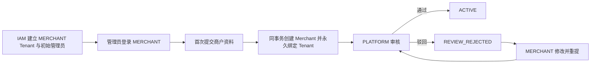
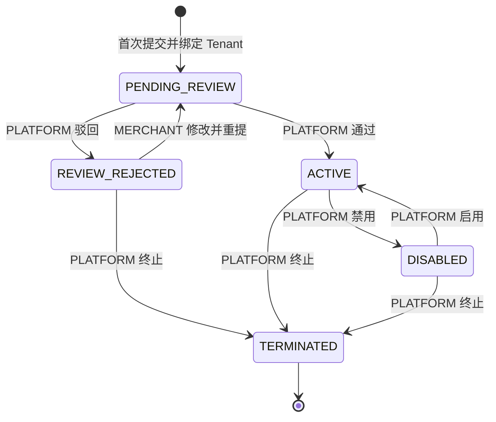

# 商户管理

## 当前结论

MCH-001 的产品边界和交互已经定版，本版本包含 Merchant 数据表、后端接口、权限、菜单及 PLATFORM/MERCHANT 页面 Candidate。本地真实浏览器已完成 MERCHANT 提交、PLATFORM 通过/禁用/启用、两端状态同步、时间格式、原因 i18n、商户资料页可用和 AGENT 无菜单验收；独立前端 review 发现的脱敏字段形状校验和列表并发查询问题也已修复。生产可用性仍必须由绑定精确不可变 SHA 的正式门禁和签名复审结果决定，本文不能单独作为 Production GO 证据。

## 两个不同概念

| 概念 | 用途 | 生命周期所有者 |
| --- | --- | --- |
| Identity Tenant | MERCHANT 后台的授权工作区，承载 User、Membership、Role 和 Session | IAM |
| Merchant | 商户法律/业务主体，承载入驻资料和业务生命周期 | Merchant context |

两者永久一对一，但不是同一个对象。PLATFORM 仍通过 IAM 建立 MERCHANT Tenant 和初始受保护管理员；该管理员登录 MERCHANT 后提交商户资料。提交不会再创建账号、角色、密码、MFA 或 Tenant。



## 状态机



- 没有 `DRAFT`。尚未提交表示当前 Tenant 没有 Merchant，而不是数据库里有草稿状态。
- 待审核时不能修改，避免审核对象在审查过程中漂移。
- 只有驳回后允许修改资料并重提；ACTIVE 资料变更由后续独立审核切片处理。
- `TERMINATED` 是终态，不能重新启用、编辑或重提。
- Merchant 禁用/终止不自动禁用 IAM Tenant、User、Membership 或 Session；身份生命周期由 IAM 独立治理。

## 页面和动作

### PLATFORM 运维端

菜单：`商户管理 -> 商户列表`。

列表支持商户号、名称、状态、注册国家和创建时间筛选，展示商户号、法定名称、展示名称、注册国家、脱敏注册号、状态、提交时间和更新时间。

详情按状态提供：

| 状态 | 可用动作 |
| --- | --- |
| `PENDING_REVIEW` | 通过、驳回 |
| `REVIEW_REJECTED` | 终止 |
| `ACTIVE` | 禁用、终止 |
| `DISABLED` | 启用、终止 |
| `TERMINATED` | 只读 |

审核、禁用、启用和终止都要求选择当前动作允许的原因码，不提供自由文本输入：通过仅 `PROFILE_VERIFIED`；驳回为 `PROFILE_MISMATCH`、`REGISTRATION_UNVERIFIED` 或 `COMPLIANCE_REJECTED`；禁用为 `COMPLIANCE_HOLD` 或 `RISK_CONTROL`；启用为 `COMPLIANCE_CLEARED` 或 `RISK_CLEARED`；终止为 `BUSINESS_CLOSED` 或 `COMPLIANCE_TERMINATION`。页面必须在提交前展示当前版本；服务端发现版本冲突时关闭旧决策上下文并刷新，不自动覆盖。

### MERCHANT 商户端

菜单：`商户资料`。未提交时显示申请表；提交后显示当前资料、状态和最近一次审核结论。

- 首次提交：法定名称、展示名称、注册国家、注册号全部必填。
- 首次提交和驳回后重提不让商户选择原因；服务端审计分别固定记录 `APPLICATION_SUBMITTED` 和 `APPLICATION_RESUBMITTED`。
- 同一提交接口以 `expectedVersion` 的严格 JSON 形状固定命令：`null` 是首次提交，非负整数是重提；超时重试不会因为 Merchant 已经创建而改变命令或权限。
- 待审核：只读，不能修改或重复创建。
- 驳回：展示原因，允许修改后重提；可以保留现有受保护注册号，也可以输入新注册号。
- ACTIVE、DISABLED、TERMINATED：只读。MCH-001 不提供 ACTIVE 资料修改。
- 注册号只显示脱敏值，不进入浏览器持久化、URL、埋点、错误上报或客户端日志。

### AGENT 代理端

MCH-001 不展示商户管理页面。本地真实浏览器已确认 AGENT 菜单没有 Merchant 入口；代理与商户的关系必须等 AgentRelation 后续切片定版，不能提前从 Tenant、账号域或 Merchant 状态推导。

## 当前页面验收事实

本 Candidate 在 `local`/`iam002-local` 密码模式完成了一次本地真实浏览器验收：MERCHANT 从“商户资料”首次提交，PLATFORM 从“商户列表”通过审核后再禁用、启用；每一步后 MERCHANT 与 PLATFORM 页面都显示同一状态，最终状态回到 `ACTIVE`。页面时间使用本地化格式，生命周期原因显示对应的双语 i18n 文案。MERCHANT 商户资料页此前的加载死锁在该流程中未再出现，AGENT 菜单不出现 Merchant 入口。

作者之外的前端 review 发现并已修复两个问题：API client 现在对 `registrationNumberMasked` 执行 fail-closed 脱敏形状校验，明文样式或非法脱敏值不能进入页面；PLATFORM 商户列表把并发刷新收敛为 latest-query 队列，旧响应不能覆盖最新筛选结果。正式结论仍以精确不可变 Candidate 的门禁和签名独立复审为准。

PLATFORM 的通过、禁用和启用属于要求 recent step-up 的敏感操作。本地密码登录成功把 `STEP_UP_AT` 记为当前时间，仅作为最近 10 分钟本地重认证验收凭据；不能称为 LoA 2，也不能推导生产认证已通过。生产 OIDC 初始登录没有 `stepUpAt`，必须另走 OIDC step-up 才能执行这些动作。

## 权限和职责隔离

- MERCHANT 只能查看、首次提交和驳回后重提当前 Session Tenant 永久绑定的 Merchant。
- PLATFORM 只能通过专用控制面列表、查看、审核和治理 Merchant 状态，不会因此加入目标 Tenant 或模拟商户 Session。
- MERCHANT 账号提交、PLATFORM 账号审核构成账号域和角色职责隔离。系统当前不能识别两个 Realm 账号是否属于同一自然人，因此不能宣称已经实现自然人级四眼。
- 前端隐藏动作只是交互；后端仍按组合根、精确权限、受保护系统角色、可信 Session、绑定关系、状态和版本逐项拒绝。

## 商户资料和隐私

MCH-001 只收集：

```text
merchantCode            服务端生成，不可编辑
legalName               法定名称
displayName             展示名称
registrationCountry     ISO 3166-1 alpha-2
registrationNumber      受保护注册号
```

注册号按国家和规范化结果做 keyed hash 唯一判断；驳回重提时如果修改注册国家，必须同时重新填写注册号。注册号必须使用 AES-256-GCM 受保护字段契约保存密文，不能选择不保留。列表和详情只显示脱敏值。普通审计、幂等记录、日志、trace、指标和异常都不得包含明文、密文或 fingerprint；幂等使用与检索完全独立的专用 HMAC key，并在重放前重新校验当前账号和权限。

## 明确不包含

MCH-001 不创建以下菜单、字段或后端行为：

- Market、国家市场开通、MerchantMarket；
- Agent、AgentRelation、直连/间连关系；
- 全局/市场/自定义费率；
- 交易限额；
- 结算账户或资金账户；
- API 接入、密钥、回调、IP 白名单；
- 订单、支付、余额、账本或任何资金写入。

## 产品验收

1. 一个 MERCHANT Tenant 并发首次提交只产生一个 Merchant 和一个永久绑定。
2. 所有合法迁移可达，所有未声明迁移失败且不产生部分审计或幂等结果。
3. MERCHANT 请求不能通过任何字段选择 Tenant/Merchant；PLATFORM 不获得目标 Membership。
4. 驳回后可修改重提，待审核和 ACTIVE 不可借提交接口修改。
5. 注册号仅以脱敏值展示；浏览器存储、服务端日志、普通 audit 和 idempotency 均无明文。
6. 重复相同命令在当前账号仍有效且仍具原命令权限时返回原结果；撤权后拒绝重放，同 key 不同载荷、旧版本和并发冲突都有稳定错误，搜索 key 轮换不改变重放结果。
7. PLATFORM 和 MERCHANT 页面按状态显示正确动作，AGENT 不含 MCH-001 页面或接口。
8. Merchant 状态变化不隐式改变 IAM Tenant、User、Membership、Credential 或 Session。
## MCH-002 Candidate interaction

> 状态：Candidate implementation；当前工作树已完成后端、前端、V34/V35/V36、保留数据升级和真实浏览器验收，但在精确 SHA 正式门禁与作者之外复审完成前仍是 Production NO-GO。

PLATFORM 商户列表按老系统业务语言收敛为：`商户号`、`商户名称`（displayName）、`商户类型`（merchantTypeCode）、`法人名称`（legalPersonName）、`认证类型`（authenticationType）、`主体名称`（legalName）、`市场`（marketCodes）、`商户状态`、`状态备注`（statusReasonCode）、`商户备注`（remarks）、`创建时间`、`更新时间`。业务邮箱不进入 Merchant 资料；登录邮箱属于 Identity User，不复制为 Merchant 字段。

- 列表同时提供“详情”和“编辑”；编辑只允许 `ACTIVE`、`DISABLED`，维护商户名称、主体名称、商户类型、法人名称、认证类型、商户备注和一个或多个市场。
- 商户类型和认证类型沿用老系统业务名称，但只是 Merchant 资料分类。它们不创建或推导 Tenant、代理关系、MerchantMarket 或权限；旧数据可为空，首次编辑必须补齐。
- 市场是多选下拉，当前值为 `BRA`、`PHL`，所有下拉使用 `allowClear`。法律注册国仍按 ISO alpha-2 单独保存，不显示成“市场”。
- 商户类型和认证类型下拉从批量字典读取顺序与颜色，但合法值和双语名称由应用固定；字典缺失、重复、非法或加载失败时显示完整默认选项和可重试错误，不新增业务值。
- `ACTIVE` 与 `DISABLED` 使用 Switch 并调用既有 enable/disable 命令；其他状态使用 Tag，不能通过 Switch 越过审核状态机。
- 详情只在 `PENDING_REVIEW` 提供审核动作；不显示 disable、enable、terminate。终止能力仍由服务端保留，但不是日常详情操作。
- 老数据无法从注册国推断实际经营市场，因此列表/详情允许市场为空；首次 MCH-002 编辑必须至少选择一个市场。
- 状态备注只显示当前状态的精确原因；无法从保留 audit/decision 证明的历史行显示为空，禁止按当前状态猜测。编辑资料不改变状态备注。

本切片不新增 MERCHANT 或 AGENT 资料维护入口，不改变 MCH-001 的申请、驳回后重提和注册号保护规则。V35 只做前向字段/字典扩展，禁止回写已执行的 V34；V34 前置检查和 V36 唯一约束共同保证每个 Merchant aggregate version 只有一条可信审计事件。发现重复历史时升级必须失败关闭并走另行批准的前向修复，不能删除审计记录后重试。

## MCH-003 可变 Candidate

> 状态：ADR-0015 和精确接口契约已接受，前后端 Candidate、三组合根集成、本地持久卷兼容和真实浏览器新增/审核/编辑验收已经完成；工作树尚未绑定最终提交，生产运行控制仍未闭环，因此仍是 Production NO-GO。

PLATFORM 新增和编辑统一为全页表单，使用排除 `receiveEmail` 后的老表单 22 项加现有
`registrationNumber`，共 23 个必填业务输入；只有 `remarks` 可为空。新增选择一个已有、
ACTIVE、未绑定 Merchant 的 MERCHANT Tenant 后代提交 `PENDING_REVIEW`，不会创建 IAM
Tenant、User、Membership、Role、Credential 或管理员。

新增和编辑共用一个 23 字段、5 证件表单全页。详情与审核使用两个独立隐藏路由，但共用同一
套完整只读资料版式；返回图标位于页面标题内，审核页仅在服务端确认仍有待审创建或资料修改时
在标题右侧显示一个“审核”按钮，点击后在弹窗选择通过/驳回和当前
决策允许的结构化原因，不再回到信息不完整的抽屉。注册国家是可清除的已分配 ISO alpha-2
下拉；变更注册国家时必须
替换注册号，变更法人证件类型时必须替换法人证件号，恢复原值后才允许继续保留原受保护值。

ACTIVE/DISABLED 编辑提交独立 `amendment`，不立即改 Merchant。另一 Membership 审核通过后
才原子应用完整资料并保留原运行状态；驳回或版本漂移不改 Merchant。创建者或修改者的
Membership 都不能审核自己提交的待审版本。

五个图片字段只传 `documentId`：品牌 Logo、营业执照、法人证件正面、反面和手持照。它们
不是公开 URL；仅 PNG/JPEG，经服务端校验、解码重编码、加密私存和授权流式读取。法人证件号
与注册号分别保护，页面和接口只返回脱敏值。新增时五项都必须先上传；编辑时每项可以保留
当前同类型证件，也可以只上传需要替换的证件，不要求为了修改其他资料重新上传全部五项。
服务端会把五项分别固化为“保留”或“替换”引用，拒绝历史证件、其他商户证件或其他操作者
的临时文件。

审核 amendment 时，证件预览必须把当前待审 `amendmentId` 传给既有附件读取接口，只展示
这次待审版本绑定的图片。接口失败或附件不匹配时页面显示不可验证，不能退回展示 Merchant
当前生效图片，否则审核人会看到错误证据。

列表市场列居中，只显示“巴西/菲律宾”等本地化名称。列表使用服务端 `reviewPending` 判断审核入口，
已审核且没有新待审资料修改的商户不再显示“审核”。操作数不超过三个时全部内联，超过
三个时仅前三个内联，其余进入现有点击触发菜单。商户类型新写入只使用“平台商户”等规范值，
历史 `DIRECT` 仅用于旧回执重放。

当前页面已实现上述表单全页、详情/审核只读全页、5 个图片字段、市场展示、前三项操作与点击
溢出、创建/修改独立 reviewer 和待审证件精确预览。Node.js 24 前端全量 128 个文件/975 个测试、五项 typecheck、
31 项 production-safety 和三应用构建/制品检查通过。本轮真实页面验证确认三项列表操作直接展示、
市场居中且只显示本地化名称、详情和审核资料一致、审核只通过一个弹窗动作选择通过/驳回及原因；
页面内计时为新增约 335ms 完成挂载、编辑约 460ms 完成 23 字段回填，操作窗口无新增业务
console error/warn。页面离开后迟到的附件预览和提交响应必须失效；正在由提交事务绑定的临时附件不得被
组件卸载清理误删。提交未完成时，Tenant、表单、替换开关和上传控件全部冻结，不能删除、替换或切换
这些临时附件的绑定上下文。本轮作者外独立复审必须在工作树冻结后重新执行，旧 reviewer 结果不替代本轮结论。

后端在最新工作树完成三组合根及 blackbox `verify -am`：17/17 reactor `BUILD SUCCESS`、IAM
黑盒 10/10、总耗时 07:56。local-bootstrap 集成测试 61/61 通过；自动化连续消费 candidate1..9 后只生成
candidate10，重复重启保持九个 Merchant 摘要不变，候选序号只接受 `2..999999`，非法谱系均
失败关闭且不修复。真实 HTTP 证明 Merchant `10802` 消费 Tenant `4000`；同卷重启后 Merchant 摘要
不变，eligible 唯一返回 Department、Membership、Role、Merchant 均为空的替代候选 Tenant
`10805`（`local-merchant-candidate-2`），本地运行态保持 healthy。Unified backend `clean verify`: PASS. 95 XML reports / 678 tests / 0 failures / 0 errors.
结果包含 IAM 黑盒 10/10。以上均是可变 Candidate 证据；在精确 SHA 正式
repository gate 和作者之外签名复审完成前，产品状态不能标记为已交付或 GO。
