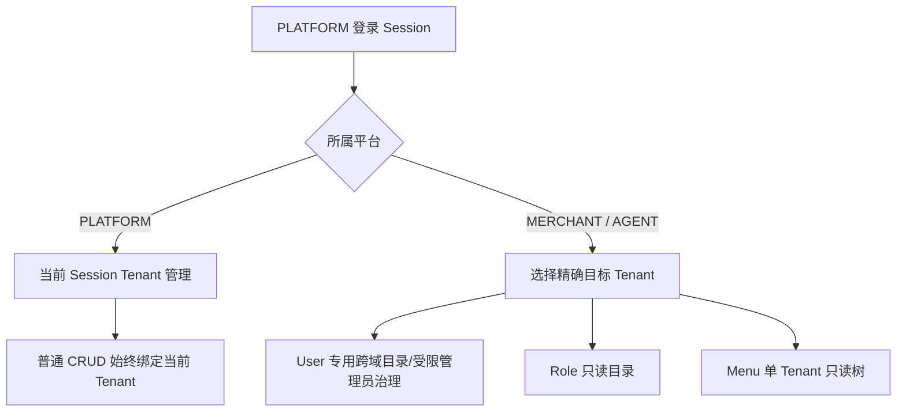
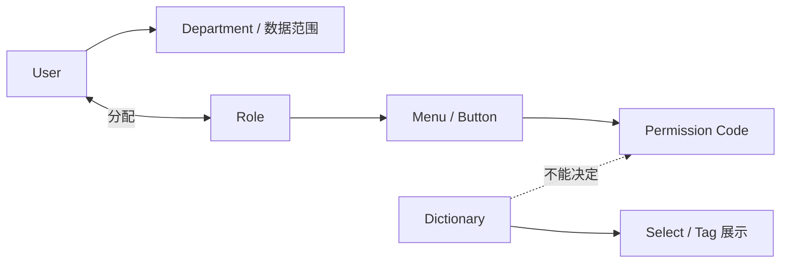
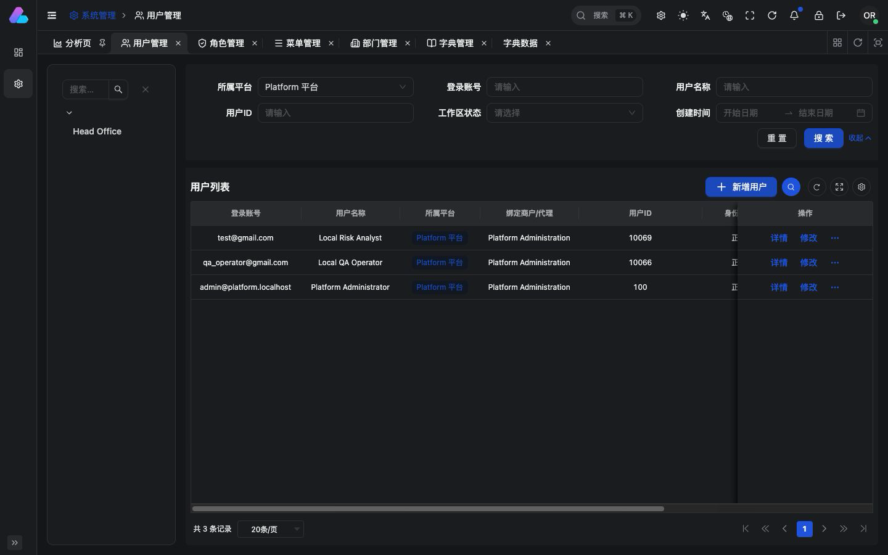
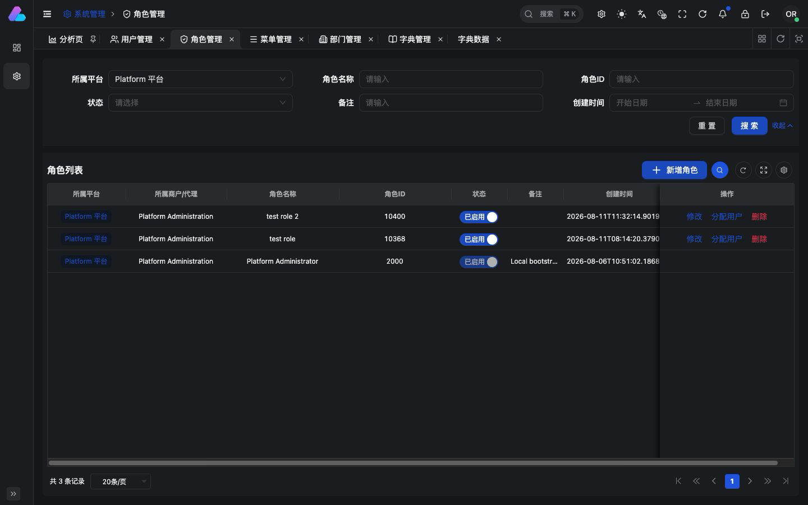
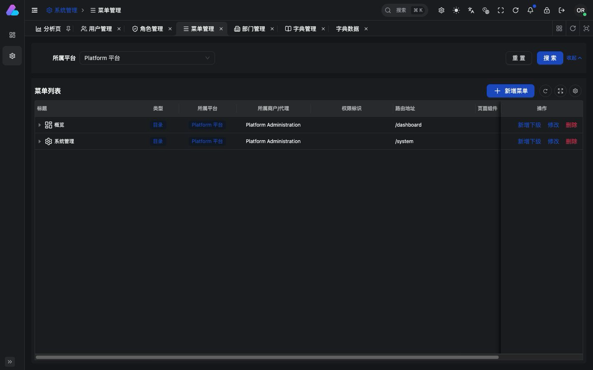
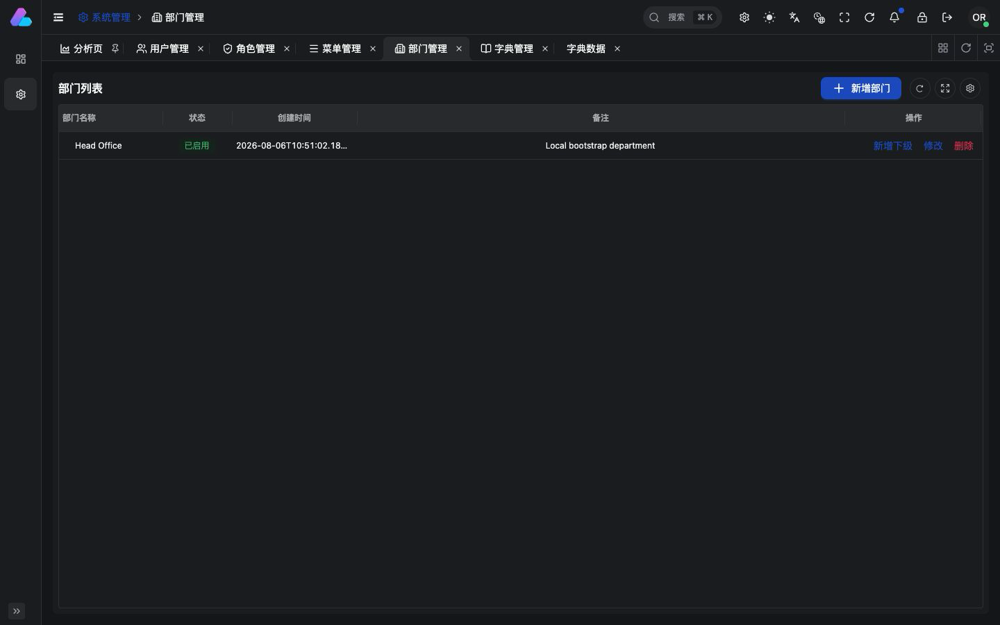
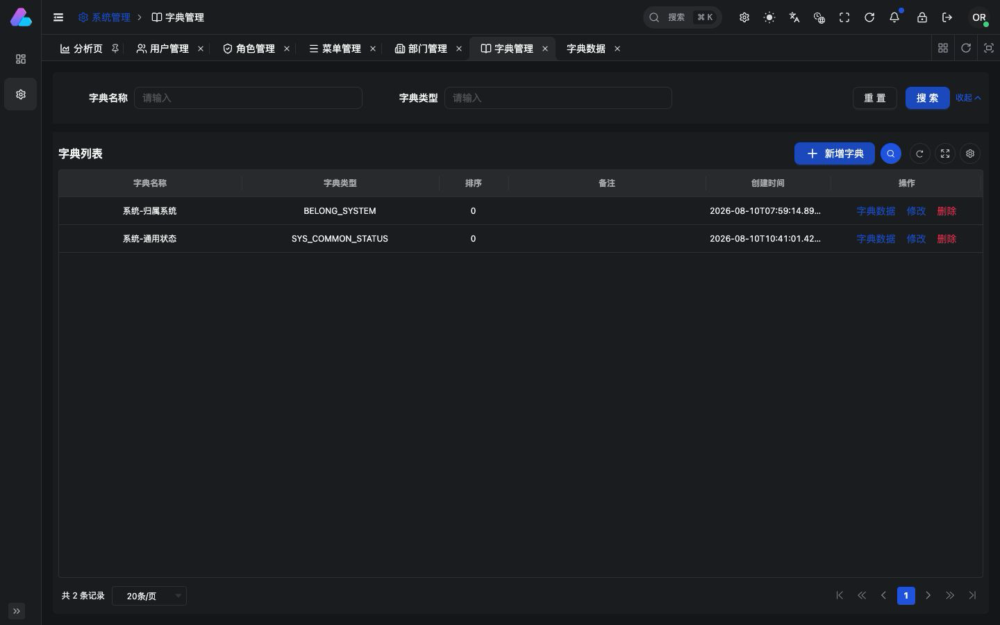
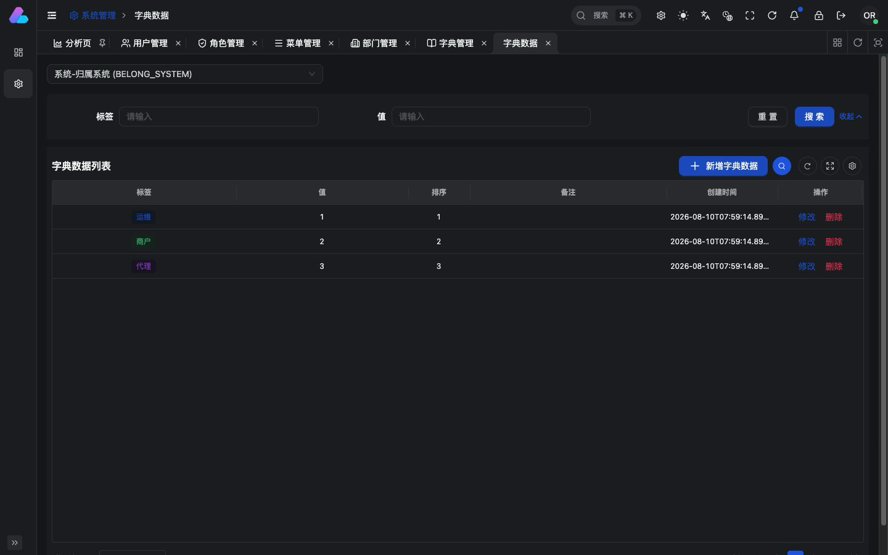

# 系统管理

## 能力范围

| 菜单/能力 | 运维端 PLATFORM | 商户端 MERCHANT | 代理端 AGENT |
| --- | --- | --- | --- |
| 用户管理 | 当前租户 CRUD；可查看其他账号域目录；跨域写仅限契约允许的受保护管理员治理 | 当前租户 CRUD | 当前租户 CRUD |
| 角色管理 | 当前租户 CRUD、菜单/权限配置、分配用户；其他账号域只读 | 当前租户 CRUD、分配用户 | 当前租户 CRUD、分配用户 |
| 菜单管理 | 当前租户 CRUD；其他账号域只读 | 不展示 | 不展示 |
| 部门管理 | 当前租户 CRUD | 不展示 | 不展示 |
| 字典管理 | 字典和字典数据 CRUD | 不展示；仅消费批量字典接口 | 不展示；仅消费批量字典接口 |
| 字典数据 | 隐藏详情页，从字典行进入 | 无页面 | 无页面 |

“所属平台”选择器只决定查询哪个账号域。它不能改变当前登录 Session、授权工作区或 Membership，也不能把字典值当作合法域或授权依据。

## 权限关系

前端隐藏按钮只是交互反馈，后端仍按权限、Tenant、账号域和主体状态独立拒绝。

## 用户管理

- 支持账号、名称、ID、状态、创建时间和部门筛选；PLATFORM 系统管理员可以切换所属平台。
- PLATFORM 控制面切换到 MERCHANT/AGENT 跨域目录时，不能把 source PLATFORM 部门条件带到目标域；MERCHANT/AGENT 自身的 User 管理仍可查询各自 Session Tenant 的部门。
- 新增用户时分配角色；行操作最多展示三个主要动作，第四个起通过点击 `...` 菜单触发。
- MERCHANT/AGENT 同租户管理员只能操作本租户 Membership；跨租户或跨账号域不能通过普通 User API 切换。

## 角色管理

- 当前租户可新增、修改、启停、删除、配置菜单/按钮并分配用户。
- PLATFORM 查询 MERCHANT/AGENT 时必须选择精确 Tenant，列表降级为只读并移除操作列。
- 角色的菜单展示关系和权限 Grant 是两套显式数据，保存时都由后端按当前 Tenant 校验；不能从前端勾选结果推导越权权限。

## 菜单管理

- PLATFORM 当前租户可维护目录、菜单和按钮；路由 name/path/component、i18n title 和权限码受跨端契约约束。
- 目录、页面和按钮的 `meta.title` 都必须解析为当前语言的字符串；Merchant 按钮统一使用 `merchant.permission.review/disable/enable/terminate/edit/create`，不能显示原始 key 或把对象节点当作标题。
- 查询其他账号域时每次只返回一个精确 Tenant 的只读树，不合并多个商户或代理租户。
- 隐藏页面不出现在角色菜单树；前端页面不可见不能替代后端不可达和权限拒绝。

## 部门管理

- 部门表示 PLATFORM 当前租户的组织和数据范围，不表示账号域或业务资源所有者。
- 支持树形新增、修改、启停和删除；删除/调整必须由后端检查关联用户和版本冲突。
- MERCHANT/AGENT 当前阶段不展示部门管理。

## 字典管理

- PLATFORM 维护字典类型及其数据；字典数据权限并入字典管理，不在角色分配中单独暴露页面节点。
- 点击字典行的“字典数据”进入隐藏详情页，左侧菜单不展示该入口。
- PostgreSQL 是字典事实源，Redis revision cache 只做读取加速；缓存异常必须回源数据库。

- 标签列直接按 `color` 渲染 Tag，不单独展示颜色列。
- 当前允许的颜色为 `default`、`processing`、`success`、`warning`、`error`、`purple`。
- MERCHANT/AGENT 不包含该页面和写接口，只通过 `POST /dict/queryBatch` 批量读取展示值。
- `BELONG_SYSTEM` 固定 `1/2/3 -> PLATFORM/MERCHANT/AGENT`；字典只覆盖顺序和颜色，双语名称与合法域仍由应用固定。

## 验收边界

产品验收至少覆盖：

1. PLATFORM 五个菜单可达，MERCHANT/AGENT 仅可达用户和角色；有限域制品不能包含字典管理/数据页面。
2. PLATFORM 切换 MERCHANT/AGENT 时，Role/Menu 操作列消失；切换账号域或 Tenant 后，迟到响应不能覆盖新目标。
3. 用户新增可分配角色，角色可分配用户；角色保存的菜单/权限由后端重新校验，不能仅依赖树组件状态。
4. 字典数据只能从字典行进入，角色树不显示隐藏路由；批量字典读取缺失类型时返回显式空数组。
5. 页面在固定桌面和移动视口无文字/操作溢出，行操作统一由点击触发的 `...` 菜单收纳次要动作。

## 交互变更检查

以下变化必须在同一任务更新本页并原位重拍对应图片：菜单可见性、路由入口、筛选字段、表格列、主要动作、只读边界、权限分配方式、字典展示或弹窗流程。截图只证明页面表现，最终接口和权限边界仍以 Contract、ADR、源码和测试为准。
